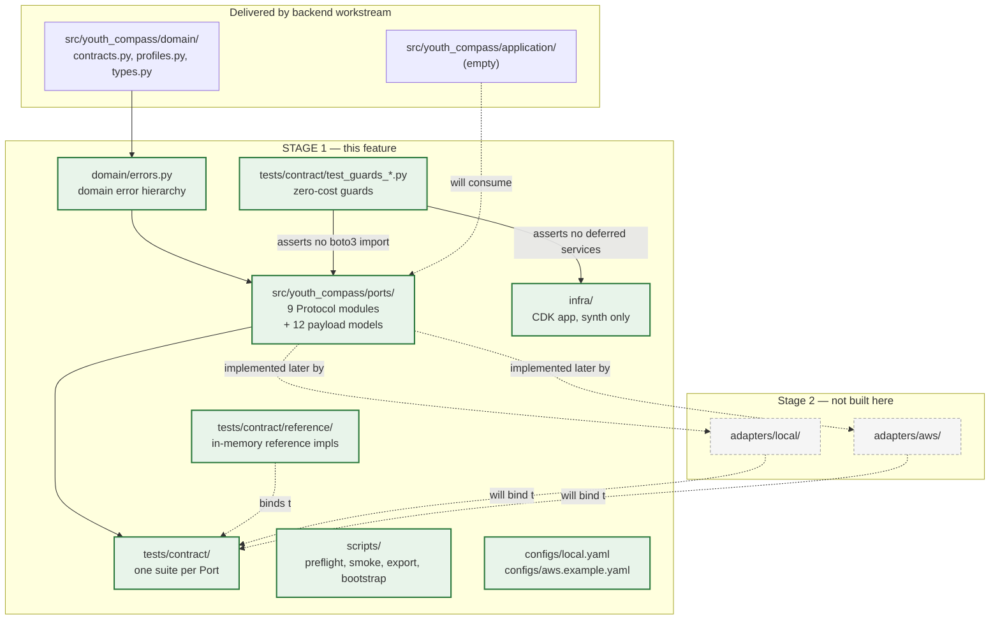
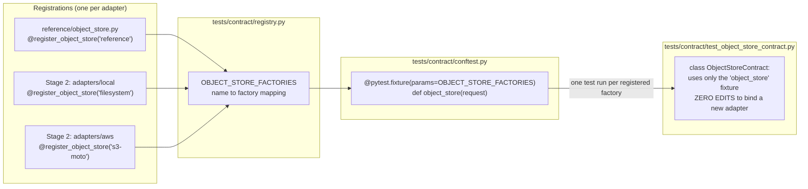
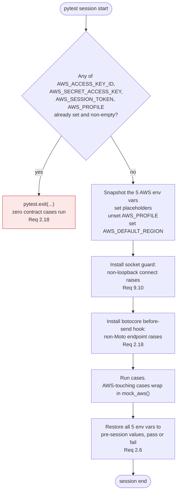
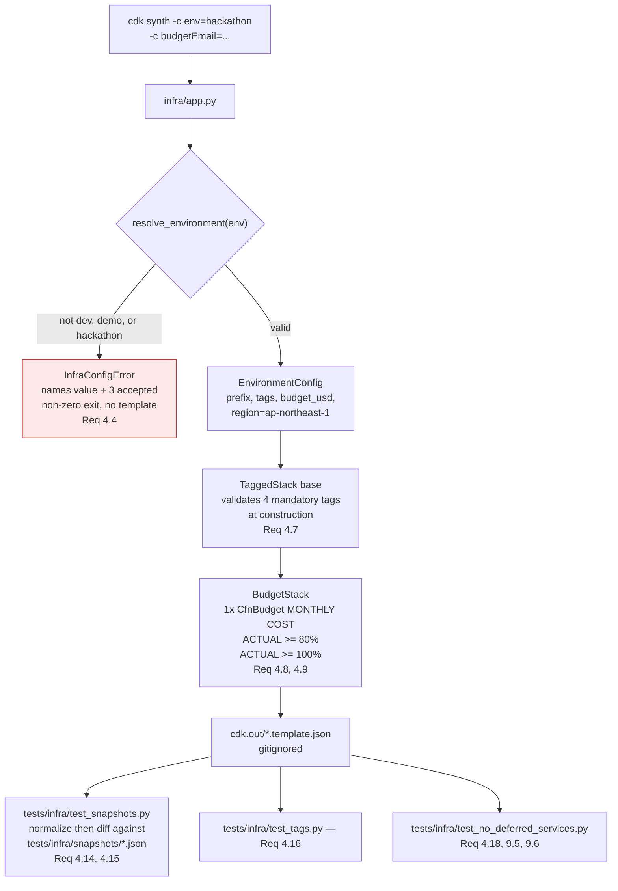
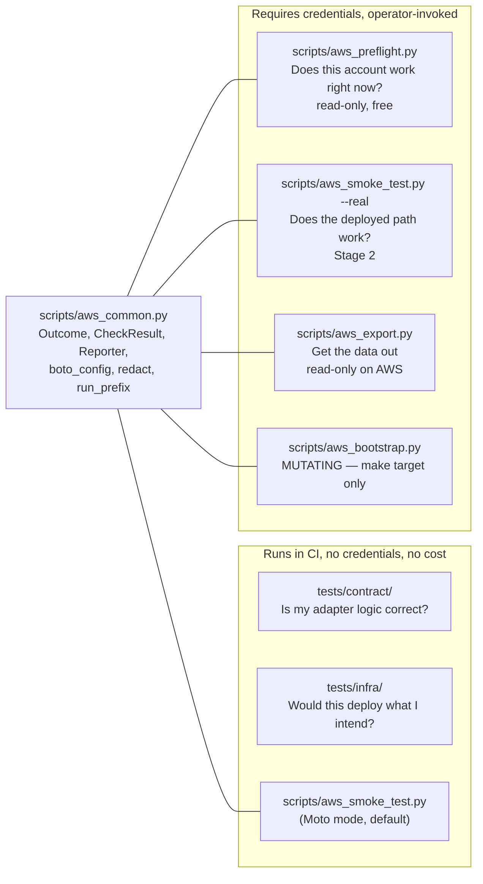
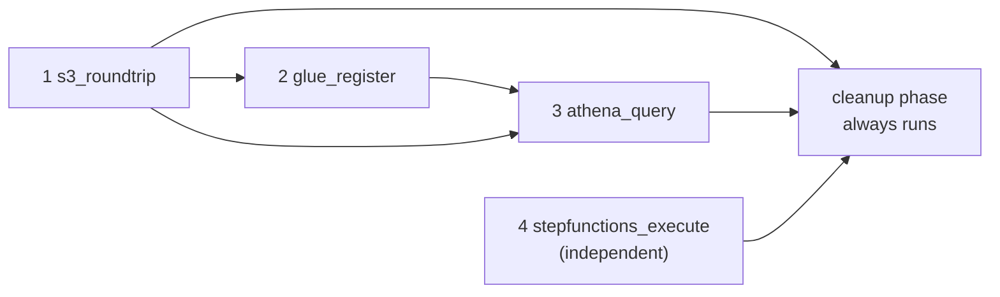
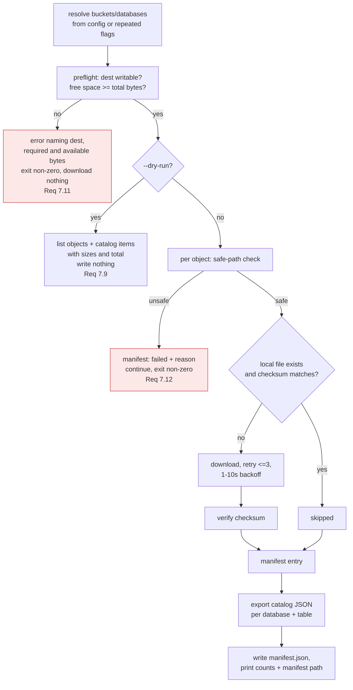
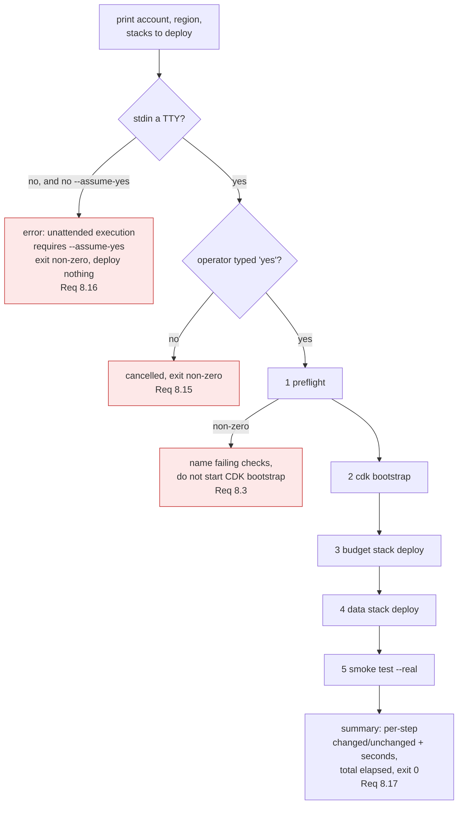

# Design Document

## Overview

Stage 1 delivers the AWS foundation layer for **New Taipei Youth Policy** as five artifact groups that share one property: none of them can create an AWS resource or spend money. The design is organised around that property rather than around the artifacts, because the guarantee is what makes the feature mergeable six days before the competition and before any hackathon credit exists.

The five artifact groups:

| Group | Location | What it is |
|---|---|---|
| Port Protocols | `src/youth_compass/ports/` | Nine `typing.Protocol` modules plus their Pydantic payload models, transcribed from `docs/01-system-architecture.md` §5 as an amendable proposal |
| Contract-test harness | `tests/contract/` | One reusable pytest suite per Port, parametrized over any number of bound adapters, plus in-memory reference implementations and the zero-cost guard tests |
| CDK application | `infra/`, tests in `tests/infra/` | A synthesizable-but-never-deployed CDK app with three context environments, mandatory cost-allocation tags, and an AWS Budgets stack |
| Verification scripts | `scripts/` | `aws_preflight.py`, `aws_smoke_test.py`, `aws_export.py`, `aws_bootstrap.py` on a shared result-and-reporting core |
| Operational surface | `Makefile`, `configs/`, `docker-compose.yml`, `docs/12-` | One-command bootstrap, provider-selection configuration, optional LocalStack, and the Stage 1 team document |

### Design goals

1. **Zero cost is mechanically proven, not asserted.** Every AWS-mutating call sits behind an explicit operator flag or `make` target, and a guard-test group in `tests/contract/` fails the build if that invariant breaks. *(Requirement 9)*
2. **A port signature change is cheap.** Because backend port progress is unknown, the Protocols are published as a proposal. The contract suite is the mechanism that localises the blast radius of an amendment to a single adapter. *(Requirements 1, 2)*
3. **Competition morning is rehearsable.** `make hackathon-bootstrap` takes an unfamiliar empty account to a verified stack; `make aws-export` takes the data back out before the organizer suspends the account. Both are runnable offline against Moto before 9/12. *(Requirements 6, 7, 8)*
4. **Deferred services stay deferred.** Amazon Bedrock, Amazon SageMaker AI, and Amazon Bedrock AgentCore get readiness *checks* only. A synthesis test asserts zero constructs of those namespaces. *(Requirements 4, 9)*
5. **Nothing already delivered breaks.** Additive-only changes to shared files, and a verified-unchanged result for every pre-existing test in `tests/unit/` and `tests/integration/`. *(Requirement 2 criterion 16, Requirement 3 criterion 10)*

### Design non-goals

Stage 1 writes no AWS adapter (Stage 2), deploys no stack (Stage 2), and integrates no foundation model (Stage 3). The contract suite proves itself against in-memory reference implementations, not against adapters that do not exist yet.

### Research findings that shaped the design

Four findings changed decisions rather than merely informing them.

1. **Moto does not execute Athena queries, and executes Step Functions only when told to.** The Moto documentation states plainly that Athena queries are not executed and the results call returns zero rows by default ([moto Athena docs](https://github.com/getmoto/moto/blob/master/docs/docs/services/athena.rst)); Moto does expose its Athena backend for seeding query results and column metadata ([backend-seeding technique](https://stackoverflow.com/questions/75325949/how-to-mock-athena-query-results-values-with-moto3-for-a-specific-table)). Separately, Moto interprets a Step Functions definition only under the `stepfunctions.execute_state_machine` configuration flag ([moto configuration options](https://docs.getmoto.org/en/latest/docs/configuration/index.html)). Consequence: the smoke tester's Athena step in Moto mode verifies the tester's own orchestration, polling, parsing, and assertion path against a seeded result set rather than Athena's SQL semantics, and its Step Functions step must opt into execution explicitly or the assertion is vacuous. The same document supplies `core.service_whitelist`, which this design adopts as the primary unexpected-service guard in the contract harness. This boundary is named explicitly in [Moto fidelity boundary](#354-moto-fidelity-boundary) and surfaced in the tester's own output. *Content was rephrased for compliance with licensing restrictions.*
2. **Amazon Athena is not available in LocalStack's free tier, and LocalStack's free/Community delivery changed during 2026.** LocalStack's own material describes a tiered model in which the free tier is for experimentation and advanced service coverage sits in paid tiers ([LocalStack tiers announcement](https://blog.localstack.cloud/introducing-localstack-new-aws-tiers-expanded-snowflake-support/), [LocalStack plans](https://docs.localstack.cloud/aws/licensing/)), and LocalStack has announced a consolidation of its emulator delivery ([road-ahead post](https://blog.localstack.cloud/the-road-ahead-for-localstack/)). Requirement 11 criterion 2 forbids declaring any licence key or auth token, and criterion 3 supplies the fallback rule. Consequence: LocalStack is pinned to a pre-consolidation image tag, its emulated-service list omits Athena, and Moto is documented as Athena's substitute. LocalStack is the lowest-priority Stage 1 artifact. *Content was rephrased for compliance with licensing restrictions.*
3. **`iam:SimulatePrincipalPolicy` is the correct permission-probe primitive.** Requirement 5 criterion 8 demands permission probes using only read-only or dry-run calls. Only EC2 offers a real `DryRun` flag, and none of the five probed permissions are EC2 actions. IAM policy simulation is read-only, creates nothing, and answers exactly the question asked. Consequence: all five permission probes go through `simulate_principal_policy`, with `indeterminate` as the honest outcome when the simulate call is itself denied.
4. **Adding a property-based testing library is forbidden by the requirements.** Requirement 3 criterion 1 fixes the dev group at exactly ten entries, and Hypothesis is not one of the four approved additions. Consequence: the correctness properties in this document are real universally-quantified properties, but they are implemented with a small standard-library seeded generator harness rather than a PBT library. See [Property-test implementation without a PBT library](#71-property-test-implementation-without-a-pbt-library).

---

## Architecture

### 1.1 Where Stage 1 sits in the ports-and-adapters seam

Stage 1 builds the seam and the test rig around it. The shaded work is Stage 1; everything else is Stage 2 or later, or already delivered by the backend workstream.



The dependency-direction rule from `docs/07-project-structure.md` §13 is what this diagram encodes: arrows into `ports/` come only from `domain/`, and `adapters/` depends on `ports/` rather than the reverse. Requirement 1 criterion 7 and Requirement 9 criterion 4 turn that rule into two failing tests if it is violated.

### 1.2 How the contract suite parametrizes over adapters

The central mechanism of Requirement 2 criterion 1: binding an adapter is one registration, and the test class body never changes.



Because the fixture is function-scoped and each factory is a context manager yielding a freshly constructed adapter, per-case state isolation (Requirement 2 criterion 17) falls out of the fixture lifecycle rather than needing explicit teardown logic in every test.

### 1.3 Where Moto and the credential guards sit



### 1.4 CDK application and stack structure



Only the budget stack exists in Stage 1. Requirement 8 criterion 2 names a data stack as bootstrap step 4; that stack is a Stage 2 delivery, and the bootstrap driver treats a not-yet-defined stack as a hard configuration error rather than silently skipping it. See [Bootstrap step 4 before Stage 2](#372-step-model-and-idempotence).

### 1.5 Verification-script layering

The three scripts answer three different questions, which is why they are three programs rather than one.



---

## Components and Interfaces

### 3.1 Port modules

Nine modules under `src/youth_compass/ports/`, one Protocol each, every Protocol decorated `@runtime_checkable` (Requirement 1 criterion 4). Eight filenames come from `docs/07-project-structure.md` §7; `workflow_runner.py` is a proposed ninth (Requirement 1 criterion 10).

Every module carries a docstring stating the three facts Requirement 1 criterion 5 requires. The template:

```python
"""ObjectStore port.

Stage 1 proposal originating from the AWS workstream. The backend workstream may
amend these signatures; see docs/12-aws-stage1-foundation.md for the amendment
procedure. Signatures transcribed from docs/01-system-architecture.md section 5.1.
"""
```

Signatures, transcribed with the same method and parameter names as `docs/01` §5, with the two substitutions Requirement 1 criterion 9 mandates (`dict` becomes `dict[str, str]`; storage locations are scheme-qualified URI `str`, never `pathlib.Path`):

```python
# ports/object_store.py
@runtime_checkable
class ObjectStore(Protocol):
    def put(self, key: str, content: bytes, metadata: dict[str, str]) -> str: ...
    def get(self, uri: str) -> bytes: ...
    def list(self, prefix: str) -> list[str]: ...
    def exists(self, uri: str) -> bool: ...


# ports/catalog.py
@runtime_checkable
class DataCatalog(Protocol):
    def register(self, dataset: DatasetMetadata) -> None: ...
    def get(self, dataset_id: str) -> DatasetMetadata: ...
    def search_compatible(self, profile: DatasetProfile) -> list[DatasetMetadata]: ...


# ports/query_engine.py
@runtime_checkable
class QueryEngine(Protocol):
    def execute(self, query: QuerySpec) -> QueryResult: ...


# ports/model_provider.py
@runtime_checkable
class ModelProvider(Protocol):
    async def generate(self, request: ModelRequest) -> ModelResponse: ...


# ports/forecast_service.py
@runtime_checkable
class ForecastService(Protocol):
    def get_forecast(self, request: ForecastRequest) -> ForecastResult: ...
    def trigger_training(self, request: TrainingRequest) -> TrainingRun: ...


# ports/workflow_runner.py   <-- proposed addition to docs/07 section 7
@runtime_checkable
class WorkflowRunner(Protocol):
    def start_ingestion(self, request: IngestionRequest) -> JobReference: ...
    def resume_after_approval(self, job_id: str, decision: ApprovalDecision) -> None: ...


# ports/checkpoint_store.py
@runtime_checkable
class CheckpointStore(Protocol):
    def save(self, workflow_id: str, checkpoint: WorkflowCheckpoint) -> None: ...
    def load(self, workflow_id: str) -> WorkflowCheckpoint | None: ...


# ports/event_bus.py
@runtime_checkable
class EventBus(Protocol):
    def publish(self, event: DomainEvent) -> None: ...
    def subscribe(self, event_type: str, handler: Callable[[DomainEvent], None]) -> None: ...


# ports/clock.py
@runtime_checkable
class Clock(Protocol):
    def now(self) -> datetime: ...
```

Three design notes:

- `Clock.now` returns a timezone-aware UTC `datetime`. The Protocol cannot express awareness in the type, so the contract suite asserts `tzinfo is not None` and `utcoffset() == timedelta(0)` (Requirement 1 criterion 3).
- `CheckpointStore.load` returns `None` for a missing identifier rather than raising, per Requirement 1 criterion 3. This is the one deliberate asymmetry with `ObjectStore.get` and `DataCatalog.get`, which do raise.
- `ObjectStore.put` returns the URI of the written object; `get`/`exists` take a URI. `list` takes a *key prefix* and returns *keys*. That key/URI asymmetry is inherited verbatim from `docs/01` §5 and is preserved rather than tidied, so the transcription stays auditable. The contract suite pins the relationship: `store.exists(store.put(key, ...))` is `True`, and `key in store.list(prefix_of(key))`.

`ports/__init__.py` re-exports all nine Protocols and all payload models, mirroring the existing `domain/__init__.py` style.

Requirement 1 criteria 6 and 8 constrain the imports to the standard library, `pydantic`, and `src/youth_compass/domain/`, with no `type: ignore` and no `typing.Any` in any Protocol method signature. `Callable` in `EventBus.subscribe` comes from `collections.abc`.

### 3.2 Domain error hierarchy

Requirement 2 criteria 10 and 13 require adapters to raise a *domain* error, and the suite to fail if a `botocore`, OS, or other technology-specific exception escapes instead. That needs a shared error module the Ports can name.

**Decision: `src/youth_compass/domain/errors.py`.** `docs/07-project-structure.md` §2 already lists `domain/errors.py` in the planned domain package, so this is a sanctioned filename rather than an invention, and Requirement 1 criterion 6 permits ports to import from `domain/`. It is backend-owned space, so the module is additive and contains only exception classes.

```python
class YouthCompassError(Exception):
    """Base for every error crossing a port boundary."""

class ObjectNotFoundError(YouthCompassError):     # ObjectStore.get / Req 2.10
class DatasetNotFoundError(YouthCompassError):    # DataCatalog.get
class QueryNotPermittedError(YouthCompassError):  # allowlist rejection / Req 2.13
class QueryExecutionError(YouthCompassError):     # engine-side failure
class ModelInvocationError(YouthCompassError):
class ForecastNotAvailableError(YouthCompassError)
class TrainingRejectedError(YouthCompassError)
class WorkflowStateError(YouthCompassError)       # resume of unknown/settled job
class ConfigurationError(YouthCompassError)       # provider-selection validation
```

Each port module documents, per method, which of these it may raise. The contract suite asserts the *declared* type, so a Stage 2 S3 adapter that lets `botocore.exceptions.ClientError` escape fails the suite rather than passing silently.

### 3.3 Contract-test harness

```text
tests/contract/
├── README.md                       # the three ordered binding steps (Req 2.14)
├── conftest.py                     # credential neutralization, endpoint guard, fixtures
├── registry.py                     # per-Port factory registries + register_* decorators
├── generators.py                   # seeded deterministic value generators
├── reference/
│   ├── __init__.py                 # imports every module so registration happens
│   ├── object_store.py             # InMemoryObjectStore
│   ├── catalog.py                  # InMemoryDataCatalog
│   ├── query_engine.py             # InMemoryQueryEngine (allowlist-aware)
│   ├── model_provider.py           # EchoModelProvider
│   ├── forecast_service.py         # InMemoryForecastService
│   ├── workflow_runner.py          # InMemoryWorkflowRunner
│   ├── checkpoint_store.py         # InMemoryCheckpointStore
│   ├── event_bus.py                # InMemoryEventBus
│   └── clock.py                    # FixedClock / InMemoryClock
├── test_object_store_contract.py
├── test_catalog_contract.py
├── test_query_engine_contract.py
├── test_model_provider_contract.py
├── test_forecast_service_contract.py
├── test_workflow_runner_contract.py
├── test_checkpoint_store_contract.py
├── test_event_bus_contract.py
├── test_clock_contract.py
├── test_guards_imports.py          # Req 1.7, 9.4
├── test_guards_no_account_ids.py   # Req 9.8
├── test_guards_network.py          # Req 9.10
├── test_guards_secret_scan.py      # Req 9.9
└── test_config_providers.py        # Req 10.8
```

#### 3.3.1 The binding mechanism

`registry.py` holds one registry per Port. A factory is a zero-argument callable returning a context manager that yields a fresh adapter instance:

```python
ObjectStoreFactory = Callable[[], AbstractContextManager[ObjectStore]]
OBJECT_STORE_FACTORIES: dict[str, ObjectStoreFactory] = {}


def register_object_store(name: str) -> Callable[[ObjectStoreFactory], ObjectStoreFactory]: ...
```

`conftest.py` turns each registry into a parametrized fixture:

```python
@pytest.fixture(params=sorted(OBJECT_STORE_FACTORIES), ids=lambda n: f"objectstore[{n}]")
def object_store(request: pytest.FixtureRequest) -> Iterator[ObjectStore]:
    with OBJECT_STORE_FACTORIES[request.param]() as store:
        yield store
```

The contract class body references only the `object_store` fixture. Binding a new adapter is one decorated factory function; the class body is untouched, and N registered factories produce N runs of the same class (Requirement 2 criterion 1). Reference implementations register themselves on import of `tests/contract/reference/__init__.py`, which `conftest.py` imports at module load so the registry is populated before collection.

The `tests/contract/README.md` records exactly three ordered steps: (1) write the factory context manager and decorate it with the Port's `register_*`; (2) import the module from `tests/contract/reference/__init__.py` or an adapter-side conftest; (3) run `uv run pytest tests/contract -k "<adapter-name>"`.

#### 3.3.2 Credential neutralization and abort guards

A session-scoped autouse fixture in `tests/contract/conftest.py`, ordered as in [diagram 1.3](#13-where-moto-and-the-credential-guards-sit):

1. **Guard before mutate.** Read the four credential variables. If any is set and non-empty, call `pytest.exit(msg, returncode=3)` so zero contract cases execute (Requirement 2 criterion 18). Checking before setting is what makes "a value that was not set by the Contract_Harness" decidable.
2. **Snapshot and set.** Record the pre-session value of all five variables, including absence. Set `AWS_ACCESS_KEY_ID=testing`, `AWS_SECRET_ACCESS_KEY=testing`, `AWS_SESSION_TOKEN=testing`, delete `AWS_PROFILE`, set `AWS_DEFAULT_REGION=ap-northeast-1`.
3. **Restore in a `finally`.** Variables absent before the session are deleted, not set to empty (Requirement 2 criterion 6).

Non-Moto endpoint detection uses two layers. The primary layer is Moto's own service allowlist, which raises `ServiceNotWhitelisted` for any service outside the declared set:

```python
mock_aws(
    config={
        "core": {
            "service_whitelist": ["s3", "glue", "athena", "stepfunctions"],
            "mock_credentials": True,
        }
    }
)
```

That is stronger than a hand-rolled check because it fails on the *service*, not just the host, so a case that reaches for an unexpected service fails immediately. The second layer is a `botocore` `before-send.*.*` event handler that inspects the outbound request URL and raises if the host is not one Moto serves, covering the case of a client constructed outside a `mock_aws` context. Under `mock_aws()` the request is intercepted in-process, so a request reaching a real endpoint host is exactly the failure condition.

The socket guard (`test_guards_network.py` plus an autouse fixture in the root `tests/conftest.py`) patches `socket.socket.connect` to raise `AssertionError` naming the test and destination for any address outside `127.0.0.0/8`, `::1`, and AF_UNIX (Requirement 9 criterion 10). It is installed at the root so the whole suite is covered; the verification step for this design is confirming the existing `tests/integration/test_api.py` (which uses `httpx` against an ASGI app in-process, opening no socket) and the CSV profiler tests still pass unchanged.

#### 3.3.3 Per-Port assertion sets

Beyond the properties in [Correctness Properties](#correctness-properties), each suite carries example and edge cases:

| Port | Contract assertions |
|---|---|
| ObjectStore | round-trip over the size and key-length matrix; overwrite leaves one object and one `list` entry; prefix isolation and empty-prefix result; `get` of an unwritten URI raises `ObjectNotFoundError`; `exists` is `False` before and `True` after `put` |
| DataCatalog | register-then-get field equality; re-register upsert keeps one record with later values; `get` of unknown id raises `DatasetNotFoundError`; `search_compatible` returns only records whose grain matches the profile |
| QueryEngine | identical `QuerySpec` twice yields identical rows, order, and column names and order; non-allowlisted table raises `QueryNotPermittedError` and returns no row; `max_rows` is honoured |
| ModelProvider | `await generate(...)` returns a schema-valid `ModelResponse`; the request's `max_tokens` is respected or reported |
| ForecastService | `get_forecast` for an unknown key raises `ForecastNotAvailableError`; `trigger_training` returns a `TrainingRun` with a non-empty id and a queued-or-running status |
| WorkflowRunner | `start_ingestion` returns a `JobReference` with a non-empty `job_id`; `resume_after_approval` on an unknown job raises `WorkflowStateError`; approve-then-approve is rejected |
| CheckpointStore | save-then-load round-trip; `load` of unknown id returns `None`; save twice keeps the later checkpoint |
| EventBus | a subscribed handler receives every matching published event in publish order and no non-matching event |
| Clock | `now()` is timezone-aware with zero UTC offset and is non-decreasing across successive calls |

#### 3.3.4 Guard tests

| Test | Mechanism |
|---|---|
| `test_guards_imports.py` | `ast.parse` every `.py` found by `Path.rglob` under `src/youth_compass/ports`, `domain`, `application` (Req 1.7) and all of `src/youth_compass/` (Req 9.4); collect every `Import`/`ImportFrom` name; assert none matches the forbidden set `{boto3, botocore, aws_cdk, constructs, moto, fastapi}` or a module under `adapters.`. Accumulate **all** violations and report each as `path:lineno: imports X` — Req 1.7 forbids stopping at the first. `ast` rather than regex, so a name inside a string or comment cannot cause a false positive. |
| `test_guards_no_account_ids.py` | regex `(?<!\d)\d{12}(?!\d)` over `scripts/**/*.py` and `infra/**/*.py` (Req 9.8). The test lives under `tests/`, which the scan does not cover, so the pattern cannot match itself. |
| `test_guards_secret_scan.py` | patterns for AWS access key ids (`(?:AKIA\|ASIA)[0-9A-Z]{16}`), 40-character secret-key-shaped strings adjacent to a secret-key label, and session-token-shaped strings, run over `git ls-files` output. Findings report `path:lineno` only, never the matched text (Req 9.9). |
| `test_guards_network.py` | asserts the socket guard is active and that a deliberate non-loopback connect attempt raises (Req 9.10). |
| `tests/infra/test_no_deferred_services.py` | synthesizes all three context environments and asserts zero resources whose type starts with `AWS::Bedrock`, `AWS::SageMaker`, or `AWS::BedrockAgentCore`, and zero of the five always-on types (Req 4.18, 9.5, 9.6). Failure names stack, logical id, and resource type. |
| `tests/contract/test_mutating_paths.py` | asserts each mutating entry point exits non-zero with a message naming the required flag when invoked without it (Req 9.3). |
| `tests/contract/test_docs_consistency.py` | extracts every `make` target, script path, and `--option` from fenced blocks and inline code in `docs/12-aws-stage1-foundation.md`, and asserts each exists in the `Makefile` or in the corresponding script's parser. Failure names the mismatched string and its document line (Req 12.7). |

### 3.4 CDK application

```text
infra/
├── cdk.json                    # {"app": "python app.py", "versionReporting": false}
├── app.py                      # entry point
├── README.md                   # Req 4.20
├── __init__.py
├── environments.py             # EnvironmentConfig + ENVIRONMENTS + resolve_environment
├── errors.py                   # InfraConfigError
└── stacks/
    ├── __init__.py
    ├── base.py                 # TaggedStack
    └── budget.py               # BudgetStack
tests/infra/
├── __init__.py
├── constants.py                # PLACEHOLDER_ACCOUNT = "0" * 12, PLACEHOLDER_EMAIL
├── conftest.py
├── snapshots/
│   └── YouthCompass-dev-Budget.template.json   (one per env x stack)
├── test_snapshots.py
├── test_tags.py
├── test_environments.py
└── test_no_deferred_services.py
```

Infra tests live under `tests/infra/` rather than `infra/tests/` because `[tool.pytest.ini_options] testpaths = ["tests"]` is unchanged by this feature, and `pythonpath = ["."]` already makes `import infra.app` resolve. This is the smallest change that gets infra tests collected by a bare `uv run pytest`.

#### 3.4.1 Context environments

```python
@dataclass(frozen=True)
class EnvironmentConfig:
    name: str  # dev | demo | hackathon
    stack_prefix: str  # 1..32 chars
    budget_usd: int  # 10 | 20 | 50
    tags: Mapping[str, str]  # Project, Environment, Owner, CostCenter


ENVIRONMENTS: Mapping[str, EnvironmentConfig] = {...}
DEFAULT_REGION = "ap-northeast-1"
```

| Environment | Stack prefix | Budget (USD/month) |
|---|---|---|
| `dev` | `YouthCompass-dev` | 10 |
| `demo` | `YouthCompass-demo` | 20 |
| `hackathon` | `YouthCompass-hackathon` | 50 |

`resolve_environment(name)` raises `InfraConfigError` naming the supplied value and the three accepted values for anything else, including absence. Absence is treated as invalid rather than defaulted, so `cdk synth` never silently targets the wrong environment (Requirement 4 criterion 4). `app.py` lets `InfraConfigError` propagate, which the CDK CLI surfaces as a non-zero exit with no template written.

Region resolution: `-c region` → `CDK_DEFAULT_REGION` → `DEFAULT_REGION` (Requirement 4 criterion 5).

#### 3.4.2 Mandatory-tag enforcement

`TaggedStack` validates before it tags, so failure happens at construction time:

```python
MANDATORY_TAGS = ("Project", "Environment", "Owner", "CostCenter")


class TaggedStack(Stack):
    def __init__(self, scope, construct_id, *, tags: Mapping[str, str], **kwargs):
        problems = [
            f"{k}: {'missing' if k not in tags else 'empty'}"
            for k in MANDATORY_TAGS
            if not tags.get(k, "").strip()
        ]
        problems += [f"{k}: exceeds 255 characters" for k, v in tags.items() if len(v) > 255]
        if problems:
            raise InfraConfigError("mandatory cost-allocation tags invalid: " + "; ".join(problems))
        super().__init__(scope, construct_id, **kwargs)
        for key, value in tags.items():
            Tags.of(self).add(key, value)
```

All problems are reported together (Requirement 4 criterion 7). `Environment` is always set to the resolved environment name (criterion 6).

#### 3.4.3 Budget stack

One `aws_cdk.aws_budgets.CfnBudget` — L1 is the only construct AWS Budgets offers:

```python
CfnBudget(
    self,
    "MonthlyCostBudget",
    budget=CfnBudget.BudgetDataProperty(
        budget_type="COST",
        time_unit="MONTHLY",
        budget_limit=CfnBudget.SpendProperty(amount=env.budget_usd, unit="USD"),
    ),
    notifications_with_subscribers=[_notification(threshold, email) for threshold in (80, 100)],
)
```

Each notification is `notification_type="ACTUAL"`, `comparison_operator="GREATER_THAN_OR_EQUAL_TO"`, `threshold_type="PERCENTAGE"`, with one `EMAIL` subscriber — matching "actual monthly spend reaches 80 percent and 100 percent" (Requirement 4 criterion 9).

**Notification address.** Read from context key `budgetEmail`, falling back to environment variable `YOUTH_COMPASS_BUDGET_EMAIL`, context preferred (Requirement 4 criterion 10). Absent, empty, or lacking `@` raises `InfraConfigError` naming *both* the context key and the variable (criterion 11). Keeping it out of version control (criterion 12) needs three `.gitignore` entries added by this feature:

```gitignore
cdk.out/
infra/cdk.out/
cdk.context.json
```

`cdk.context.json` matters because the CDK CLI caches `-c` values there. Snapshot tests synthesize with `PLACEHOLDER_EMAIL = "budget-alerts@example.invalid"`, so the committed expected templates contain only the placeholder.

#### 3.4.4 Snapshot testing and template normalization

`Template.from_stack(stack).to_json()` compared against `tests/infra/snapshots/<StackName>.template.json`. Raw CDK output is not stable across `aws-cdk-lib` patch bumps, so comparison runs on a normalized template:

- drop `Resources.CDKMetadata` (its `Analytics` blob encodes the construct-library version)
- drop `Parameters.BootstrapVersion` and `Rules.CheckBootstrapVersion`
- drop any `Metadata."aws:cdk:path"` value

`cdk.json` sets `"versionReporting": false` so the metadata resource is not emitted in the first place; the normalization is belt-and-braces for the in-test `Template.from_stack` path.

Snapshots refresh with `UPDATE_INFRA_SNAPSHOTS=1 uv run pytest tests/infra`, and the diff reporter walks both documents recursively to report dotted resource paths for every differing element (Requirement 4 criterion 15) rather than dumping two JSON blobs.

Synthesis in tests uses `Environment(account=PLACEHOLDER_ACCOUNT, region="ap-northeast-1")` where `PLACEHOLDER_ACCOUNT = "0" * 12` (Requirement 4 criterion 19). Constructing it rather than writing the literal is what keeps the Requirement 9 criterion 8 guard clean, and it keeps the placeholder out of `infra/` entirely.

### 3.5 Verification scripts

#### 3.5.1 Shared core: `scripts/aws_common.py`

`scripts/__init__.py` is added so tests can `import scripts.aws_preflight` under the existing `pythonpath = ["."]`.

```python
class Outcome(StrEnum):
    PASS = "pass"
    FAIL = "fail"
    WARN = "warn"
    SKIP = "skip"


class CheckResult(BaseModel):
    name: str
    outcome: Outcome
    detail: str = Field(max_length=120)  # Req 5.12
    remediation: str | None = None  # Req 5.13
    elapsed_ms: int = Field(ge=0)


class Report(BaseModel):
    tool: str
    region: str
    started_at: datetime
    elapsed_seconds: float
    summary: dict[str, int]  # Req 5.22
    checks: list[CheckResult]
```

Shared behaviour:

| Helper | Behaviour |
|---|---|
| `boto_config()` | `Config(connect_timeout=5, read_timeout=5, retries={"max_attempts": 2, "mode": "standard"})` — Req 5.16 |
| `run_check(name, fn)` | executes `fn`, catches `BaseException` except `KeyboardInterrupt`/`SystemExit`, returns `FAIL` with the exception type and a message truncated to 200 characters, and never propagates — Req 5.18 |
| `redact(text)` | replaces access-key-shaped, secret-shaped, and token-shaped substrings with `<redacted>` before any value reaches stdout — Req 5.17 |
| `validate_region(value)` | `^[a-z]{2}(?:-[a-z]+)+-\d$`; rejection prints an error naming `--region` and the value, makes no AWS call, exits non-zero — Req 5.21 |
| `exit_status(results)` | `1` if any outcome is `FAIL`, else `0`; `WARN` and `SKIP` do not affect it — Req 5.14 |
| `render_table(report)` | fixed-width table, one row per check |
| `render_json(report)` | `report.model_dump_json()`, suppressing the table — Req 5.15 |
| `run_prefix(literal)` | `f"{literal}-{utc:%Y%m%d%H%M%S}-{token_hex(4)}"`, lowercase/digits/hyphen only, total name capped at 63 characters — Req 6.16 |
| `COST_RATES` | ap-northeast-1 per-unit rate constants with a comment that they are estimates to confirm against the AWS pricing calculator — Req 6.12 |

Concurrency: a 30-second whole-run budget against a 5-second per-call timeout and up to 17 calls forces parallelism. Checks run in `ThreadPoolExecutor(max_workers=8)` with one boto3 client created *inside* each check (clients are not documented as thread-safe when shared), and results are re-sorted into a fixed display order so the table is deterministic.

#### 3.5.2 `scripts/aws_preflight.py`

`uv run python scripts/aws_preflight.py [--region ap-northeast-1] [--json]`

Checks in display order:

| # | Check name | Call | Outcome mapping |
|---|---|---|---|
| 1 | `credentials` | `sts:GetCallerIdentity` | PASS with account, principal ARN, region, and resolution source name; FAIL if unresolved, and every later AWS check becomes SKIP (Req 5.4) |
| 2 | `cdk_bootstrap` | `cloudformation:DescribeStacks` for `CDKToolkit` | PASS only for `CREATE_COMPLETE`/`UPDATE_COMPLETE`; else FAIL stating the observed status or absence, remediation `npx cdk bootstrap aws://<account>/<region>` (Req 5.5, 5.6) |
| 3-8 | `service.s3` … `service.bedrock` | one read-only list/describe per service | FAIL on authorization error or non-completion; `service.bedrock` is clamped to PASS or WARN (Req 5.7) |
| 9-13 | `perm.s3_rw`, `perm.glue_ddl`, `perm.athena_query`, `perm.sfn_start`, `perm.lambda_invoke` | `iam:SimulatePrincipalPolicy` | `allowed`→PASS, `denied`→FAIL, `indeterminate`→WARN; detail carries the word (Req 5.8) |
| 14 | `bedrock_model_access` | `bedrock:ListFoundationModels` + simulate `bedrock:InvokeModel` | PASS listing permitted model identifiers when at least one is permitted; otherwise WARN, never FAIL (Req 5.9, 5.20) |
| 15 | `cost_guard` | 5 read-only enumerations | PASS with count 0; else WARN listing id, type, region per resource plus the removal command (Req 5.10, 5.11) |

Credential source reporting (Requirement 5 criterion 2) reads `boto3.Session().get_credentials().method` and maps it to one of the six required names. Only the name is reported.

Permission probing detail: the caller ARN from `GetCallerIdentity` is often `arn:aws:sts::<acct>:assumed-role/<Role>/<session>`, which `SimulatePrincipalPolicy` will not accept. The script rewrites that shape to `arn:aws:iam::<acct>:role/<Role>` before simulating. If `iam:SimulatePrincipalPolicy` is itself denied, every permission check reports `indeterminate`/WARN rather than a misleading FAIL — which is also the honest outcome when the caller is a root or federated principal that simulation cannot resolve.

Under Moto, the tests for these probes attach explicit inline policies to the simulated principal rather than relying on AWS managed policies, because Moto does not load managed policies unless configured to (`iam: {"load_aws_managed_policies": True}`). Inline policies keep the test fixtures self-contained and fast.

The five always-on enumerations: `sagemaker:ListEndpoints`, `sagemaker:ListNotebookInstances`, `ec2:DescribeNatGateways`, `rds:DescribeDBInstances`, and `ec2:DescribeAddresses` filtered to entries with no `AssociationId`.

Output on a healthy account:

```text
mode: live account 123456789012 (redacted in docs)  region: ap-northeast-1

CHECK                 OUTCOME  DETAIL
credentials           pass     source=sso account=... arn=arn:aws:iam::...:role/Admin
cdk_bootstrap          pass     CDKToolkit CREATE_COMPLETE
service.s3            pass     list_buckets ok
service.glue          pass     get_databases ok
service.athena        pass     list_work_groups ok
service.stepfunctions pass     list_state_machines ok
service.lambda        pass     list_functions ok
service.bedrock       pass     list_foundation_models ok (42 models)
perm.s3_rw            pass     allowed
perm.glue_ddl         pass     allowed
perm.athena_query     pass     allowed
perm.sfn_start        pass     allowed
perm.lambda_invoke    pass     allowed
bedrock_model_access  warn     0 models permitted for InvokeModel
cost_guard            pass     0 always-on resources

remediation:
  bedrock_model_access  Enable model access: Bedrock console > Model access > Manage.
                        Competition rules require Bedrock model access before submission.

summary: pass=14 fail=0 warn=1 skip=0   elapsed=8.4s
exit status: 0
```

#### 3.5.3 `scripts/aws_smoke_test.py`

`uv run python scripts/aws_smoke_test.py [--real] [--region R] [--sfn-timeout 120] [--scan-limit 104857600] [--json]`

Default is Moto mode: the script prints `mode: moto` before the first step and issues zero calls to a live account (Requirement 6 criteria 1, 2). `--real` is the single flag that unlocks the live path, satisfying Requirement 9 criterion 2 for this program.

Steps and dependency edges (Requirement 6 criterion 20):



A failed step marks its dependents `SKIP` and leaves independent steps running. Cleanup always runs, including after a failure or the 300-second wall-clock stop (Requirement 6 criteria 9, 19).

| Step | Assertion |
|---|---|
| `s3_roundtrip` | write 10 records, ≤4 KiB; read back; `sha256(read) == sha256(written)` |
| `glue_register` | register a table; `get_table` returns exactly the registered column names, types, and order |
| `athena_query` | query the table; row count is 10 and every field equals what was written; fail if not completed within 60 s, or if scanned bytes ≥ the configured limit |
| `stepfunctions_execute` | start an execution; it reaches `SUCCEEDED` within the configured timeout (default 120 s, range 10-600 s) |

Cleanup deletes S3 objects, the Glue table, and Athena query output, retrying each up to 3 attempts with at most 60 seconds per resource; a survivor prints its identifier and removal command and forces a non-zero exit (Requirement 6 criteria 10, 11).

Exit status is `0` only when every step is `PASS` and every created resource was deleted (criterion 15).

#### 3.5.4 Moto fidelity boundary

This is the one place where a Stage 1 green result does not mean the real thing works, so it is stated in the design, printed by the tool, and repeated in `docs/12-`.

| Step | Moto mode verifies | Only `--real` (Stage 2) verifies |
|---|---|---|
| `s3_roundtrip` | genuinely — Moto's S3 stores and returns bytes | bucket policy, encryption, cross-account access |
| `glue_register` | genuinely — Moto's Glue keeps table metadata | Glue Data Catalog type coercion, partition projection |
| `athena_query` | the tester's submit/poll/paginate/parse/assert path against a **seeded** result set | SQL semantics, scanned-byte accounting, workgroup limits |
| `stepfunctions_execute` | a single-`Pass`-state machine reaching `SUCCEEDED` under Moto's simplified interpreter | real state transitions, IAM on task states, the approval callback |

Two concrete Moto behaviours drive this:

- **Athena.** Moto does not execute Athena SQL and returns zero rows by default, so in Moto mode the script seeds the Moto Athena backend with the expected column metadata and the 10 rows it wrote, inside a `_seed_moto_athena()` function that is unreachable when `--real` is set.
- **Step Functions.** Moto executes a state machine only when explicitly configured to. Moto mode therefore enters `mock_aws(config={"stepfunctions": {"execute_state_machine": True}})` and uses a single-`Pass`-state definition, which Moto's interpreter can carry to `SUCCEEDED`. Without that flag Moto assumes a successful invocation without interpreting the definition, which would make the step vacuous.

The affected rows are annotated `(simulated)` in Moto mode so a reader is never misled:

```text
mode: moto   region: ap-northeast-1   run prefix: ycsmoke-20260906T0142-9f3ac1b7

STEP                    RESULT  DETAIL
s3_roundtrip            pass    10 records, 1.9 KiB, sha256 match
glue_register           pass    4 columns, order preserved
athena_query            pass    10 rows, 0 bytes scanned  (simulated: moto seeds results)
stepfunctions_execute   pass    SUCCEEDED in 0.1s  (simulated: moto interpreter)
cleanup                 pass    6 resources deleted, 0 survived

estimated cost: 0.00 USD
  s3: 0 requests @ 0.0000047/req   glue: 0 requests @ 0.000001/req
  athena: 0 bytes @ 5.00/TiB       stepfunctions: 0 transitions @ 0.000025/transition
Rates are ap-northeast-1 estimates; confirm against the AWS pricing calculator.

summary: pass=5 fail=0 skip=0   elapsed=1.8s
exit status: 0
```

#### 3.5.5 `scripts/aws_export.py`

`uv run python scripts/aws_export.py --dest ./exports/aws [--bucket B]... [--database D]... [--region R] [--dry-run]`

Flow:



**Checksum handling** is the one place Requirement 7 needs a design decision rather than a transcription. Criterion 4 asks for "the checksum value Amazon S3 reports", but an S3 ETag is an MD5 only for single-part uploads; multipart ETags are not a checksum of the object. So each manifest entry records `checksum_algorithm` as one of `sha256`, `etag-md5`, or `etag-multipart`:

- `head_object(..., ChecksumMode="ENABLED")` and prefer `ChecksumSHA256` when S3 reports one;
- else use the ETag as an MD5 when it has no `-<parts>` suffix;
- else record `etag-multipart` with `checksum_comparable: false` and fall back to a size comparison, so the skip/re-download decision stays deterministic rather than looping forever on an incomparable object.

**Key-to-path safety** (criterion 12) rejects absolute keys, any `..` segment, keys whose resolved path escapes the destination, and keys ending in `/` (zero-byte folder markers). Each is recorded `failed` with its source URI and reason; the run continues and exits non-zero.

Paging uses `list_objects_v2` paginators so a bucket with more than one listing page exports completely (criterion 2), and zero-byte objects are exported rather than skipped.

Console summary:

```text
exported: 128 objects, 41.3 MiB   skipped: 12   failed: 0
catalog:  2 databases, 9 tables
manifest: exports/aws/manifest.json
exit status: 0
```

### 3.6 Configuration

#### 3.6.1 File shapes

`configs/local.yaml` and `configs/aws.example.yaml` reproduce `docs/01-system-architecture.md` §6 exactly (Requirement 10 criteria 1, 2):

```yaml
# configs/local.yaml
environment: local
storage:
  provider: filesystem
  root: ./data
catalog:
  provider: sqlite
query:
  provider: duckdb
model:
  provider: ollama
forecast:
  provider: local
```

```yaml
# configs/aws.example.yaml
environment: aws
region: ap-northeast-1
storage:
  provider: s3
  bucket: <PLACEHOLDER_CURATED_BUCKET>
catalog:
  provider: glue
  database: <PLACEHOLDER_GLUE_DATABASE>
query:
  provider: athena
  workgroup: <PLACEHOLDER_ATHENA_WORKGROUP>
model:
  provider: bedrock
forecast:
  provider: sagemaker
# Account identifiers are supplied at runtime, never committed:
#   AWS_ACCOUNT_ID / YOUTH_COMPASS_ACCOUNT_ID
```

Every account-specific identifier is a marked placeholder token; the file contains no 12-digit account id, no access key, no secret, no session token (Requirement 10 criterion 5), which the Requirement 9 guard tests also cover.

#### 3.6.2 Where provider validation lives

**Decision: extend `src/youth_compass/config.py`.** Recommended over a separate AWS-workstream settings module.

Reasons: precedence resolution (Requirement 10 criterion 6) already lives in that file, and a parallel module would have to reimplement layering, YAML loading, and the `YOUTH_COMPASS_` env-var mapping — two implementations that will drift, and two settings objects that callers must choose between. Requirement 10 criterion 3 explicitly permits either.

Tradeoff and mitigation: it touches a backend-owned file. The change is strictly additive — five new optional top-level fields, a new `ProviderSettings` shape, and two new validators. No existing field, default, or method signature changes, so `tests/unit/test_config.py` passes unmodified. If backend declines, the fallback is `src/youth_compass/aws_settings.py` subclassing `AppSettings`, which costs a second loader entry point but no reimplementation. This is carried forward as [open decision 3](#93-open-decisions).

#### 3.6.3 Validation and precedence

Closed permitted sets as `StrEnum`s, which gives Pydantic-native rejection that already names the offending value and the key path (Requirement 10 criteria 3, 4):

```python
class StorageProvider(StrEnum):
    FILESYSTEM = "filesystem"
    S3 = "s3"


class CatalogProvider(StrEnum):
    SQLITE = "sqlite"
    GLUE = "glue"


class QueryProvider(StrEnum):
    DUCKDB = "duckdb"
    ATHENA = "athena"


class ModelProviderName(StrEnum):
    OLLAMA = "ollama"
    BEDROCK = "bedrock"


class ForecastProvider(StrEnum):
    LOCAL = "local"
    SAGEMAKER = "sagemaker"
```

Each of the five top-level keys maps to a small model with a `provider` field plus provider-specific extras (`root`, `bucket`, `database`, `workgroup`), so `docs/01` §6's nested shape is honoured and env-var overrides work through the existing `__` delimiter (`YOUTH_COMPASS_STORAGE__PROVIDER=s3`).

`AppSettings` sets `protected_namespaces=()` because one field is named `model`, which would otherwise sit awkwardly beside Pydantic's `model_*` API.

Two validators complete the behaviour:

- `environment == "local"` and a provider key absent → default to that Port's local provider name, so loading `configs/base.yaml` alone still resolves (criterion 9).
- `environment != "local"` and any of the five absent → `ConfigurationError` naming **every** omitted key, returning no settings object (criterion 10).

A new `AppSettings.load(environment=None, overrides=None)` implements the four-source precedence from `docs/07` §9: `base.yaml`, then `configs/{environment}.yaml`, then `YOUTH_COMPASS_`-prefixed environment variables, then explicit overrides. Layering is a **recursive** merge, because criterion 6 says a later source replaces only the keys it supplies. A missing environment YAML raises an error naming the environment and the expected path (criterion 11). `from_yaml` and `load_settings` keep their current signatures and behaviour.

### 3.7 Makefile and bootstrap

#### 3.7.1 Thin targets over a Python driver

Confirmation prompts, TTY detection, per-step timing, and idempotence detection are awkward and untestable in Make recipes. **Decision: the five-step orchestration lives in `scripts/aws_bootstrap.py`; Makefile targets are thin wrappers.** Requirement 8 describes the Bootstrap_Target as the `make` target and the targets it chains, which a Python driver satisfies while gaining mypy, ruff, and pytest coverage.

```make
hackathon-bootstrap:   ## Empty account -> verified stack. REQUIRES AWS CREDENTIALS.
	uv run python scripts/aws_bootstrap.py $(if $(ASSUME_YES),--assume-yes,)
```

`ASSUME_YES=1` is the single documented option that suppresses the prompt (Requirement 8 criterion 7).

| Target | Command | Credentials |
|---|---|---|
| `aws-preflight` | `uv run python scripts/aws_preflight.py` | required |
| `aws-synth` | `cd infra && npx cdk synth -c env=$(ENV)` | not required |
| `aws-smoke` | `uv run python scripts/aws_smoke_test.py` (Moto by default) | not required |
| `aws-export` | `uv run python scripts/aws_export.py --dest $(DEST)` | required |
| `aws-teardown` | `uv run python scripts/aws_teardown.py` | required |
| `test` | `uv run pytest --cov=youth_compass --cov-report=term-missing` | not required |
| `lint` | `uv run ruff check .` then `uv run ruff format --check src apps tests scripts` | not required |
| `typecheck` | `uv run mypy src apps scripts` then `uv run mypy infra` | not required |
| `format` | `uv run ruff format src apps tests scripts` then `uv run ruff check . --fix` | not required |
| `help` | self-documenting scan of `##` comments | n/a |

`lint`, `typecheck`, and `format` reproduce the commands in `docs/11-development-guide.md` and propagate the first non-zero exit (Requirement 8 criterion 12). `typecheck` adds a second `mypy infra` invocation so `infra/` is covered without changing the documented first command. `help` derives its lines from `##` comments, so every target is listed by construction, and targets needing credentials carry that phrase in their comment (criteria 13, 14).

#### 3.7.2 Step model and idempotence



Each step is a `BootstrapStep` with a name, a `detect()` returning `satisfied | needs_change`, and a `run()`. Idempotence detection (Requirement 8 criterion 5):

| Step | `satisfied` when |
|---|---|
| 1 preflight | never skipped; it mutates nothing, so it reports `unchanged` |
| 2 cdk bootstrap | preflight already observed `CDKToolkit` in `CREATE_COMPLETE`/`UPDATE_COMPLETE` |
| 3, 4 stack deploys | `npx cdk diff --fail -c env=...` exits `0`, meaning no differences |
| 5 smoke test | never skipped; verification only, reports `unchanged` |

Requirement 8 criterion 17 allows only `changed` or `unchanged`, so verification steps map to `unchanged`. Any step exiting non-zero stops the chain and prints the failing step, the unexecuted step names, and total elapsed seconds (criterion 4). Every step prints its own name and whole-second elapsed time as it terminates (criterion 8).

**Bootstrap step 4 before Stage 2.** The data stack does not exist in Stage 1. `aws_bootstrap.py` resolves its step list from the stacks the CDK app actually defines; if the data stack is absent it reports a configuration error naming Stage 2 rather than silently succeeding with four steps. The step is therefore implemented and tested now, and becomes live the moment Stage 2 lands the stack.

`aws-teardown` uses a stricter prompt: it prints account, region, and every stack to be destroyed and requires the operator to type the 12-digit account number (Requirement 8 criterion 11). The expected value comes from `GetCallerIdentity` at runtime, never from a literal, keeping the Requirement 9 criterion 8 guard satisfied.

### 3.8 Dependency and tooling changes

`pyproject.toml` is shared. Only these blocks change; everything else is byte-identical (Requirement 3 criterion 10).

```toml
[dependency-groups]
dev = [
    "aws-cdk-lib>=2.170.0",
    "boto3>=1.35.0",
    "constructs>=10.4.0",
    "httpx>=0.28.0",
    "moto>=5.0.0",
    "mypy>=1.17.0",
    "pytest>=8.4.0",
    "pytest-cov>=6.2.0",
    "ruff>=0.12.0",
    "types-pyyaml>=6.0.12.20250516",
]
```

Ten entries: the six existing with unchanged specifiers, plus exactly four additions in the existing lower-bound style (Requirement 3 criterion 1). `[project] dependencies` keeps its nine entries untouched, with no AWS package (criterion 2).

Platform coverage (criterion 7): all four additions are pure Python and publish `py3-none-any` wheels. The one transitive dependency that is not pure Python is `cryptography`, pulled in by `moto`, which publishes manylinux wheels for both `x86_64` and `aarch64` on CPython 3.12. The verification is a `uv.lock` inspection asserting each of the four names resolves to a universal wheel and that no transitive dependency resolves to a platform-specific wheel lacking an `aarch64` variant, satisfying the ARM64 requirement in `docs/01` §8.

Plain `moto` rather than `moto[all]`: the services Stage 1 mocks — S3, Glue, Athena, Step Functions, STS, CloudFormation, IAM, EC2, RDS, SageMaker control plane — are all covered by the base install. `moto[all]` would add Docker-dependent extras for Batch and Lambda execution that Stage 1 does not use and that would break the no-container-runtime requirement.

```toml
[tool.ruff]
target-version = "py312"
line-length = 100
extend-exclude = ["data", "docs", "README.md"]   # neither infra nor scripts present

[tool.mypy]
python_version = "3.12"
strict = true
files = ["src", "apps", "scripts", "infra"]
exclude = [
    # Stage 2 delivers these adapters; they are type-checked when they land.
    "^adapters/aws/",
    # CDK writes generated CloudFormation JSON and staging assets here.
    "^infra/cdk\\.out/",
]
```

`packages = ["youth_compass"]` becomes `files = [...]` so a bare `uv run mypy` covers `infra/` and `scripts/` (Requirement 3 criterion 5), each remaining exclude entry carries a reason comment, and `strict = true` is retained. `ruff` already reaches `infra/` and `scripts/` because neither is in `extend-exclude`; the design's job is to keep them out of it (criterion 6). `requires-python`, `target-version`, and `python_version` are unchanged (criterion 4).

`aws-cdk-lib` is typed and ships `py.typed`, but its generated L1 surface produces a large number of `Any`-adjacent signatures. `infra/` code annotates its own boundaries fully; if a specific CDK call proves unannotatable under strict mode, the escape hatch is a narrowly scoped `[[tool.mypy.overrides]]` for `aws_cdk.*` rather than a `type: ignore` in `infra/` — and never in `src/youth_compass/ports/`, where Requirement 1 criterion 8 forbids it outright.

### 3.9 LocalStack

Lowest-priority artifact, and deliberately inert with respect to the test suite.

```yaml
services:
  localstack:
    # Pinned to a pre-consolidation tag that runs with no auth token.
    image: localstack/localstack:3.8.1
    ports:
      - "4566:4566"
    environment:
      SERVICES: "s3,stepfunctions,glue"
      DEBUG: "0"
      AWS_ACCESS_KEY_ID: "test"
      AWS_SECRET_ACCESS_KEY: "test"
      AWS_DEFAULT_REGION: "ap-northeast-1"
    healthcheck:
      test: ["CMD", "curl", "-sf", "http://localhost:4566/_localstack/health"]
      interval: 10s
      timeout: 5s
      retries: 18          # 180 s to ready, Req 11.4
```

Design points:

- **Athena is omitted from `SERVICES`,** applying Requirement 11 criterion 3's fallback rule: Athena is not emulated in LocalStack's free tier, so it is dropped from the list and `docs/12-` records Moto as its substitute. Glue is declared for catalog use only; Glue ETL job execution is likewise a paid-tier capability and is not relied on.
- **No licence key, no auth token, no paid image variant** (criterion 2), and the image is pinned rather than floating.
- **Credentials are literal placeholders**, never interpolated from the host environment (criterion 8), so a developer with real credentials exported cannot accidentally point LocalStack at a live account.
- **No test and no bootstrap step touches it.** No pytest case starts the container, connects to port 4566, or fails when a container runtime is absent (criterion 6). The contract suite's outcome is identical whether the container runs or not, because every AWS call routes to Moto (criterion 5).

### 3.10 Stage 1 documentation deliverable

`docs/12-aws-stage1-foundation.md`, registered in the `docs/README.md` documentation map (Requirement 12 criteria 1, 8). It carries: the artifact table with paths and one-sentence purposes; the zero-cost and no-credential statements; the deferral of Bedrock, SageMaker AI, and AgentCore to Stage 3 with cost avoidance as the reason; a command table giving, for each of preflight, synth, smoke, export, bootstrap, and teardown, the exact invocation, whether credentials are required, whether charges are possible, the success output, and the exit statuses; the port-amendment procedure as an ordered list; the competition-day constraints and which artifact answers each; a "what Stage 1 does not deliver" list naming the later stage for each item; and the Bedrock/SageMaker foundation-model rule.

`test_docs_consistency.py` ([3.3.4](#334-guard-tests)) keeps the command table honest by failing the build when a documented target, path, or option does not exist.

---

## Data Models

### 4.1 Port payload models

Requirement 1 criterion 11 requires each payload to be a Pydantic model defined in the port module that references it, with `DatasetMetadata` and `DatasetProfile` imported from `domain/` rather than redefined. Twelve models across five modules — the eleven named in the requirement plus `WorkflowCheckpoint` and `DomainEvent`, which `CheckpointStore` and `EventBus` need.

| Module | Model | Fields |
|---|---|---|
| `query_engine.py` | `QuerySpec` | `table: str`, `metrics: list[str]`, `dimensions: list[str] = []`, `filters: dict[str, str \| int \| float \| bool] = {}`, `order_by: list[str] = []`, `max_rows: int = Field(default=1000, ge=1, le=100_000)` |
| | `QueryResult` | `columns: list[str]`, `rows: list[list[str \| int \| float \| bool \| None]]`, `row_count: int = Field(ge=0)`, `scanned_bytes: int = Field(default=0, ge=0)`, `truncated: bool = False` |
| `model_provider.py` | `ModelRequest` | `prompt: str`, `system: str \| None = None`, `max_tokens: int = Field(default=1024, ge=1)`, `temperature: float = Field(default=0.0, ge=0.0, le=2.0)`, `response_schema: dict[str, object] \| None = None` |
| | `ModelResponse` | `text: str`, `model_id: str`, `input_tokens: int \| None`, `output_tokens: int \| None`, `stop_reason: str \| None` |
| `forecast_service.py` | `ForecastRequest` | `metric_code: str`, `district_codes: list[str] = []`, `horizon_years: int = Field(ge=1, le=20)`, `as_of: date \| None = None` |
| | `ForecastResult` | `metric_code: str`, `model_version: str`, `points: list[ForecastPoint]`, `generated_at: datetime` |
| | `ForecastPoint` | `district_code: str`, `year_gregorian: int`, `value: float`, `lower: float`, `upper: float` |
| | `TrainingRequest` | `metric_code: str`, `training_data_uri: str`, `hyperparameters: dict[str, str] = {}` |
| | `TrainingRun` | `run_id: str`, `status: TrainingStatus`, `submitted_at: datetime`, `artifact_uri: str \| None = None` |
| `workflow_runner.py` | `IngestionRequest` | `source_uri: str`, `submitted_by: str`, `topic_hint: str \| None = None` |
| | `JobReference` | `job_id: str`, `status: JobStatus`, `created_at: datetime`, `callback_token: str \| None = None` |
| | `ApprovalDecision` | `approved: bool`, `decided_by: str`, `decided_at: datetime`, `notes: str \| None = None`, `mapping_overrides: dict[str, str] = {}` |
| `checkpoint_store.py` | `WorkflowCheckpoint` | `workflow_id: str`, `node: str`, `state: dict[str, object]`, `saved_at: datetime` |
| `event_bus.py` | `DomainEvent` | `event_type: str`, `occurred_at: datetime`, `actor: str`, `resource_id: str`, `trace_id: str \| None`, `payload: dict[str, object] = {}` |

Two supporting enums, `TrainingStatus` and `JobStatus`, live beside their models. `dict[str, object]` rather than `dict[str, Any]` keeps Requirement 1 criterion 8's no-`Any` rule satisfied while still allowing nested JSON-shaped state.

`ForecastPoint` carries `lower` and `upper` because `docs/README.md` lists uncertainty intervals as a non-negotiable rule for forecasts. `QueryResult.scanned_bytes` exists so the Athena adapter can report against the scanned-data limits that `docs/08` §4.4 requires and the smoke tester enforces. `DomainEvent.event_type` uses the dotted vocabulary already fixed in `docs/08` §6.

### 4.2 Script reporting models

`CheckResult` and `Report` from [3.5.1](#351-shared-core-scriptsaws_commonpy) are the shared reporting shape. The exporter adds:

| Model | Fields |
|---|---|
| `ExportEntry` | `source_uri: str`, `destination_path: str`, `size_bytes: int = Field(ge=0)`, `remote_checksum: str \| None`, `local_checksum: str \| None`, `checksum_algorithm: ChecksumAlgorithm`, `checksum_comparable: bool`, `outcome: ExportOutcome`, `reason: str \| None` |
| `CatalogExportEntry` | `database: str`, `table: str \| None`, `destination_path: str`, `outcome: ExportOutcome`, `reason: str \| None` |
| `ExportManifest` | `tool: str`, `region: str`, `started_at: datetime`, `destination: str`, `objects: list[ExportEntry]`, `catalog: list[CatalogExportEntry]`, `exported_count: int`, `skipped_count: int`, `failed_count: int`, `total_bytes: int` |

`ExportOutcome` is `exported | skipped | failed`, matching Requirement 7 criterion 4 exactly. `ChecksumAlgorithm` is `sha256 | etag-md5 | etag-multipart`, the honest three-way distinction from [3.5.5](#355-scriptsaws_exportpy). `ExportManifest` being a Pydantic model is what makes the manifest round-trip a testable property.

### 4.3 Infra configuration models

`EnvironmentConfig` from [3.4.1](#341-context-environments) is a frozen dataclass rather than a Pydantic model: it is construction-time-only, never serialised, and never crosses a port boundary.

### 4.4 Configuration models

`ProviderSettings` and the five per-Port settings models from [3.6.3](#363-validation-and-precedence), added to `src/youth_compass/config.py` beside the existing `ProfileSettings`.

---

## Correctness Properties

*A property is a characteristic or behavior that should hold true across all valid executions of a system — essentially, a formal statement about what the system should do. Properties serve as the bridge between human-readable specifications and machine-verifiable correctness guarantees.*

The acceptance-criteria analysis classified roughly 110 criteria as property-testable. A redundancy pass consolidated them into the 56 properties below by merging clauses of a single rule (prefix listing's three clauses are one set-equality statement), merging the same rule at different scopes (the forbidden-import guard over `ports/`, `domain/`, `application/` and over all of `src/youth_compass/`), and merging the same rule over different type sets (deferred-service namespaces and always-on resource types in synthesized templates). Each property below therefore validates between one and six criteria.

Criteria that depend on external tool behaviour — `uv` resolution timing, `cdk` CLI wall clock, real-account bootstrap duration, LocalStack container readiness, and Athena's actual SQL semantics — are excluded from the property set and handled as smoke or integration tests in [Testing Strategy](#testing-strategy).

**Group A — Port surface**

### Property 1: Port surface conformance

*For any* Protocol declared under `src/youth_compass/ports/` and *for any* method annotation on it, the annotation resolves to a Pydantic `BaseModel` subclass, a fully parameterized standard-library generic, or a permitted scalar; it is never a bare `dict`, `list`, or `tuple`, never `typing.Any`, and never `pathlib.Path`. *For any* import statement in any port module, the imported top-level name is a standard-library module, `pydantic`, or a module under `youth_compass.domain`. *For any* of the eleven named payload symbols, the symbol is a `BaseModel` subclass whose `__module__` is the port module that references it, while `DatasetMetadata` and `DatasetProfile` resolve to modules under `youth_compass.domain`.

**Validates: Requirements 1.6, 1.8, 1.9, 1.11**

### Property 2: Runtime-checkable Protocol conformance

*For any* of the nine Protocols and *for any* object whose attribute set is generated from the subsets of that Protocol's declared method names, `isinstance(obj, Protocol)` returns `True` exactly when every declared method name is present, and `False` otherwise.

**Validates: Requirements 1.4**

### Property 3: Port module self-documentation

*For any* module under `src/youth_compass/ports/`, its module docstring is non-empty and states all three required facts: that the Protocol is a Stage 1 proposal from the AWS workstream, that the backend workstream may amend the signatures, and the document and section the signatures were taken from.

**Validates: Requirements 1.5, 1.10**

### Property 4: Forbidden imports are absent and fully reported

*For any* `.py` module found by recursive search of `src/youth_compass/`, no import statement names `boto3`, `botocore`, `aws_cdk`, `constructs`, `moto`, `fastapi`, or a module under `adapters/`. *For any* synthetic module tree containing N planted forbidden imports, the checker returns exactly N findings, each naming the offending module path and the offending import name, rather than stopping at the first.

**Validates: Requirements 1.7, 9.4**

**Group B — Port contracts**

### Property 5: ObjectStore round-trip preserves bytes exactly

*For any* payload of any size and *for any* valid key, reading the URI returned by `put(key, payload, metadata)` returns bytes identical in content and identical in length to the payload written. The generated input space must include payloads of 0 bytes, 1 byte, and at least 1 MiB, and keys of 1 character and at least 256 characters.

**Validates: Requirements 2.7**

### Property 6: Repeated writes to one key are idempotent in listing and last-write-wins in content

*For any* key and *for any* pair of payloads written to that key in sequence, exactly one readable object remains, its content is byte-identical to the later payload, and a `list` of that key's prefix returns the key exactly once.

**Validates: Requirements 2.8**

### Property 7: Prefix listing is exact set equality

*For any* set of written keys and *for any* prefix, `list(prefix)` returns exactly the subset of written keys beginning with that prefix — no key from another prefix, no omission, and an empty collection when no written key matches.

**Validates: Requirements 2.9**

### Property 8: Absent or forbidden subjects raise the declared domain error

*For any* Port operation applied to a subject that is absent or not permitted — a URI never written, a dataset identifier never registered, a `QuerySpec` naming a table outside the allowlist, a forecast key with no artifact, or a resume of an unknown workflow job — the adapter raises the domain error type that Port declares, no result is returned, and no `botocore`, operating-system, or other technology-specific exception propagates.

**Validates: Requirements 2.10, 2.13**

### Property 9: Catalog registration round-trips and re-registration upserts

*For any* `DatasetMetadata`, registering it and then retrieving it by identifier returns a record whose every field value equals the registered value. *For any* two metadata records sharing one identifier, registering both in sequence leaves exactly one retrievable record, carrying the later field values.

**Validates: Requirements 2.11**

### Property 10: Query execution is deterministic

*For any* `QuerySpec` executed twice against unchanged data, the two `QueryResult` values have the same row count, identical row values in identical order, and identical column names in identical order.

**Validates: Requirements 2.12**

### Property 11: Checkpoint round-trip, missing-key nullity, and monotonic clock

*For any* workflow identifier and *for any* `WorkflowCheckpoint`, saving then loading returns an equal checkpoint; *for any* workflow identifier never saved, `load` returns `None` rather than raising. *For any* sequence of `Clock.now()` calls, every returned `datetime` is timezone-aware with a zero UTC offset, and the sequence is non-decreasing.

**Validates: Requirements 1.3**

**Group C — Harness isolation**

### Property 12: Adapter binding is registration-only and scales

*For any* number N of factories registered for a given Port, the Port's contract test class executes exactly N times, the source of that class file is unchanged across bindings, and each execution observes a distinct adapter instance.

**Validates: Requirements 2.1**

### Property 13: No contract-suite operation escapes the local machine

*For any* operation performed by any contract-suite case, no AWS credential is read from an environment variable other than the harness placeholders, from `~/.aws/`, or from an instance metadata endpoint; every `boto3` call is served by Moto rather than an AWS endpoint; every socket connection attempt targets a loopback address; and *for any* non-loopback destination attempted, the guard raises naming the test and the destination.

**Validates: Requirements 2.2, 2.4, 2.5, 9.1, 9.10, 11.5**

### Property 14: Credential environment is restored exactly

*For any* pre-session assignment of `AWS_ACCESS_KEY_ID`, `AWS_SECRET_ACCESS_KEY`, `AWS_SESSION_TOKEN`, `AWS_PROFILE`, and `AWS_DEFAULT_REGION` — each either absent or holding a value — running a test session to completion leaves every one of the five in exactly its pre-session state, with absent variables absent rather than empty, whether the session passed or failed.

**Validates: Requirements 2.6**

### Property 15: Ambient credentials abort the session before any case runs

*For any* non-empty value assigned to at least one of `AWS_ACCESS_KEY_ID`, `AWS_SECRET_ACCESS_KEY`, `AWS_SESSION_TOKEN`, or `AWS_PROFILE` before the session starts, and *for any* `boto3` call directed at an endpoint Moto does not serve, the harness aborts the affected session with an error indicating ambient credentials or a non-Moto endpoint, and executes zero further contract cases.

**Validates: Requirements 2.18**

### Property 16: Cases are isolated and the suite is order-independent

*For any* permutation of a subset of contract cases, each case observes an adapter containing zero objects, zero registered datasets, and zero query results at entry, and two consecutive executions of the suite produce identical per-case pass/fail results with no manual cleanup between runs.

**Validates: Requirements 2.17**

**Group D — Zero-cost guarantees**

### Property 17: Mutating paths are unreachable without their operator flag

*For any* AWS-mutating entry point among the Infra_App, Preflight_Checker, Smoke_Tester, and Data_Exporter, invoking it without its explicit flag or `make` target issues zero AWS-mutating calls, prints an error naming the required flag or target, and exits with a non-zero status. *For any* deferred-service API name referenced under `scripts/`, that name belongs to a read-only, no-charge allowlist, and no model inference, training, tuning, or endpoint or agent deployment API name appears.

**Validates: Requirements 9.2, 9.3, 9.12**

### Property 18: Repository hygiene over tracked files

*For any* file tracked in the repository, no AWS access key, secret access key, session token, or account-specific secret pattern matches; *for any* `.py` module under `scripts/` or `infra/`, no 12-digit token bounded by non-digits occurs; *for any* value in `docker-compose.yml` or `configs/aws.example.yaml`, no real account identifier, credential value, or host-environment interpolation of the five AWS variables appears, and every account-specific identifier is a marked placeholder token. *For any* finding, the report names the file path and line number and does not contain the matched value.

**Validates: Requirements 9.8, 9.9, 10.5, 11.2, 11.8, 4.12**

### Property 19: Synthesized templates contain no forbidden resource type

*For any* of the three context environments, *for any* stack the app defines, and *for any* resource in the synthesized template, the resource type belongs to neither the deferred-service namespaces (Amazon Bedrock, Amazon SageMaker AI, Amazon Bedrock AgentCore) nor the five always-on types (SageMaker real-time endpoints, SageMaker notebook instances, NAT Gateways, RDS database instances, Elastic IP allocations). *For any* planted violation, the failure names the stack, the construct logical identifier, and the resource type.

**Validates: Requirements 4.17, 4.18, 9.5, 9.6**

### Property 20: Shared-file blocks outside the named set are unchanged

*For any* top-level or nested table in `pyproject.toml` other than `[dependency-groups] dev`, `[tool.mypy]`, `[tool.ruff]`, and `[tool.ruff.lint]`, the table's content is equal to the committed pre-change baseline, so concurrent backend edits to this shared file are not overwritten.

**Validates: Requirements 3.5, 3.10**

**Group E — Infrastructure synthesis**

### Property 21: Environment resolution is total and closed

*For any* string supplied as the context environment name, resolution succeeds exactly when the string is `dev`, `demo`, or `hackathon`; for every other string, including empty and absent, it raises an error naming the supplied value and all three accepted values, exits non-zero, and writes no CloudFormation template. *For any* entry in the environment table, the stack prefix is 1 to 32 characters, all four cost-allocation tags are present and non-empty, and one positive budget threshold is bound.

**Validates: Requirements 4.2, 4.4**

### Property 22: Mandatory tags are enforced completely and applied universally

*For any* non-empty subset S of the four cost-allocation tags removed or blanked at construction, the stack raises an error naming exactly the members of S, exits non-zero, and writes no template. *For any* environment and *for any* stack the app defines, every one of the four tags is present with a non-empty value of at most 255 characters, and `Environment` equals the resolved environment name.

**Validates: Requirements 4.6, 4.7, 4.16**

### Property 23: Value resolution follows the declared precedence

*For any* combination of the context key and the environment variable being present or absent, the resolved budget notification address equals the context value when present, else the environment value, and otherwise raises an error naming both the context key and the environment variable; addresses that are empty or contain no `@` raise the same error, and no template is written. *For any* combination of context region and `CDK_DEFAULT_REGION` being present or absent, the resolved region equals the context value when present, else the environment value, else `ap-northeast-1`.

**Validates: Requirements 4.5, 4.10, 4.11**

### Property 24: Budget shape follows the environment threshold

*For any* of the three context environments and *for any* valid notification address, the synthesized template contains exactly one monthly cost budget whose limit equals that environment's threshold in USD, carrying exactly two notifications — actual spend at or above 80 percent and at or above 100 percent — each with one email subscriber equal to the supplied address.

**Validates: Requirements 4.8, 4.9, 4.13**

### Property 25: Snapshot diffs report every differing path

*For any* set of mutations planted at known dotted paths in a committed expected template, the snapshot comparison reports exactly that set of resource paths and terminates with a non-zero exit status; with no mutation, the normalized synthesized template equals the committed template for every stack the app defines.

**Validates: Requirements 4.14, 4.15**

**Group F — Tool reporting and behaviour**

### Property 26: Reports are internally consistent and redacted

*For any* report a verification tool produces, the rendered table has exactly one row per check or step; every outcome token belongs to that tool's closed outcome vocabulary; every detail is at most 120 characters; the number of remediation lines equals the count of `fail` plus `warn` outcomes; the four summary counts sum to the number of checks and each equals the count of that outcome; and no access key identifier, secret access key, session token, single sign-on token, or credential-file content appears in whole or in part.

**Validates: Requirements 5.12, 5.13, 5.17, 5.22, 6.12, 7.7**

### Property 27: Machine-readable output matches the table

*For any* report, parsing the `--json` output yields, per check, the same name, outcome, detail, and remediation values the table renders; the table is suppressed; and the exit status is identical to the table-mode exit status for the same report.

**Validates: Requirements 5.15**

### Property 28: Exit status is a pure function of outcomes

*For any* multiset of check outcomes, the Preflight_Checker exits `1` if and only if it contains at least one `fail`, with `warn` and `skip` having no effect. *For any* combination of step outcomes and surviving-resource counts, the Smoke_Tester exits `0` if and only if every step is `pass` and zero created resources survive. *For any* assignment of step exit statuses, the Bootstrap_Target's executed step sequence equals the declared prefix up to and including the first non-zero step, its output names the failing step and exactly the unexecuted steps, and it exits non-zero.

**Validates: Requirements 5.14, 6.15, 8.2, 8.3, 8.4**

### Property 29: Every check is isolated from every other check's failure

*For any* check index and *for any* exception type, timeout, or throttling condition injected at that index, that check is recorded `fail` with the exception or condition type and a message of at most 200 characters, and every remaining check still executes and produces a row.

**Validates: Requirements 5.18**

### Property 30: Credential failure degrades to skip, not to silence

*For any* run in which credentials fail to resolve, every check requiring an AWS call is reported with the `skip` outcome, the credential check is reported `fail` with configuration steps printed, and the exit status is non-zero.

**Validates: Requirements 5.4**

### Property 31: Region and account come only from configuration or options

*For any* invalid region string, the tool prints an error naming the `--region` option and the rejected value, issues zero AWS calls, and exits non-zero. *For any* of the three programs and *for either* of region and account, removing the value from configuration and options produces an error naming the missing value and a non-zero exit rather than a fall back to a compiled-in value. *For any* client the tool constructs, the connect and read timeouts are at most 5 seconds and the retry attempt budget is at most 2 retries.

**Validates: Requirements 5.16, 5.21, 9.7, 5.1**

### Property 32: Bedrock readiness never fails the run

*For any* Amazon Bedrock condition — an empty permitted-model set, a denied access call, or the service being unavailable in the target region — the model-access check is reported `warn` rather than `fail`, the output states that competition rules require Bedrock model access before submission, and the run's exit status is identical to what it would be with that check removed.

**Validates: Requirements 5.7, 5.9, 5.20**

### Property 33: Always-on resources are reported completely with a remedy

*For any* set of always-on resources present across the five watched types, the cost-guard check is `pass` with count zero when the set is empty and `warn` otherwise, and for every resource in the set the output contains its identifier, type, and region, a statement that it accrues charges while it exists, and the command that removes it.

**Validates: Requirements 5.10, 5.11**

**Group G — Smoke tester**

### Property 34: Moto mode is free and offline by construction

*For any* invocation without the `--real` flag, every constructed AWS client is bound to Moto, zero calls reach a live account, the reported estimated run cost is `0.00` USD, and each of Amazon S3, AWS Glue, Amazon Athena, and AWS Step Functions reports zero billable units.

**Validates: Requirements 6.2, 6.3**

### Property 35: Data written is data read back

*For any* generated 10-record payload of at most 4 KiB, the checksum of the bytes read from Amazon S3 equals the checksum of the bytes written using the same checksum function. *For any* generated column schema registered in the AWS Glue Data Catalog, retrieval returns exactly the registered column names, types, and order, with no extra and no missing column.

**Validates: Requirements 6.4, 6.5**

### Property 36: Failure and deadline always reach cleanup, and cleanup is complete

*For any* single injected step failure, assertion failure, Athena timeout, scanned-byte breach, or wall-clock deadline expiry, the cleanup phase still runs, and after it the set of resources bearing the run prefix is empty. *For any* injected permanent deletion failure, the output names the surviving resource and the command that removes it, and the run exits non-zero.

**Validates: Requirements 6.7, 6.9, 6.10, 6.11, 6.14, 6.19**

### Property 37: Skipping follows the dependency graph and the deadline

*For any* single failing step, the set of steps marked `skipped` equals that step's transitive dependents in the declared graph, and every later step that does not depend on it still executes. *For any* point at which the 300-second deadline expires, every unstarted step is marked `skipped`, no new step is started, and the run exits non-zero.

**Validates: Requirements 6.19, 6.20**

### Property 38: Run-scoped names are unique and legal

*For any* generated resource name, the name consists only of lowercase letters, digits, and hyphens, is at most 63 characters, contains the fixed literal and a UTC start timestamp, and carries a random suffix of at least 8 characters; two generations within one process differ.

**Validates: Requirements 6.16**

### Property 39: Bounded options are validated against their declared ranges

*For any* integer supplied as the Step Functions timeout, it is accepted exactly when it lies in 10 to 600 seconds and otherwise rejected with an error naming the bounds, with a default of 120. *For any* integer supplied as the Athena scanned-byte limit, it is accepted exactly when it lies in 1,048,576 to 1,073,741,824 bytes and otherwise rejected with an error naming the bounds, with a default of 104,857,600.

**Validates: Requirements 6.8, 6.13**

### Property 40: The real path refuses to start when prerequisites are missing

*For any* non-empty subset of AWS credentials, target region, and a required Stage 2 resource made unavailable while `--real` is passed, the error names exactly the members of that subset, zero resources are created, and the exit status is `1`.

**Validates: Requirements 6.18**

**Group H — Data exporter**

### Property 41: Export is complete and the manifest is a bijection

*For any* set of objects across any set of selected buckets — including sets spanning more than one listing page and including zero-byte objects — the set of files written beneath the destination equals the set of object keys mapped through the per-bucket relative-path rule, and *for any* selected AWS Glue database, one JSON document exists for the database definition and one for each table definition. *For any* export run, the manifest's entry set is in one-to-one correspondence with the set of attempted items, every entry carries source URI, relative destination path, byte size, reported checksum, locally computed checksum, and an outcome in `{exported, skipped, failed}`, and parsing the written manifest reproduces an equal model.

**Validates: Requirements 7.2, 7.3, 7.4**

### Property 42: Destination state decides download, and the decision is idempotent

*For any* object whose destination file exists with a locally computed checksum equal to the reported checksum, no download is issued and the entry is counted `skipped`; *for any* object whose destination file differs, the object is downloaded again, the file is overwritten and becomes byte-identical to the remote object, and both expected and observed checksum values are reported. Consequently, *for any* object set, a second consecutive export over an unchanged destination issues zero object downloads and leaves every file byte-identical.

**Validates: Requirements 7.5, 7.8**

### Property 43: Dry run has no side effect

*For any* bucket and database selection, a `--dry-run` invocation leaves the destination directory tree byte-identical, issues zero object downloads and writes no file, and prints every object and catalog item that would be exported with each object's byte size plus a total equal to the sum of those sizes.

**Validates: Requirements 7.9**

### Property 44: Failures are recorded, survivable, and reflected in the exit status

*For any* subset of objects and databases made to fail — through a download failure exceeding the permitted attempts, a checksum that still differs after the permitted attempts, a catalog read failure, or a key that cannot be written as a relative path beneath the destination — exactly those items appear in the manifest as `failed` with an identifier and a reason, no file is written outside the destination, every remaining item is still attempted, and the run exits non-zero. *For any* required-versus-available byte pair where required exceeds available, or an unwritable destination, the error names the destination and both byte counts, zero downloads are issued, and the run exits non-zero before any download.

**Validates: Requirements 7.6, 7.11, 7.12**

### Property 45: Retry policy is bounded in attempts and in backoff

*For any* count k of transient failures on a single object download or catalog read, the operation succeeds when k is at most 3 additional attempts and is recorded `failed` when k exceeds that, and every observed wait between attempts is at least 1 second and at most 10 seconds.

**Validates: Requirements 7.13**

**Group I — Operational surface**

### Property 46: Confirmation gates admit exactly one response

*For any* operator response string, a confirmation-gated target proceeds if and only if the response exactly equals that target's required value — the literal `yes` for the Bootstrap_Target and the discovered 12-digit account number for `aws-teardown`. *For any* non-matching response, zero mutating calls are issued, the output states that the operation was cancelled, and the exit status is non-zero. *For any* confirmation-gated target invoked while standard input is not an interactive terminal and no confirmation-skip option is supplied, zero mutating calls are issued, the output states that unattended execution requires the confirmation-skip option, and the exit status is non-zero. In every case the pre-prompt output contains the account number, the region name, and the name of every stack to be deployed or destroyed.

**Validates: Requirements 8.6, 8.11, 8.15, 8.16**

### Property 47: Already-satisfied steps are detected rather than repeated

*For any* subset of bootstrap steps whose preconditions are already satisfied, each of those steps reports `unchanged`, no deploy or bootstrap call is issued for it, and every deployed stack is left unmodified; when every step is satisfied the run exits with status zero and every step in the summary reports `unchanged`.

**Validates: Requirements 8.5, 8.17**

### Property 48: Every step and every target reports itself

*For any* bootstrap step that terminates, exactly one line is emitted containing that step's name and its elapsed whole-second count. *For any* target defined in the Makefile, `make help` emits exactly one line containing the target name and a description of at most 80 characters, and that line contains the credentials statement exactly when the target requires resolvable AWS credentials.

**Validates: Requirements 8.8, 8.13, 8.14**

### Property 49: Quality targets propagate the first failure

*For any* of the `test`, `lint`, `typecheck`, and `format` targets and *for any* position in that target's command chain, forcing the command at that position to fail makes the target exit with that command's status and leaves every later command in the chain unexecuted. *For any* of the five operational targets, it is invocable independently of the Bootstrap_Target and exits zero on success and non-zero on failure.

**Validates: Requirements 8.10, 8.12**

**Group J — Configuration**

### Property 50: Provider selection is a closed set per Port

*For any* Port and *for any* value in that Port's permitted provider set, loading succeeds and resolves to that value; *for any* string outside the set, loading raises a validation error whose message contains both the rejected value and the provider-selection key it was declared for, and returns no settings object.

**Validates: Requirements 10.3, 10.4**

### Property 51: Environment decides whether provider keys are optional

*For any* subset of the five provider-selection keys omitted while the resolved environment is `local`, each omitted key resolves to that Port's local provider name and loading succeeds, so `configs/base.yaml` alone still resolves. *For any* non-local environment and *for any* non-empty subset S of the five keys omitted, loading raises a validation error naming exactly the members of S and returns no settings object. *For any* environment name whose YAML file is absent from `configs/`, loading raises an error naming the environment and the expected file path and returns no settings object.

**Validates: Requirements 10.9, 10.10, 10.11**

### Property 52: Configuration precedence resolves per key, recursively

*For any* four source layers — `configs/base.yaml`, the environment YAML, `YOUTH_COMPASS_`-prefixed environment variables, and explicit command-line overrides — the resolved value of every key equals the value from the last layer that supplies that key, every key no layer supplies retains its model default, and nesting is preserved so that a later layer supplying one subkey does not discard sibling subkeys resolved by an earlier layer.

**Validates: Requirements 10.6**

### Property 53: Documented provider files match the architecture record

*For any* of `configs/local.yaml` and `configs/aws.example.yaml`, and *for any* of the five provider-selection keys, loading the file raises no error and the resolved value equals the value `docs/01-system-architecture.md` §6 records for that environment.

**Validates: Requirements 10.8**

**Group K — Documentation and inertness**

### Property 54: Documentation records every required fact for every item

*For any* item in a documented set — the ten delivered artifacts, the three deferred services, the six operational commands, and the three Stage 1 absences — the Stage 1 document records every fact required for that set: repository-relative path and one-sentence purpose for artifacts; deferral, cost reason, and delivering stage for deferred services; invocation string, credential requirement, charge possibility, success output, and exit statuses for commands; and the delivering stage for each absence. *For any* recorded artifact path, the path exists on disk.

**Validates: Requirements 12.1, 12.3, 12.4, 12.9**

### Property 55: Documented commands exist in executable reality

*For any* `make` target, script path, or command-line option token appearing in a command string in the Stage 1 document, the token is accepted by the Makefile or by the corresponding script's argument parser; *for any* planted mismatch, the documentation-consistency test fails naming the mismatched command string and the document line it appears on.

**Validates: Requirements 12.7**

### Property 56: LocalStack is inert with respect to the test suite

*For any* test collected by `uv run pytest` and *for any* Bootstrap_Target step, no reference to the LocalStack host port or to a container start command occurs, and the suite passes on a machine with no container runtime available. *For either* state of the LocalStack container, running or not running, the contract suite's per-case outcome set is identical, with every AWS call routed to Moto.

**Validates: Requirements 11.5, 11.6**

---

## Error Handling

Stage 1 has four distinct error surfaces with different rules, because "fail fast" is right for infrastructure synthesis and wrong for a readiness checker.

### 6.1 Port boundary: typed domain errors

Adapters translate technology exceptions into the `domain/errors.py` hierarchy from [3.2](#32-domain-error-hierarchy). The rule is directional: `botocore.exceptions.ClientError`, `OSError`, `duckdb.Error`, and `sqlite3.Error` are adapter-internal and must never cross a Port boundary. Property 8 is what enforces it, and it enforces it for every adapter bound to the suite, including Stage 2's, without any new test.

| Situation | Raised |
|---|---|
| URI never written | `ObjectNotFoundError` |
| Unknown dataset id | `DatasetNotFoundError` |
| Table outside the allowlist | `QueryNotPermittedError` |
| Engine-side query failure | `QueryExecutionError` |
| Unknown workflow id, or approval of a settled job | `WorkflowStateError` |
| Unknown checkpoint id | *nothing* — returns `None` by design |

### 6.2 Infrastructure synthesis: fail fast, report everything

Every configuration problem in `infra/` raises `InfraConfigError` at construction time, before any template is written. Two rules matter:

1. **All problems at once.** A stack missing three mandatory tags reports all three, not the first. Same for the environment-name error, which names the supplied value *and* all three accepted values. Nobody has time on competition morning to fix one tag per synth cycle.
2. **No partial output.** Raising during construction means `cdk synth` writes no template, so a failed synth cannot leave a stale or half-valid template behind for `cdk deploy` to pick up.

### 6.3 Verification scripts: isolate, degrade, never crash

The preflight checker's value is that it surveys the whole account in one pass, so one broken check must not end the run. `run_check` wraps every check: any exception except `KeyboardInterrupt` and `SystemExit` becomes a `FAIL` row carrying the exception type and a message truncated to 200 characters, and the remaining checks proceed (Property 29).

The degradation ladder, in order of severity:

| Condition | Outcome | Effect on exit status |
|---|---|---|
| Check passed | `PASS` | none |
| Advisory finding — Bedrock access absent, always-on resource present | `WARN` | none |
| Prerequisite unavailable — no credentials, so downstream checks cannot run | `SKIP` | none |
| Real problem — no CDK bootstrap, denied permission, unreachable service | `FAIL` | exit `1` |

Two deliberate asymmetries. Bedrock is clamped to `PASS`/`WARN` because Stage 1 defers Bedrock for cost, so an account without model access is not broken for Stage 1 purposes — it is a submission risk to be surfaced, not a blocker (Property 32). Always-on resources are `WARN` because they are someone's deliberate choice often enough that failing the run would be wrong; the remediation command is the useful output.

Argument validation happens before any AWS call, so an invalid `--region` costs nothing and cannot half-run (Property 31).

### 6.4 Mutating operations: confirm, then always clean up

For the smoke tester and the bootstrap driver, error handling is about not leaving debris.

- **Cleanup is unconditional.** The smoke tester's cleanup phase runs after a step failure, an assertion failure, an Athena timeout, a scanned-byte breach, and the 300-second deadline (Property 36). It is a `finally`-scoped phase over a registry of created resources, not a step in the happy path.
- **A survivor is a failure.** If cleanup cannot delete a resource after 3 attempts, the run exits non-zero and prints the identifier and the removal command, because a silent survivor in a hackathon account is exactly the thing that accrues charges unnoticed.
- **The chain stops at the first failure.** The bootstrap driver never runs step N+1 after step N fails, and it names the unexecuted steps so the operator knows what state the account is in (Property 28).
- **Cancellation is an error.** A non-matching confirmation response exits non-zero rather than silently doing nothing, so a scripted caller cannot mistake a cancelled run for a successful one (Property 46).

### 6.5 Configuration loading: reject at load time

Provider-selection validation raises `ConfigurationError` during load and returns no settings object, so no caller can hold a half-valid settings instance. Errors name every problem: `ConfigurationError` for a non-local environment missing three provider keys names all three (Property 51).

---

## Testing Strategy

### 7.1 Property-test implementation without a PBT library

Requirement 3 criterion 1 fixes the dev group at exactly ten entries, and Hypothesis is not one of the four approved additions. The properties above are therefore real properties implemented without a PBT library:

- **`tests/contract/generators.py`** provides deterministic generators built on `random.Random(seed)` — `payloads()`, `object_keys()`, `dataset_metadata()`, `query_specs()`, `env_var_states()`, `tag_subsets()`, `outcome_multisets()`, `step_outcome_assignments()`, `nested_config_layers()`.
- Each property test runs **at least 100 iterations** per the workflow's requirement, driven by an in-test loop over `generators.samples(n=100)` rather than by `pytest.mark.parametrize`, so a 100-iteration property is one test node and one failure rather than 100.
- The seed is fixed by default for reproducibility and overridable via `YOUTH_COMPASS_PROPERTY_SEED` for exploratory runs. On failure the test reports the seed and the failing sample so a run is replayable.
- Generators **must include** the boundary values the requirements name: payload sizes 0, 1, and ≥1 MiB; key lengths 1 and ≥256; more than one S3 listing page; zero-byte objects.
- No shrinking. This is the honest cost of the constraint: a failure reports the raw failing sample rather than a minimal one. Accepted, because the alternative violates Requirement 3 criterion 1.

Each property test carries a tag comment referencing its design property:

```python
# Feature: aws-stage1-foundation, Property 5: ObjectStore round-trip preserves bytes exactly
def test_object_store_round_trip(object_store: ObjectStore) -> None: ...
```

If a future stage relaxes the dependency cap, these tests port to Hypothesis mechanically: the generators become strategies and the loop becomes `@given`. Recorded as [risk 5](#94-risks).

### 7.2 The three verification layers

| Layer | Question | Location | Credentials | Cost | Runs in CI |
|---|---|---|---|---|---|
| Contract tests | Is my adapter logic correct? | `tests/contract/` | none | zero | yes |
| Infra synthesis tests | Would this deploy what I intend? | `tests/infra/` | none | zero | yes |
| Real-account scripts | Does this account work right now? | `scripts/` | required | read-only, free | no |

All three are exercised by a single `uv run pytest` at the repository root, because the third layer's Moto-mode paths are themselves tested. The distinction is that layer 3's `--real` path is invoked by an operator, never by CI.

### 7.3 Test layout

```text
tests/
├── conftest.py                     # NEW: session-wide socket guard (Req 9.10)
├── unit/                           # unchanged; must keep passing
├── integration/                    # unchanged; must keep passing
├── fixtures/                       # existing employment_unfamiliar.csv
├── contract/                       # NEW: see 3.3
├── infra/                          # NEW: see 3.4
└── scripts/                        # NEW: script behaviour under Moto
    ├── test_aws_common.py          # Properties 26, 27, 28, 31, 38, 39
    ├── test_preflight.py           # Properties 29, 30, 32, 33 + Req 5.19 scenarios
    ├── test_smoke_test.py          # Properties 34-37, 40 + Req 6.17
    ├── test_export.py              # Properties 41-45 + Req 7.10 scenarios
    └── test_bootstrap.py           # Properties 46-49
```

`tests/scripts/` needs no change to `testpaths` or `pythonpath`; `scripts/__init__.py` ([3.5.1](#351-shared-core-scriptsaws_commonpy)) is what makes `import scripts.aws_preflight` resolve.

### 7.4 Unit and example tests

Property tests cover the universal rules; unit tests cover the finite structural facts, where a property would be a loop over three items pretending to be a generator:

- **Port structure** — one test per Protocol asserting method names, parameter names, and `async def` on `ModelProvider.generate` against an expected literal table (Requirement 1 criteria 1, 2, 10).
- **`pyproject.toml` shape** — `tomllib`-parsed assertions on the ten dev entries, the nine runtime entries, the three unchanged version pins, and the ruff configuration (Requirement 3 criteria 1, 2, 4, 6, 7).
- **Budget thresholds** — the three literal values 10/20/50 (Requirement 4 criterion 3).
- **Preflight scenario tests** — the five Moto-backed account scenarios Requirement 5 criterion 19 enumerates: all-pass exits `0`; missing bootstrap exits non-zero; no credentials exits non-zero with skips; an always-on resource exits `0` with a warn; no Bedrock access exits `0` with a warn.
- **Exporter scenario tests** — the six scenarios Requirement 7 criterion 10 enumerates.
- **Configuration files** — `configs/local.yaml` and `configs/aws.example.yaml` load and resolve to the documented values (Requirement 10 criteria 1, 2, 7).
- **`docker-compose.yml`** — one pinned service, the emulated-service list with Athena absent, the published port (Requirement 11 criteria 1, 3).
- **Documentation presence** — the fixed statements Requirement 12 criteria 2, 5, 6, 8, 10 require, plus the six LocalStack facts Requirement 11 criterion 7 requires (start command, stop-and-remove command, endpoint address, placeholder credentials, emulated-service list, and the optional-versus-Moto statement).
- **Invocation surface** — the preflight credentials row reports account, ARN, and region on success and the bootstrap remediation on a missing or non-completed `CDKToolkit` (Requirement 5 criteria 3, 6); the exporter is runnable with a destination option and creates the destination when absent (Requirement 7 criterion 1); `make hackathon-bootstrap` is invocable from the repository root with no additional arguments (Requirement 8 criterion 1); the smoke tester prints its mode line before the first step (Requirement 6 criterion 1).
- **Athena step in Moto mode** — one example asserting the submit, poll, paginate, parse, and assert path against seeded results returns 10 rows with matching field values (Requirement 6 criterion 6). Real SQL semantics are an integration concern; see [7.7](#77-what-stage-1-cannot-verify).

### 7.5 Smoke checks in CI

Four things are single-execution checks rather than tests, because they measure the environment:

| Check | Assertion |
|---|---|
| Contract suite against the reference implementations | zero failed, zero errored, zero skipped, and at least one executed test for every covered Port (Requirement 2 criterion 3) |
| `uv run pytest` at the repository root | the contract suite is collected alongside the existing unit and integration suites, and its portion completes within 60 s when bound to the reference implementations (Requirement 2 criterion 15) |
| `uv sync --python 3.12 --all-groups` on a clean checkout | exits zero within 600 s; `uv.lock` pins the four packages (Requirement 3 criterion 3) |
| sync without the dev group | none of the four AWS packages present (Requirement 3 criterion 9) |
| induced dependency conflict in a scratch copy | non-zero exit naming the conflicting package and the unsatisfiable constraint, with `uv.lock` unmodified (Requirement 3 criterion 8). Verified once by hand rather than automated, since it exercises `uv`'s resolver rather than our code. |
| `cdk synth` for each of the three environments with credentials unset | exits zero within 120 s, one template per stack (Requirement 4 criteria 1, 13) |
| Smoke tester end to end in Moto mode under `uv run pytest` | exit status `0`, zero surviving created resources, duration under 60 s (Requirement 6 criterion 17) |
| CI job configuration | the guard selection runs, and no step is granted an AWS credential secret (Requirement 9 criterion 11) |

### 7.6 Regression protection for existing suites

Requirement 2 criterion 16 requires every pre-existing test in `tests/unit/` and `tests/integration/` to keep its exact result. Procedure:

1. Before landing the harness, record the baseline with `uv run pytest tests/unit tests/integration --tb=no -q` and save the per-test outcome list.
2. After landing, re-run and diff. Zero previously passing tests may fail, error, or become skipped.

The two changes with any realistic chance of disturbing existing tests, and their mitigations:

| Change | Risk | Mitigation |
|---|---|---|
| Session-wide socket guard in `tests/conftest.py` | a pre-existing test opens a socket we did not anticipate | `tests/integration/test_api.py` drives the ASGI app in-process through `httpx` and opens no socket; the CSV profiler tests are filesystem-only. If a violation surfaces, narrow the guard's scope to `tests/contract/` and `tests/infra/` and note the reduced coverage of Requirement 9 criterion 10. |
| `[tool.mypy] packages` → `files` | `mypy` now checks `scripts/` and `infra/`, surfacing pre-existing errors in `scripts/export_contracts.py` | run `uv run mypy` before committing the change and fix any finding in `export_contracts.py` as part of this feature |

### 7.7 What Stage 1 cannot verify

Stated plainly so nobody reads a green Stage 1 build as more than it is:

| Unverifiable in Stage 1 | Why | When it becomes verifiable |
|---|---|---|
| Amazon Athena SQL semantics, scanned-byte accounting | Moto does not execute Athena queries ([3.5.4](#354-moto-fidelity-boundary)) | Stage 2, `--real` |
| Real Step Functions state transitions, IAM on task states, the approval callback | Moto runs a simplified interpreter | Stage 2, `--real` |
| Actual IAM permission grants | `SimulatePrincipalPolicy` evaluates policy, not runtime conditions such as resource policies or SCPs | Stage 2, against a real account |
| The 15-minute bootstrap budget (Requirement 8 criterion 9) | needs a real empty account and a real data stack | Stage 2 rehearsal against a personal account |
| LocalStack container readiness within 180 s (Requirement 11 criterion 4) | needs a container runtime, and Requirement 11 criterion 6 forbids any test from depending on it | manual, optional, developer-initiated |
| `cdk bootstrap` and `cdk deploy` behaviour | both mutate a real account | Stage 2 rehearsal |
| LocalStack readiness | needs a container runtime, and no test may depend on it | manual, optional, developer-initiated |
| Any AWS adapter | none exists in Stage 1 | Stage 2, by binding it to the existing contract suite |

The Stage 2 rehearsal against a personal account, well before 9/12, is the mitigation for every row in this table. It is already item 4 in the AWS lane's next steps in `docs/aws-workstream-status.md` §12.

---

## Open Decisions and Risks

### 9.1 Requirement traceability

| Requirement | Where the design addresses it |
|---|---|
| 1 — Port Protocols | [3.1](#31-port-modules), [3.2](#32-domain-error-hierarchy), [4.1](#41-port-payload-models), Properties 1-4, 11 |
| 2 — Contract harness | [3.3](#33-contract-test-harness), Properties 5-16 |
| 3 — Dependencies | [3.8](#38-dependency-and-tooling-changes), Property 20, [7.5](#75-smoke-checks-in-ci) |
| 4 — CDK app | [3.4](#34-cdk-application), Properties 19, 21-25 |
| 5 — Preflight | [3.5.2](#352-scriptsaws_preflightpy), Properties 26-33 |
| 6 — Smoke test | [3.5.3](#353-scriptsaws_smoke_testpy), [3.5.4](#354-moto-fidelity-boundary), Properties 34-40 |
| 7 — Export | [3.5.5](#355-scriptsaws_exportpy), [4.2](#42-script-reporting-models), Properties 41-45 |
| 8 — Bootstrap and Makefile | [3.7](#37-makefile-and-bootstrap), Properties 46-49 |
| 9 — Zero cost | [3.3.4](#334-guard-tests), Properties 13, 17-19 |
| 10 — Provider config | [3.6](#36-configuration), Properties 50-53 |
| 11 — LocalStack | [3.9](#39-localstack), Properties 18, 56 |
| 12 — Documentation | [3.10](#310-stage-1-documentation-deliverable), Properties 54, 55 |

### 9.2 Design decisions and their reasons

| Decision | Reason |
|---|---|
| Domain errors live in `src/youth_compass/domain/errors.py` | `docs/07` §2 already lists that filename, and Requirement 1 criterion 6 permits ports to import from `domain/`. No other location satisfies both. |
| Infra tests live in `tests/infra/`, not `infra/tests/` | `testpaths = ["tests"]` stays unchanged, and `pythonpath = ["."]` already resolves `import infra.app`. Smallest change that gets them collected. |
| Bootstrap orchestration is a Python driver, not shell in the Makefile | TTY detection, per-step timing, idempotence detection, and confirmation handling are testable in Python and get mypy and ruff coverage. Makefile targets stay thin. |
| Permission probes use `iam:SimulatePrincipalPolicy` | The only read-only primitive that answers "may I do X" without doing X. `DryRun` exists only on EC2, and none of the five probed actions are EC2 actions. |
| Snapshot comparison normalizes the template | Raw CDK output embeds the construct-library version, so an `aws-cdk-lib` patch bump would fail every snapshot for no real reason. |
| Placeholder account built as `"0" * 12` | Keeps the Requirement 9 criterion 8 guard clean and keeps the placeholder out of `infra/` entirely. |
| Provider validation extends `src/youth_compass/config.py` | Precedence resolution already lives there; a parallel module means two implementations that will drift. Additive-only change. |
| Properties implemented with a seeded stdlib generator | Requirement 3 criterion 1 caps the dev group at ten entries, which excludes Hypothesis. |
| LocalStack omits Athena from its service list | Athena is not in LocalStack's free tier, so Requirement 11 criterion 3's fallback rule applies. |
| Absent context environment is an error, not a default | A silent default would let `cdk synth` target the wrong environment, which is the one mistake with real cost. |

### 9.3 Open decisions

Three items need backend agreement. All three are carried forward from `docs/aws-workstream-status.md` §7 rather than decided unilaterally, and each has a fallback that does not block implementation.

**Decision 1 — Port count: nine, or the six from `docs/01` §5?**

`docs/01` §5 defines six ports. `docs/07` §7 fixes eight filenames, adding CheckpointStore, EventBus, and Clock while omitting WorkflowRunner. This design covers nine, with `workflow_runner.py` proposed as an addition to `docs/07` §7.

*Recommendation: keep nine.* The three extra Protocols are small (one to two methods each), their reference implementations are trivial, and they are the ports the LangGraph agent work will need first. Trimming to six saves perhaps two hours of implementation and costs a second round of port review later.

*Fallback if backend prefers six:* delete three port modules, three reference implementations, and three contract suites. Nothing else changes — the harness is parametrized by Port, so removing a Port removes its rows and nothing more. Properties 11 and 3 lose scope; no other property changes.

**Decision 2 — Who edits `pyproject.toml`?**

Stage 1 adds four dev dependencies, changes `[tool.mypy] packages` to `files`, and narrows the mypy `exclude`. Runtime dependencies are untouched. The file is shared with the backend workstream.

*Recommendation: the AWS workstream makes the edit, in one commit, touching only the four named blocks.* Property 20 asserts every other block is byte-identical to a committed baseline, which is what makes the edit safe to review quickly.

*Fallback:* hand backend the exact diff. Implementation is blocked until it lands, because nothing in `tests/contract/` or `infra/` imports without `boto3`, `moto`, and `aws-cdk-lib`. This is the one open decision on the critical path.

**Decision 3 — Does provider validation go in `config.py` or a separate module?**

*Recommendation: extend `src/youth_compass/config.py`,* per [3.6.2](#362-where-provider-validation-lives). Additive only: five new optional top-level fields, one `ProviderSettings` shape, two validators, one `load` classmethod. No existing field, default, or signature changes, so `tests/unit/test_config.py` passes unmodified.

*Fallback:* `src/youth_compass/aws_settings.py` subclassing `AppSettings`. Costs a second loader entry point and a second thing for callers to choose between, but reimplements nothing. Requirement 10 criterion 3 explicitly permits it.

### 9.4 Risks

**Risk 1 — Backend port signatures drift from this proposal.** *Likelihood: high.* These signatures are transcribed from `docs/01` §5, not negotiated with a working implementation, so the first real adapter will probably want a change.

*Mitigation:* this is the risk the contract suite exists to absorb. An amendment touches the Protocol, its payload models, and the reference implementation — three files in one package — and the suite immediately tells you which adapters no longer conform. No application code depends on these signatures in Stage 1, so the blast radius today is genuinely one package. `docs/12-` records the amendment procedure (Requirement 12 criterion 5) so an amendment is a known process rather than a negotiation.

**Risk 2 — Moto's Athena and Step Functions fidelity gives false confidence.** *Likelihood: certain; impact depends entirely on whether it is labelled.*

*Mitigation:* named as a design section ([3.5.4](#354-moto-fidelity-boundary)), printed by the tool as `(simulated)` on the affected rows, tabulated in [7.7](#77-what-stage-1-cannot-verify), and repeated in `docs/12-`. The real mitigation is the Stage 2 rehearsal against a personal account before 9/12, which is the only thing that closes the gap.

**Risk 3 — Time.** *Likelihood: high.* Six days, and Stage 1 is one of three stages.

*Mitigation:* the artifacts have a clear priority order. Ports plus contract harness plus configuration are the foundation everything else builds on. Preflight is the highest-value competition-morning artifact. The exporter is the highest-value competition-evening artifact. Then the CDK app and bootstrap. LocalStack is last and genuinely droppable — Requirement 11 criterion 6 already forbids anything from depending on it, so cutting it costs one document paragraph.

**Risk 4 — mypy strict against `aws-cdk-lib`.** *Likelihood: medium.* CDK's generated L1 surface is large and its type stubs are permissive; strict mode may object to specific calls.

*Mitigation:* a narrowly scoped `[[tool.mypy.overrides]]` for `aws_cdk.*`, never a `type: ignore` in `infra/`, and never anything in `src/youth_compass/ports/`, where Requirement 1 criterion 8 forbids it outright. If this proves noisy, `infra/` gets its own override block with a reason comment, which Requirement 3 criterion 5's comment rule already anticipates.

**Risk 5 — No shrinking on property failures.** *Likelihood: certain.* A failing property reports the raw failing sample, not a minimal one, because the dependency cap excludes Hypothesis.

*Mitigation:* generators bias toward small values and always include the named boundary cases, so most failures surface on a small sample anyway. Failures print the seed for replay. If the cap is ever relaxed, the generator-to-strategy port is mechanical.

**Risk 6 — Requirement 8's bootstrap step 4 references a stack Stage 1 does not define.** *Likelihood: certain by construction.*

*Mitigation:* the bootstrap driver resolves its step list from the stacks the CDK app actually defines and reports a configuration error naming Stage 2 if the data stack is absent, rather than silently succeeding with four steps ([3.7.2](#372-step-model-and-idempotence)). The step is implemented and tested now and goes live the moment Stage 2 lands the stack.

**Risk 7 — The socket guard breaks a pre-existing test.** *Likelihood: low.* The existing suite is filesystem- and in-process-only.

*Mitigation:* the baseline-and-diff procedure in [7.6](#76-regression-protection-for-existing-suites) catches it immediately, and the documented fallback is narrowing the guard to `tests/contract/` and `tests/infra/` with the reduced coverage noted.

---

## Sources

External sources consulted for the research findings in the Overview. Content from these sources was rephrased for compliance with licensing restrictions.

- [moto Athena service documentation](https://github.com/getmoto/moto/blob/master/docs/docs/services/athena.rst) — Athena queries are not executed by Moto
- [Seeding Moto's Athena backend with query results](https://stackoverflow.com/questions/75325949/how-to-mock-athena-query-results-values-with-moto3-for-a-specific-table) — the backend-access technique used in Moto mode
- [moto configuration options](https://docs.getmoto.org/en/latest/docs/configuration/index.html) — the `stepfunctions.execute_state_machine`, `core.service_whitelist`, `core.mock_credentials`, and `iam.load_aws_managed_policies` flags this design relies on
- [LocalStack plans and licensing](https://docs.localstack.cloud/aws/licensing/) — tier structure and feature availability
- [LocalStack AWS tiers announcement](https://blog.localstack.cloud/introducing-localstack-new-aws-tiers-expanded-snowflake-support/) — free-tier positioning
- [LocalStack: the road ahead](https://blog.localstack.cloud/the-road-ahead-for-localstack/) — emulator delivery consolidation
- [LocalStack Athena service documentation](https://docs.localstack.cloud/aws/services/athena/) — Athena emulation scope
