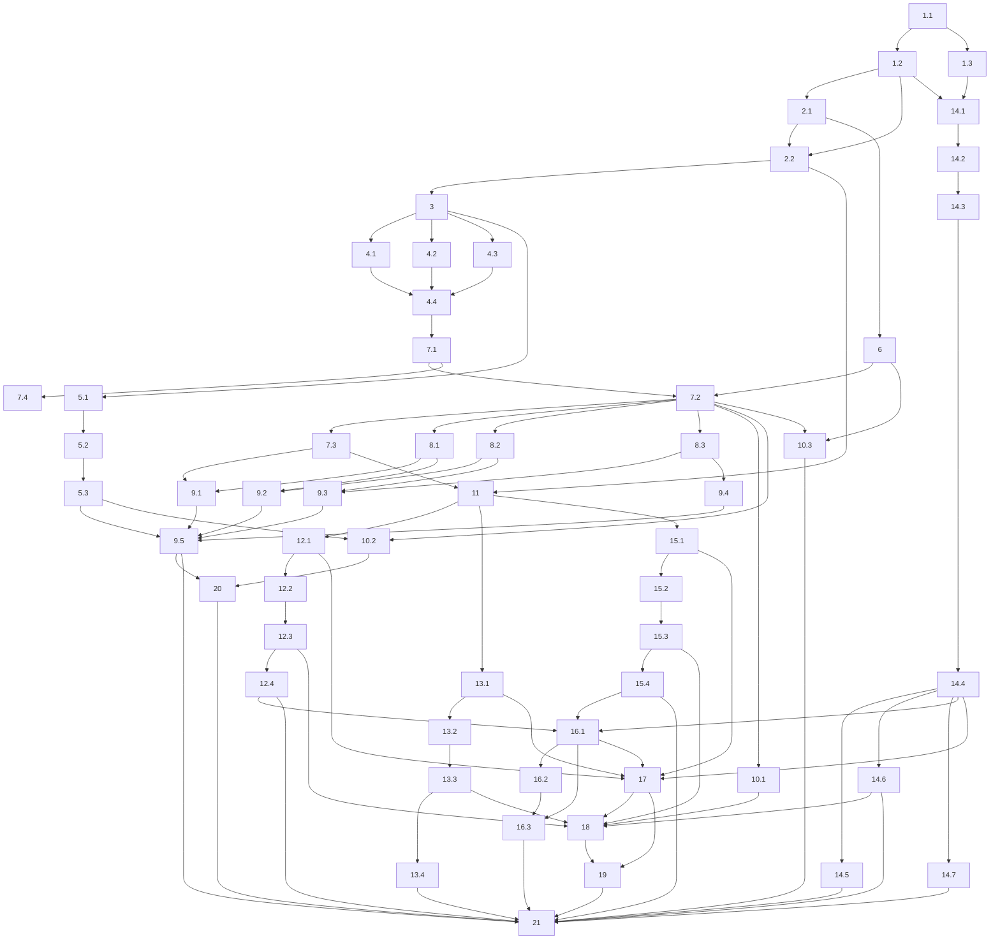

# Implementation Plan

## Overview

Ordering follows design 9.4 Risk 3: the shared-file blocker first, then the regression baseline, then ports and configuration, then the contract harness, then the two highest-value competition-day scripts (preflight, exporter), then the CDK app, smoke tester, bootstrap and Makefile, then LocalStack last as optional, then final integration. Every property test is implemented against the seeded standard-library generator harness described in design 7.1 at 100 or more iterations per property; Hypothesis is not available because Requirement 3 criterion 1 caps the dev group at ten entries.

The plan is 21 top-level tasks delivering the zero-cost Stage 1 AWS foundation: the nine port Protocols and their payload models, the contract-test harness with in-memory reference adapters, a CDK application that synthesizes but never deploys, three verification scripts (preflight, exporter, smoke tester), and the bootstrap Makefile. Nothing is deployed and no AWS account is required to run the suite end to end.

## Tasks

- [ ] 1. Land the shared-file dependency and ignore changes
- [ ] 1.1 Add the four AWS dev dependencies to the Dependency_Manifest
  - Add `boto3>=1.35.0`, `moto>=5.0.0`, `aws-cdk-lib>=2.170.0`, `constructs>=10.4.0` to `[dependency-groups] dev`, keeping the six existing entries and their specifiers, for exactly ten entries
  - Leave `[project] dependencies` at its nine entries, and leave `requires-python`, `[tool.ruff] target-version`, and `[tool.mypy] python_version` untouched
  - Use plain `moto`, not `moto[all]`, so no Docker-dependent extras enter the environment
  - Run `uv sync --python 3.12 --all-groups` and confirm `uv.lock` gains pinned entries for the four packages, and that each resolves to a `py3-none-any` wheel with no transitive dependency lacking a `linux/arm64` distribution
  - _Requirements: 3.1, 3.2, 3.3, 3.4, 3.7, 3.9_
  - _Design: 3.8 Dependency and tooling changes_

- [ ] 1.2 Extend the mypy and ruff configuration to cover `infra/` and `scripts/`, and pin the shared-file baseline
  - Replace `[tool.mypy] packages = ["youth_compass"]` with `files = ["src", "apps", "scripts", "infra"]`, keep `strict = true`, and place a reason comment beside each remaining `exclude` entry (`^adapters/aws/`, `^infra/cdk\.out/`)
  - Confirm `[tool.ruff] extend-exclude` names neither `infra` nor `scripts`, and leave `line-length` and the rule selection unchanged
  - Add `tests/unit/test_dependency_manifest.py` parsing `pyproject.toml` with `tomllib`: assert the ten dev entries, the nine runtime entries, the unchanged pins, the ruff configuration, and the mypy file set
  - Add the Property 20 test: capture the committed pre-change baseline of every table other than `[dependency-groups] dev`, `[tool.mypy]`, `[tool.ruff]`, `[tool.ruff.lint]` and assert byte-equality, so concurrent backend edits are not overwritten
  - _Requirements: 3.5, 3.6, 3.10_
  - _Design: 3.8 Dependency and tooling changes_
  - _Properties: 20_

- [ ] 1.3 Add the three ignore entries that keep the budget notification address out of version control
  - Append `cdk.out/`, `infra/cdk.out/`, and `cdk.context.json` to `.gitignore`
  - `cdk.context.json` is the one that matters for Requirement 4 criterion 12, because the CDK CLI caches `-c budgetEmail` values there
  - _Requirements: 4.12, 9.9_
  - _Design: 3.4.3 Budget stack_

- [ ] 2. Record the regression baseline and clear pre-existing type errors
- [ ] 2.1 Capture the pre-change outcome list for the existing suites
  - Run `uv run pytest tests/unit tests/integration --tb=no -q` and save the per-test outcome list as the comparison baseline for task 21
  - Record which tests open sockets, so the task 6 guard can be validated against reality rather than assumption
  - _Requirements: 2.16_
  - _Design: 7.6 Regression protection for existing suites_

- [ ] 2.2 Make `scripts/` importable and type-clean under the widened mypy file set
  - Add `scripts/__init__.py` so `import scripts.aws_preflight` resolves under the existing `pythonpath = ["."]`
  - Run `uv run mypy` and fix every finding the widened file set surfaces in `scripts/export_contracts.py`, changing behaviour in no way
  - Run `uv run ruff check .` and fix any finding now reported under `scripts/`
  - _Requirements: 3.5, 3.6, 2.16_
  - _Design: 3.5.1 Shared core, 7.6 Regression protection for existing suites_

- [ ] 3. Create the domain error hierarchy
  - Add `src/youth_compass/domain/errors.py` with `YouthCompassError` and the nine subclasses: `ObjectNotFoundError`, `DatasetNotFoundError`, `QueryNotPermittedError`, `QueryExecutionError`, `ModelInvocationError`, `ForecastNotAvailableError`, `TrainingRejectedError`, `WorkflowStateError`, `ConfigurationError`
  - Contain exception classes only; the module is additive in backend-owned space
  - Re-export from `domain/__init__.py` in the existing style, and add a unit test asserting the hierarchy and that every class derives from `YouthCompassError`
  - _Requirements: 1.6, 2.10, 2.13_
  - _Design: 3.2 Domain error hierarchy, 6.1 Port boundary_

- [ ] 4. Publish the nine port Protocols and their payload models
- [ ] 4.1 Write the three parameter-only ports
  - `ports/object_store.py` (`put`, `get`, `list`, `exists`), `ports/catalog.py` (`register`, `get`, `search_compatible`), `ports/clock.py` (`now`)
  - `@runtime_checkable` on each; `dict[str, str]` for the `put` metadata parameter; scheme-qualified URI `str` for every storage location, never `pathlib.Path`
  - Import `DatasetMetadata` and `DatasetProfile` from `youth_compass.domain` rather than redefining them
  - Give each module the three-fact docstring: Stage 1 proposal from the AWS workstream, amendable by the backend workstream, and the source document and section
  - Document per method which `domain/errors.py` type it may raise, and preserve the key/URI asymmetry from `docs/01` §5 rather than tidying it
  - _Requirements: 1.1, 1.2, 1.3, 1.4, 1.5, 1.6, 1.9_
  - _Design: 3.1 Port modules_

- [ ] 4.2 Write the query and model ports with their payload models
  - `ports/query_engine.py` with `QueryEngine.execute` plus `QuerySpec` and `QueryResult`, including `max_rows` bounds and `scanned_bytes`
  - `ports/model_provider.py` with `async def generate` plus `ModelRequest` and `ModelResponse`
  - Use `dict[str, object]` rather than `dict[str, Any]` so the no-`Any` rule holds; no `type: ignore` anywhere
  - _Requirements: 1.1, 1.2, 1.6, 1.8, 1.9, 1.11_
  - _Design: 3.1 Port modules, 4.1 Port payload models_

- [ ] 4.3 Write the forecast, workflow, checkpoint, and event ports with their payload models
  - `ports/forecast_service.py` with `get_forecast` and `trigger_training` plus `ForecastRequest`, `ForecastResult`, `ForecastPoint` (carrying `lower` and `upper`), `TrainingRequest`, `TrainingRun`, and the `TrainingStatus` enum
  - `ports/workflow_runner.py` with `start_ingestion` and `resume_after_approval` plus `IngestionRequest`, `JobReference`, `ApprovalDecision`, and the `JobStatus` enum; its docstring records the module as a proposed addition to `docs/07` §7
  - `ports/checkpoint_store.py` with `save` and `load` plus `WorkflowCheckpoint`, where `load` returns `None` for an unknown identifier rather than raising
  - `ports/event_bus.py` with `publish` and `subscribe` plus `DomainEvent`, taking `Callable` from `collections.abc`
  - _Requirements: 1.1, 1.2, 1.3, 1.10, 1.11_
  - _Design: 3.1 Port modules, 4.1 Port payload models_

- [ ] 4.4 Wire the package and prove the port surface
  - `ports/__init__.py` re-exporting all nine Protocols and all twelve payload models plus the two enums, mirroring `domain/__init__.py`
  - Unit tests asserting, per Protocol, the exact method names and parameter names against a literal expected table, and `async def` on `ModelProvider.generate`
  - Property 1: resolve every method annotation on every port Protocol and assert it is a `BaseModel` subclass, a fully parameterized standard-library generic, or a permitted scalar — never bare `dict`/`list`/`tuple`, `Any`, or `Path`; assert every import resolves to the standard library, `pydantic`, or `youth_compass.domain`; assert each of the eleven named payloads is a `BaseModel` whose `__module__` is its referencing port module, and that `DatasetMetadata`/`DatasetProfile` resolve under `youth_compass.domain`
  - Property 2: generate objects from subsets of each Protocol's declared method names and assert `isinstance` is `True` exactly when every declared name is present
  - Property 3: assert every port module docstring is non-empty and states all three required facts
  - Confirm `uv run mypy src apps scripts` reports zero errors
  - _Requirements: 1.1, 1.2, 1.4, 1.5, 1.8, 1.9, 1.10, 1.11_
  - _Design: 3.1 Port modules, 4.1 Port payload models, 7.4 Unit and example tests_
  - _Properties: 1, 2, 3_

- [ ] 5. Add provider-selection configuration
- [ ] 5.1 Extend `src/youth_compass/config.py` with closed provider sets
  - Add the five `StrEnum` types (`StorageProvider`, `CatalogProvider`, `QueryProvider`, `ModelProviderName`, `ForecastProvider`) and the five per-Port settings models carrying `provider` plus the provider-specific extras `root`, `bucket`, `database`, `workgroup`
  - Add the five optional top-level fields to `AppSettings` and set `protected_namespaces=()` so the `model` field coexists with Pydantic's `model_*` API
  - Add the local-default validator (absent key under `environment: local` resolves to that Port's local provider name) and the strict validator (any of the five absent under a non-local environment raises `ConfigurationError` naming every omitted key and returning no settings object)
  - Change no existing field, default, or method signature, so `tests/unit/test_config.py` passes unmodified
  - Property 50: for every permitted value loading resolves to it, and for every outside value loading raises naming the rejected value and the provider-selection key
  - Property 51: exercise the local-default and non-local-strict branches over generated omitted-key subsets
  - _Requirements: 10.3, 10.4, 10.9, 10.10_
  - _Design: 3.6.2 Where provider validation lives, 3.6.3 Validation and precedence_
  - _Properties: 50, 51_

- [ ] 5.2 Add `AppSettings.load` with recursive four-source precedence
  - Layer `configs/base.yaml`, then `configs/{environment}.yaml`, then `YOUTH_COMPASS_`-prefixed environment variables using the existing `__` delimiter, then explicit overrides
  - Merge recursively so a later layer supplying one subkey does not discard sibling subkeys resolved earlier
  - Raise an error naming the environment and the expected file path when the environment YAML is absent, returning no settings object
  - Keep `from_yaml` and `load_settings` at their current signatures and behaviour
  - Property 52: over generated four-layer nested configurations, every key resolves to the last layer that supplies it, unsupplied keys keep their model default, and nesting is preserved
  - _Requirements: 10.6, 10.11_
  - _Design: 3.6.3 Validation and precedence_
  - _Properties: 52_

- [ ] 5.3 Add the two provider configuration files and their test
  - `configs/local.yaml` and `configs/aws.example.yaml` reproducing `docs/01` §6 exactly, with every account-specific identifier in `aws.example.yaml` written as a marked placeholder token and a comment stating that account identifiers are supplied at runtime
  - `tests/contract/test_config_providers.py` loading both files and asserting no error plus that each of the five resolved provider values equals the documented value
  - Assert `configs/local.yaml` loads successfully with all five AWS environment variables unset and resolves to five local provider names
  - Property 53 here; the credential- and account-pattern half of Property 18 is asserted for `configs/aws.example.yaml` in task 10.2
  - _Requirements: 10.1, 10.2, 10.5, 10.7, 10.8_
  - _Design: 3.6.1 File shapes, 7.4 Unit and example tests_
  - _Properties: 53_

- [ ] 6. Install the session-wide socket guard
  - Add `tests/conftest.py` with an autouse fixture patching `socket.socket.connect` to raise `AssertionError` naming the test and the destination for any address outside `127.0.0.0/8`, `::1`, and AF_UNIX
  - Re-run `tests/unit` and `tests/integration` and diff against the task 2.1 baseline; the ASGI-in-process `httpx` tests and the CSV profiler tests must keep their exact results
  - If a pre-existing test does open a socket, narrow the guard's scope to `tests/contract/` and `tests/infra/` and record the reduced coverage of Requirement 9 criterion 10
  - _Requirements: 9.10, 2.16_
  - _Design: 3.3.2 Credential neutralization and abort guards, 7.3 Test layout, 7.6 Regression protection_
  - _Properties: 13_

- [ ] 7. Build the contract-harness core
- [ ] 7.1 Write `tests/contract/registry.py`
  - One registry dict and one `register_*` decorator per Port, where a factory is a zero-argument callable returning a context manager yielding a fresh adapter instance
  - Reject duplicate names so a mis-registration fails loudly rather than shadowing
  - _Requirements: 2.1_
  - _Design: 3.3.1 The binding mechanism_
  - _Properties: 12_

- [ ] 7.2 Write `tests/contract/conftest.py`
  - Session-scoped autouse fixture in the order of design diagram 1.3: guard before mutate (read the four credential variables and `pytest.exit(..., returncode=3)` if any is set and non-empty), snapshot all five variables including absence, set the placeholders, delete `AWS_PROFILE`, set `AWS_DEFAULT_REGION=ap-northeast-1`, restore in a `finally` with absent variables deleted rather than blanked
  - Enter `mock_aws(config={"core": {"service_whitelist": [...], "mock_credentials": True}})` for AWS-touching cases so an unexpected service fails on the service, not just the host
  - Install a `botocore` `before-send.*.*` handler raising when the outbound host is not one Moto serves, covering clients constructed outside a `mock_aws` context
  - Import `tests/contract/reference/__init__.py` at module load so the registries are populated before collection, and turn each registry into a function-scoped parametrized fixture with readable ids
  - _Requirements: 2.2, 2.4, 2.5, 2.6, 2.17, 2.18, 9.1, 11.5_
  - _Design: 3.3.1, 3.3.2, 1.3 Where Moto and the credential guards sit_
  - _Properties: 13, 14, 15, 16_

- [ ] 7.3 Write `tests/contract/generators.py`
  - Deterministic generators on `random.Random(seed)`: `payloads()`, `object_keys()`, `dataset_metadata()`, `query_specs()`, `env_var_states()`, `tag_subsets()`, `outcome_multisets()`, `step_outcome_assignments()`, `nested_config_layers()`
  - `samples(n=100)` driver so a property is one test node and one failure rather than 100 parametrized nodes
  - Fixed default seed, overridable via `YOUTH_COMPASS_PROPERTY_SEED`; on failure report the seed and the failing sample for replay
  - Include the required boundary values by construction: payload sizes 0, 1, and at least 1 MiB; key lengths 1 and at least 256; more than one listing page; zero-byte objects
  - _Requirements: 2.7_
  - _Design: 7.1 Property-test implementation without a PBT library_

- [ ] 7.4 Write `tests/contract/README.md`
  - Exactly three ordered binding steps: write and decorate the factory context manager, import the module from `reference/__init__.py` or an adapter-side conftest, run `uv run pytest tests/contract -k "<adapter-name>"`
  - Name the fixture to implement and the Port test class it binds to for each of the nine Ports
  - _Requirements: 2.14_
  - _Design: 3.3.1 The binding mechanism_

- [ ] 8. Write the nine in-memory reference implementations
- [ ] 8.1 `reference/object_store.py`, `reference/catalog.py`, `reference/clock.py`
  - `InMemoryObjectStore` holding bytes in a dict and returning scheme-qualified URIs from `put`; `InMemoryDataCatalog` upserting by identifier and filtering `search_compatible` by grain; `FixedClock`/`InMemoryClock` returning timezone-aware UTC values that never decrease
  - Raise `ObjectNotFoundError` and `DatasetNotFoundError` from the domain hierarchy, never an OS or technology error
  - Register each through its `register_*` decorator under the name `reference`
  - _Requirements: 2.2, 2.3_
  - _Design: 3.3 Contract-test harness_

- [ ] 8.2 `reference/query_engine.py`, `reference/model_provider.py`
  - `InMemoryQueryEngine` is allowlist-aware, deterministic in row and column order, honours `max_rows`, and raises `QueryNotPermittedError` for a table outside the allowlist and `QueryExecutionError` for engine-side failure
  - `EchoModelProvider` implements `async def generate`, returns a schema-valid `ModelResponse`, and respects or reports `max_tokens`
  - _Requirements: 2.2, 2.3_
  - _Design: 3.3 Contract-test harness_

- [ ] 8.3 `reference/forecast_service.py`, `reference/workflow_runner.py`, `reference/checkpoint_store.py`, `reference/event_bus.py`
  - `InMemoryForecastService` raises `ForecastNotAvailableError` for an unknown key and returns a `TrainingRun` with a non-empty id and a queued-or-running status
  - `InMemoryWorkflowRunner` returns a `JobReference` with a non-empty `job_id`, raises `WorkflowStateError` for an unknown job and for a second approval of a settled job
  - `InMemoryCheckpointStore` returns `None` for an unknown identifier and keeps the later checkpoint on re-save; `InMemoryEventBus` delivers matching events to subscribers in publish order and no non-matching event
  - `reference/__init__.py` imports every module so registration happens on package import
  - Store all state in process memory only: no file, no directory, no network connection
  - _Requirements: 2.2, 2.3_
  - _Design: 3.3 Contract-test harness_

- [ ] 9. Write the nine contract suites
- [ ] 9.1 `test_object_store_contract.py`
  - Property 5: round-trip byte and length equality over the generated size and key-length matrix including the named boundaries
  - Property 6: two writes to one key leave exactly one readable object with the later content and one `list` entry
  - Property 7: `list(prefix)` is exact set equality — no foreign key, no omission, empty collection when nothing matches
  - Property 8 for this Port: `get` of an unwritten URI raises `ObjectNotFoundError`, with no `botocore` or OS exception propagating
  - Example cases: `exists` is `False` before and `True` after `put`; `store.exists(store.put(key, ...))` holds; `key in store.list(prefix_of(key))`
  - _Requirements: 2.7, 2.8, 2.9, 2.10_
  - _Design: 3.3.3 Per-Port assertion sets_
  - _Properties: 5, 6, 7, 8_

- [ ] 9.2 `test_catalog_contract.py` and `test_query_engine_contract.py`
  - Property 9: register-then-get field equality, and re-registration upserts to exactly one record with the later values
  - Property 10: an identical `QuerySpec` executed twice yields the same row count, identical row values in identical order, and identical column names in identical order
  - Property 8 for these Ports: unknown dataset id raises `DatasetNotFoundError`; a non-allowlisted table raises `QueryNotPermittedError` and returns no row
  - Example cases: `search_compatible` returns only grain-matching records; `max_rows` is honoured
  - _Requirements: 2.10, 2.11, 2.12, 2.13_
  - _Design: 3.3.3 Per-Port assertion sets_
  - _Properties: 8, 9, 10_

- [ ] 9.3 `test_model_provider_contract.py`, `test_forecast_service_contract.py`, `test_workflow_runner_contract.py`
  - `await generate(...)` returns a schema-valid `ModelResponse`; `max_tokens` respected or reported
  - Property 8 for these Ports: unknown forecast key raises `ForecastNotAvailableError`; resume of an unknown job and approve-then-approve raise `WorkflowStateError`
  - Example cases: `trigger_training` returns a non-empty run id with a queued-or-running status; `start_ingestion` returns a non-empty `job_id`
  - _Requirements: 1.1, 2.10_
  - _Design: 3.3.3 Per-Port assertion sets_
  - _Properties: 8_

- [ ] 9.4 `test_checkpoint_store_contract.py`, `test_event_bus_contract.py`, `test_clock_contract.py`
  - Property 11: checkpoint save-then-load equality, `None` for a never-saved identifier, and `Clock.now()` timezone-aware with `utcoffset() == timedelta(0)` and non-decreasing across a generated call sequence
  - Example cases: save twice keeps the later checkpoint; a subscribed handler receives every matching event in publish order and no non-matching event
  - _Requirements: 1.3, 2.10_
  - _Design: 3.3.3 Per-Port assertion sets_
  - _Properties: 11_

- [ ] 9.5 Prove the harness itself
  - Property 12: register N factories for one Port in a scratch registry and assert the class executes exactly N times over distinct instances with the suite source file unchanged
  - Property 13: assert no credential is read outside the harness placeholders, every `boto3` call is served by Moto, every socket attempt targets loopback, and a non-loopback attempt raises naming the test and the destination
  - Property 14: over generated pre-session assignments of the five variables, run a session to completion and assert exact restoration, absent staying absent, on both pass and fail
  - Property 15: with an ambient credential set, and with a call aimed at a non-Moto endpoint, assert the session aborts with the right message and executes zero further contract cases
  - Property 16: over permutations of a case subset, assert each case entered with zero objects, zero datasets, zero query results, and that two consecutive suite runs give identical per-case results with no manual cleanup
  - Assert the reference-bound suite reports zero failed, zero errored, zero skipped, at least one executed test per Port, and completes within 60 seconds
  - _Requirements: 2.1, 2.3, 2.6, 2.15, 2.17, 2.18_
  - _Design: 3.3.1, 3.3.2, 7.5 Smoke checks in CI_
  - _Properties: 12, 13, 14, 15, 16_

- [ ] 10. Write the source-hygiene guard tests
- [ ] 10.1 `test_guards_imports.py`
  - `ast.parse` every `.py` found by `Path.rglob` under `ports/`, `domain/`, `application/` and separately under all of `src/youth_compass/`; collect every `Import`/`ImportFrom` name; assert none matches `{boto3, botocore, aws_cdk, constructs, moto, fastapi}` or a module under `adapters.`
  - Accumulate all violations and report each as `path:lineno: imports X` rather than stopping at the first
  - Property 4 second clause: plant N forbidden imports in a synthetic module tree and assert exactly N findings, each naming the module path and the import name
  - _Requirements: 1.7, 9.4_
  - _Design: 3.3.4 Guard tests_
  - _Properties: 4_

- [ ] 10.2 `test_guards_no_account_ids.py` and `test_guards_secret_scan.py`
  - Account-id scan: `(?<!\d)\d{12}(?!\d)` over `scripts/**/*.py` and `infra/**/*.py`; the test lives under `tests/`, which the scan does not cover, so the pattern cannot match itself
  - Secret scan over `git ls-files` output for access-key-id shapes, 40-character secret-shaped strings adjacent to a secret-key label, and session-token shapes; findings report `path:lineno` only and never the matched value
  - Extend the scan assertions to `configs/aws.example.yaml` (marked placeholders only, no 12-digit identifier, no key, secret, or token) so the configuration half of Property 18 is covered now; the `docker-compose.yml` clause is added by task 20
  - _Requirements: 9.8, 9.9, 10.5_
  - _Design: 3.3.4 Guard tests_
  - _Properties: 18_

- [ ] 10.3 `test_guards_network.py`
  - Assert the task 6 socket guard is active during a contract session and that a deliberate non-loopback connect attempt raises with the test name and the destination in the message
  - _Requirements: 9.10_
  - _Design: 3.3.4 Guard tests_
  - _Properties: 13_

- [ ] 11. Build the shared verification-script core
  - `scripts/aws_common.py` with `Outcome`, `CheckResult` (detail capped at 120 characters), `Report` (including the four-way summary), `boto_config()` at 5-second connect and read timeouts with at most 2 retries, `run_check` catching every `BaseException` except `KeyboardInterrupt`/`SystemExit` into a `FAIL` row with a 200-character message, `redact`, `validate_region`, `exit_status`, `render_table`, `render_json`, `run_prefix`, and `COST_RATES` with an estimates-to-confirm comment
  - `ThreadPoolExecutor(max_workers=8)` with one client constructed inside each check, and results re-sorted into a fixed display order so the table is deterministic
  - `tests/scripts/test_aws_common.py` implementing Property 26 (one row per check, closed outcome vocabulary, 120-character details, remediation-line count equal to fail plus warn, summary counts summing correctly, nothing credential-shaped in the output), Property 27 (`--json` matches the table and shares the exit status), Property 28 first clause (exit `1` if and only if at least one `fail`), Property 29 (injected exception, timeout, and throttle at each index isolates to that row and every remaining check still runs), Property 31 (invalid region rejected before any AWS call, missing region or account is an error rather than a compiled-in fallback, timeouts and retry budget within bounds), Property 38 (run-prefix charset, length, literal, timestamp, 8-character random suffix, uniqueness within a process), Property 39 (the two bounded option ranges and their defaults)
  - _Requirements: 5.12, 5.13, 5.14, 5.15, 5.16, 5.17, 5.18, 5.21, 5.22, 6.8, 6.12, 6.13, 6.16, 9.7_
  - _Design: 3.5.1 Shared core, 6.3 Verification scripts_
  - _Properties: 26, 27, 28, 29, 31, 38, 39_

- [ ] 12. Build the preflight checker
- [ ] 12.1 Credential resolution and CDK bootstrap checks
  - `scripts/aws_preflight.py` runnable with no arguments, accepting `--region` defaulting to `ap-northeast-1` and `--json`
  - Report the credential resolution source as exactly one of the six names, source name only; on success report the account number, full principal ARN, and effective region
  - Query CloudFormation for `CDKToolkit`, passing only on a completed create or update status, otherwise failing with the observed status or absence plus the `cdk bootstrap aws://<account>/<region>` remediation built from the discovered values
  - Property 30: when credentials fail to resolve, every AWS-requiring check is `skip`, the credential check is `fail` with configuration steps, and the exit status is non-zero
  - _Requirements: 5.1, 5.2, 5.3, 5.4, 5.5, 5.6_
  - _Design: 3.5.2 scripts/aws_preflight.py_
  - _Properties: 30_

- [ ] 12.2 Service reachability and permission probes
  - One read-only list-or-describe call per service for Amazon S3, AWS Glue, Amazon Athena, AWS Step Functions, AWS Lambda, and Amazon Bedrock, one outcome each, `fail` on an authorization error or non-completion, with the Bedrock outcome clamped to pass or warn
  - Probe the five Stage 2 permissions through `iam:SimulatePrincipalPolicy` only, mapping `allowed`/`denied`/`indeterminate` to PASS/FAIL/WARN with the word carried in the detail, and issuing no call that creates, modifies, or deletes anything
  - Rewrite an `assumed-role` caller ARN to its `arn:aws:iam::<acct>:role/<Role>` form before simulating, and report `indeterminate` for every permission when the simulate call is itself denied
  - Do not assert real IAM grants: design 7.7 records that simulation evaluates policy, not runtime conditions such as resource policies or SCPs
  - _Requirements: 5.7, 5.8_
  - _Design: 3.5.2 scripts/aws_preflight.py, 7.7 What Stage 1 cannot verify_

- [ ] 12.3 Bedrock readiness and the always-on cost guard
  - Model-access check combining `bedrock:ListFoundationModels` with a simulate of `bedrock:InvokeModel`, reporting permitted model identifiers and passing when at least one is permitted
  - Cost guard enumerating all five always-on types read-only (`sagemaker:ListEndpoints`, `sagemaker:ListNotebookInstances`, `ec2:DescribeNatGateways`, `rds:DescribeDBInstances`, and `ec2:DescribeAddresses` filtered to entries with no `AssociationId`), passing with count zero and warning otherwise
  - Restrict all deferred-service contact to read-only, no-charge calls: no inference, training, tuning, or endpoint or agent deployment call anywhere under `scripts/`
  - Property 32: every Bedrock condition yields `warn`, states that competition rules require Bedrock model access before submission, and leaves the exit status identical to the check being removed
  - Property 33: over generated always-on resource sets, `pass` with count zero when empty and `warn` otherwise, with identifier, type, region, an accrues-charges statement, and the removal command for every resource
  - _Requirements: 5.9, 5.10, 5.11, 5.20, 9.12_
  - _Design: 3.5.2 scripts/aws_preflight.py, 6.3 Verification scripts_
  - _Properties: 32, 33_

- [ ] 12.4 Preflight scenario tests under Moto
  - `tests/scripts/test_preflight.py` covering the five enumerated account scenarios: all-pass exits `0`; missing bootstrap exits non-zero; no credentials exits non-zero with remaining checks skipped; an always-on resource exits `0` with a warn; no Bedrock model access exits `0` with a warn
  - Attach explicit inline policies to the simulated principal rather than relying on AWS managed policies, which Moto does not load by default
  - Assert the run completes within 30 seconds when every call succeeds, and that the summary reports the four counts and the elapsed seconds
  - _Requirements: 5.16, 5.19, 5.22_
  - _Design: 3.5.2, 7.3 Test layout, 7.4 Unit and example tests_
  - _Properties: 26, 30, 32, 33_

- [ ] 13. Build the data exporter
- [ ] 13.1 Exporter models, destination preflight, and dry run
  - `scripts/aws_export.py` accepting `--dest`, repeatable `--bucket` and `--database`, `--region` defaulting to `ap-northeast-1`, and `--dry-run`, creating the destination when absent
  - `ExportEntry`, `CatalogExportEntry`, `ExportManifest`, `ExportOutcome`, and `ChecksumAlgorithm` in the shapes design 4.2 specifies
  - Destination preflight before any download: unwritable destination or free space below the total byte size errors naming the destination and both byte counts and exits non-zero having downloaded nothing
  - Property 43: `--dry-run` leaves the destination tree byte-identical, issues zero downloads, writes no file, and prints every object and catalog item with each size plus a total equal to their sum
  - _Requirements: 7.1, 7.9, 7.11_
  - _Design: 3.5.5 scripts/aws_export.py, 4.2 Script reporting models_
  - _Properties: 43_

- [ ] 13.2 Object export, checksum decision, path safety, and retry
  - Paginate with `list_objects_v2` so buckets beyond one listing page export completely, and export zero-byte objects rather than skipping them
  - Checksum resolution in order: `head_object(..., ChecksumMode="ENABLED")` preferring a reported `ChecksumSHA256`; else the ETag as `etag-md5` when it has no `-<parts>` suffix; else `etag-multipart` with `checksum_comparable: false` and a size comparison, so the skip/re-download decision stays deterministic
  - Key-to-path safety rejecting absolute keys, any `..` segment, resolved paths escaping the destination, and keys ending in `/`, each recorded `failed` with source URI and reason while the run continues
  - Retry a failed object download or catalog read for up to 3 additional attempts, waiting at least 1 and at most 10 seconds between attempts
  - Property 42: matching destination checksum means no download and a `skipped` count; a differing one means re-download, overwrite to byte-identical, and both expected and observed values reported; a second consecutive export over an unchanged destination issues zero downloads
  - Property 45: k transient failures succeed when k is at most 3 additional attempts and record `failed` beyond that, with every observed wait inside the 1-to-10-second window
  - _Requirements: 7.2, 7.5, 7.8, 7.12, 7.13_
  - _Design: 3.5.5 scripts/aws_export.py_
  - _Properties: 42, 45_

- [ ] 13.3 Catalog export, manifest, and console summary
  - Export one JSON document per selected Glue database definition and one per table definition beneath the destination
  - Write `manifest.json` with one entry per attempted item carrying source URI, relative destination path, byte size, reported checksum, locally computed checksum, algorithm, comparability, outcome, and reason
  - Print the exported count, total bytes, skipped count, failure count, and the manifest path
  - Property 41: the written file set equals the object key set mapped through the per-bucket relative-path rule, catalog documents exist per database and table, the manifest entry set is in one-to-one correspondence with the attempted items, and parsing the written manifest reproduces an equal model
  - Property 44: generated failing subsets appear as `failed` with identifier and reason, no file is written outside the destination, every remaining item is still attempted, and the run exits non-zero
  - _Requirements: 7.3, 7.4, 7.6, 7.7_
  - _Design: 3.5.5 scripts/aws_export.py, 4.2 Script reporting models_
  - _Properties: 41, 44_

- [ ] 13.4 Exporter scenario tests under Moto
  - `tests/scripts/test_export.py` covering the six enumerated scenarios: nested keys plus a zero-byte object, listing spanning more than one page, skip behaviour on a second run over an unchanged destination, re-download when a destination checksum differs, failure recording with a non-zero exit status, and an unchanged destination after `--dry-run`
  - _Requirements: 7.10_
  - _Design: 7.3 Test layout, 7.4 Unit and example tests_
  - _Properties: 41, 42, 43, 44, 45_

- [ ] 14. Build the CDK application
- [ ] 14.1 Infra scaffolding and environment resolution
  - `infra/__init__.py`, `infra/errors.py` with `InfraConfigError`, `infra/cdk.json` with `{"app": "python app.py", "versionReporting": false}`
  - `infra/environments.py` with the frozen `EnvironmentConfig` dataclass, the `ENVIRONMENTS` mapping for `dev`/`demo`/`hackathon` at 10/20/50 USD, `DEFAULT_REGION = "ap-northeast-1"`, and `resolve_environment` treating absence as invalid rather than defaulting
  - Region resolution order `-c region`, then `CDK_DEFAULT_REGION`, then `DEFAULT_REGION`
  - `tests/infra/test_environments.py` with Property 21: resolution succeeds exactly for the three names and otherwise raises naming the supplied value and all three accepted values with no template written; every table entry has a 1-to-32-character prefix, four non-empty tags, and one positive budget threshold
  - Unit test on the three literal thresholds 10/20/50
  - _Requirements: 4.2, 4.3, 4.4, 4.5_
  - _Design: 3.4.1 Context environments, 6.2 Infrastructure synthesis_
  - _Properties: 21_

- [ ] 14.2 `TaggedStack` base with complete tag enforcement
  - `infra/stacks/__init__.py` and `infra/stacks/base.py` validating the four mandatory tags before calling `super().__init__`, so a failure writes no template
  - Report every problem together — missing, empty, and over-255-character values — in one `InfraConfigError`, and always set `Environment` to the resolved environment name
  - Property 22 first clause: for every non-empty removed-or-blanked tag subset, the error names exactly that subset, exits non-zero, and writes no template
  - _Requirements: 4.6, 4.7_
  - _Design: 3.4.2 Mandatory-tag enforcement_
  - _Properties: 22_

- [ ] 14.3 `BudgetStack` and notification-address resolution
  - `infra/stacks/budget.py` with exactly one `CfnBudget`, `budget_type="COST"`, `time_unit="MONTHLY"`, the environment threshold in USD, and two `ACTUAL` / `GREATER_THAN_OR_EQUAL_TO` / `PERCENTAGE` notifications at 80 and 100 with one `EMAIL` subscriber each
  - Read the address from context key `budgetEmail`, falling back to `YOUTH_COMPASS_BUDGET_EMAIL`, context preferred; absent, empty, or lacking `@` raises `InfraConfigError` naming both the context key and the variable and writes no template
  - Define no construct for Amazon Bedrock, Amazon SageMaker AI, or Amazon Bedrock AgentCore, and none of the five always-on types
  - Property 23: the address and region precedence tables over present/absent combinations
  - Property 24: per environment and address, exactly one monthly cost budget at that threshold with exactly the two notifications and the supplied subscriber
  - _Requirements: 4.8, 4.9, 4.10, 4.11, 4.17_
  - _Design: 3.4.3 Budget stack_
  - _Properties: 23, 24_

- [ ] 14.4 `infra/app.py` entry point
  - Resolve the environment and region from context, construct the budget stack, and let `InfraConfigError` propagate so the CDK CLI exits non-zero with no template written
  - Verify `cdk synth -c env=<each of the three> -c budgetEmail=...` with credentials unset writes one template per stack, exits zero within 120 seconds, and invokes no creating, updating, or deleting AWS API
  - _Requirements: 4.1, 4.13_
  - _Design: 3.4 CDK application, 1.4 CDK application and stack structure_

- [ ] 14.5 Snapshot testing with template normalization
  - `tests/infra/__init__.py`, `tests/infra/constants.py` with `PLACEHOLDER_ACCOUNT = "0" * 12` (constructed, not written as a literal) and `PLACEHOLDER_EMAIL = "budget-alerts@example.invalid"`, and `tests/infra/conftest.py` synthesizing with `Environment(account=PLACEHOLDER_ACCOUNT, region="ap-northeast-1")` and reading no credentials
  - `tests/infra/snapshots/` with one committed expected template per environment and stack, containing only the placeholder address
  - `tests/infra/test_snapshots.py` normalizing before comparison: drop `Resources.CDKMetadata`, `Parameters.BootstrapVersion`, `Rules.CheckBootstrapVersion`, and any `Metadata."aws:cdk:path"`; refresh with `UPDATE_INFRA_SNAPSHOTS=1`
  - Property 25: plant mutations at known dotted paths and assert the reporter walks both documents recursively to report exactly that set of resource paths with a non-zero exit, and that an unmutated normalized template equals the committed one for every stack
  - _Requirements: 4.14, 4.15, 4.19_
  - _Design: 3.4.4 Snapshot testing and template normalization_
  - _Properties: 25_

- [ ] 14.6 Tag and deferred-service assertion tests
  - `tests/infra/test_tags.py` with Property 22 second clause: for every environment and stack, all four tags present, non-empty, at most 255 characters, and `Environment` equal to the resolved name
  - `tests/infra/test_no_deferred_services.py` with Property 19: synthesize all three environments and assert zero resources whose type starts with `AWS::Bedrock`, `AWS::SageMaker`, or `AWS::BedrockAgentCore`, and zero of the five always-on types, with failures naming stack, logical id, and resource type
  - Confirm `tests/infra/` is collected by a bare `uv run pytest` with `testpaths` and `pythonpath` unchanged
  - _Requirements: 4.16, 4.18, 9.5, 9.6_
  - _Design: 3.3.4 Guard tests, 3.4 CDK application_
  - _Properties: 19, 22_

- [ ] 14.7 `infra/README.md`
  - Document every stack, the context keys and environment variables each requires, the budget threshold per environment, and the exact `cdk synth` command for each of the three environments
  - _Requirements: 4.20_
  - _Design: 3.4 CDK application_

- [ ] 15. Build the smoke tester
- [ ] 15.1 Run scaffolding, mode line, options, and cost reporting
  - `scripts/aws_smoke_test.py` accepting `--real`, `--region`, `--sfn-timeout` (default 120, range 10-600), `--scan-limit` (default 104,857,600, range 1,048,576-1,073,741,824), and `--json`, printing the mode line before the first step
  - Default Moto mode binds every client to Moto and issues zero calls to a live account; `--real` is the single flag unlocking the live path
  - Name every created resource with `run_prefix` from `aws_common`
  - Print a per-step table and an estimated cost to two decimal places with the per-unit rate for each of S3, Glue, Athena, and Step Functions, reporting `0.00` and zero billable units in Moto mode
  - Property 34: without `--real`, every client is Moto-bound, zero calls reach a live account, cost is `0.00`, and all four services report zero billable units
  - _Requirements: 6.1, 6.2, 6.3, 6.8, 6.12, 6.13, 6.16_
  - _Design: 3.5.3 scripts/aws_smoke_test.py_
  - _Properties: 34, 38, 39_

- [ ] 15.2 The four steps, with the Moto fidelity boundary made visible
  - `s3_roundtrip` writes 10 records at most 4 KiB, reads back, and asserts `sha256` equality using the same function both ways
  - `glue_register` registers a table and asserts `get_table` returns exactly the registered column names, types, and order with no extra and no missing column
  - `athena_query` submits, polls, paginates, parses, and asserts 10 rows with every field equal to what was written; fails on non-completion within 60 seconds or scanned bytes at or above the configured limit, printing the observed value beside the limit
  - In Moto mode, seed the Moto Athena backend with the expected column metadata and the 10 rows inside a `_seed_moto_athena()` that is unreachable when `--real` is set, and annotate the row `(simulated: moto seeds results)`
  - `stepfunctions_execute` enters `mock_aws(config={"stepfunctions": {"execute_state_machine": True}})` with a single-`Pass` definition and asserts `SUCCEEDED` within the configured timeout, annotated `(simulated: moto interpreter)`
  - Assert only what design 3.5.4 says Moto verifies: no claim about Athena SQL semantics, scanned-byte accounting, or real Step Functions state transitions
  - Property 35: written bytes equal read bytes by checksum, and the registered column schema round-trips exactly
  - _Requirements: 6.4, 6.5, 6.6, 6.7, 6.14_
  - _Design: 3.5.3, 3.5.4 Moto fidelity boundary, 7.7 What Stage 1 cannot verify_
  - _Properties: 35_

- [ ] 15.3 Dependency-graph skipping, the deadline, and unconditional cleanup
  - Declare the dependency edges from design 3.5.3 and mark a failed step's transitive dependents `skipped` while independent steps still execute
  - Stop starting new steps at the 300-second deadline, mark every unstarted step `skipped`, and exit non-zero
  - Run cleanup as a `finally`-scoped phase over a registry of created resources after any step failure, assertion failure, Athena timeout, scanned-byte breach, or deadline expiry, retrying each deletion up to 3 attempts at most 60 seconds per resource
  - On a surviving resource, print its identifier and removal command and force a non-zero exit; exit `0` only when every step is `pass` and every created resource was deleted
  - Property 36: any single injected failure or deadline still reaches cleanup and leaves zero resources bearing the run prefix; a permanent deletion failure names the survivor and its removal command and exits non-zero
  - Property 37: the `skipped` set equals the failing step's transitive dependents, and every later independent step still runs
  - Property 28 second clause: exit `0` if and only if every step passes and zero created resources survive
  - _Requirements: 6.9, 6.10, 6.11, 6.15, 6.19, 6.20_
  - _Design: 3.5.3, 6.4 Mutating operations_
  - _Properties: 28, 36, 37_

- [ ] 15.4 Real-path prerequisite gate and end-to-end Moto test
  - With `--real`, check credentials, target region, and the required Stage 2 resource, printing an error naming each unavailable item, creating no resource, and exiting `1`
  - `tests/scripts/test_smoke_test.py` exercising the whole run end to end in Moto mode under `uv run pytest`, asserting exit `0`, zero surviving created resources, and a duration under 60 seconds
  - Property 40: for every non-empty unavailable subset, the error names exactly those members, zero resources are created, and the exit status is `1`
  - _Requirements: 6.17, 6.18_
  - _Design: 3.5.3, 7.3 Test layout_
  - _Properties: 34, 35, 36, 37, 40_

- [ ] 16. Build the bootstrap and teardown drivers
- [ ] 16.1 `scripts/aws_bootstrap.py` step model, confirmation gate, and idempotence
  - `BootstrapStep` with a name, `detect()` returning `satisfied` or `needs_change`, and `run()`, over the five ordered steps: preflight, CDK bootstrap, budget stack deploy, data stack deploy, smoke test `--real`
  - Resolve the step list from the stacks the CDK app actually defines, and report a configuration error naming Stage 2 when the data stack is absent rather than silently succeeding with four steps
  - Idempotence detection: CDK bootstrap satisfied when preflight already observed `CDKToolkit` complete; a stack deploy satisfied when `npx cdk diff --fail` exits `0`; verification steps never skipped and reported `unchanged`
  - Confirmation gate printing account number, region, and every stack to be deployed, requiring the literal `yes`, refusing to run when stdin is not a TTY and `--assume-yes` is absent, and treating a non-matching response as a non-zero-exit cancellation
  - Stop the chain at the first non-zero step, printing the failing step, the unexecuted step names, and the total elapsed whole seconds; print each step's name and elapsed whole seconds as it terminates; on success print the per-step `changed`/`unchanged` summary and total elapsed seconds
  - Do not assert the 15-minute budget or any real `cdk bootstrap`/`cdk deploy` behaviour: design 7.7 defers both to a Stage 2 rehearsal
  - _Requirements: 8.2, 8.3, 8.4, 8.5, 8.6, 8.8, 8.15, 8.16, 8.17_
  - _Design: 3.7.2 Step model and idempotence, 6.4 Mutating operations, 7.7 What Stage 1 cannot verify_
  - _Properties: 28, 46, 47, 48_

- [ ] 16.2 `scripts/aws_teardown.py` with the account-number confirmation
  - Print account number, region, and every stack to be destroyed, and begin destroying only after the operator enters the 12-digit account number, obtained from `GetCallerIdentity` at runtime rather than from a literal so the account-id guard stays clean
  - Apply the same non-TTY refusal and cancelled-is-non-zero rules
  - _Requirements: 8.11, 8.15, 8.16, 9.8_
  - _Design: 3.7.2 Step model and idempotence_
  - _Properties: 46_

- [ ] 16.3 `tests/scripts/test_bootstrap.py`
  - Property 46: over generated response strings, a gated target proceeds if and only if the response exactly equals its required value; non-matching responses issue zero mutating calls, print a cancellation message, and exit non-zero; a non-TTY invocation without the skip option does the same with the unattended message; the pre-prompt output always contains account, region, and every stack name
  - Property 47: for every already-satisfied step subset, those steps report `unchanged` with no deploy or bootstrap call and every deployed stack unmodified; all-satisfied exits zero with every step `unchanged`
  - Property 48 first clause: each terminating step emits exactly one line with its name and elapsed whole seconds
  - Property 28 third clause: over generated step exit-status assignments, the executed sequence equals the declared prefix through the first non-zero step, the output names the failing step and exactly the unexecuted steps, and the exit is non-zero
  - _Requirements: 8.3, 8.4, 8.5, 8.8, 8.15, 8.16, 8.17_
  - _Design: 3.7.2 Step model and idempotence, 7.3 Test layout_
  - _Properties: 28, 46, 47, 48_

- [ ] 17. Write the Makefile
  - `hackathon-bootstrap` invocable from the repository root with no additional arguments, wrapping `scripts/aws_bootstrap.py`, with `ASSUME_YES=1` as the single documented confirmation-skip option
  - `aws-preflight`, `aws-synth`, `aws-smoke`, `aws-export`, `aws-teardown` each invocable independently, exiting zero on success and non-zero on failure
  - `test`, `lint`, `typecheck`, `format` reproducing the `docs/11-development-guide.md` commands, with `typecheck` adding a second `uv run mypy infra` invocation, each propagating the first non-zero exit in its chain
  - `help` deriving one line per target from `##` comments, each at most 80 characters, with the credentials statement present exactly on targets that require resolvable credentials
  - Property 48 second clause and Property 49: forcing failure at each position in a chain makes the target exit with that status and leaves later commands unexecuted; each operational target is independently invocable
  - _Requirements: 8.1, 8.7, 8.10, 8.12, 8.13, 8.14_
  - _Design: 3.7.1 Thin targets over a Python driver_
  - _Properties: 48, 49_

- [ ] 18. Close the zero-cost guards over the finished scripts
  - `tests/contract/test_mutating_paths.py` with Property 17: every AWS-mutating entry point across the Infra_App, preflight, smoke tester, and exporter, invoked without its flag or `make` target, issues zero mutating calls, prints an error naming the required flag or target, and exits non-zero; every deferred-service API name referenced under `scripts/` belongs to a read-only no-charge allowlist, and no inference, training, tuning, or deployment API name appears
  - Add the CI guard job configuration running the guard selection from Requirement 9 criteria 4 through 10, reporting non-zero on any guard failure, with no AWS credential secret granted to any step
  - _Requirements: 9.2, 9.3, 9.11, 9.12_
  - _Design: 3.3.4 Guard tests, 7.5 Smoke checks in CI_
  - _Properties: 17_

- [ ] 19. Write the Stage 1 document and its consistency guard
  - `docs/12-aws-stage1-foundation.md` recording: the ten delivered artifacts with repository-relative path and one-sentence purpose; the deploys-nothing and no-credential-no-charge statements; Bedrock, SageMaker AI, and AgentCore deferred with cost avoidance as the reason and the delivering stage named; the six-command table giving invocation, credential requirement, charge possibility, success output, and exit statuses; the port-amendment procedure as an ordered list naming the approver, the documents updated, and the passing-suite precondition; the competition-day constraints with the Bootstrap_Target and Data_Exporter named as the responses; the Stage 1 absences with their delivering stages; the Bedrock-and-SageMaker foundation-model rule including the original wording; and the Moto fidelity boundary repeated from design 3.5.4
  - Add the `docs/12-` row to the `docs/README.md` documentation map with a one-line purpose
  - `tests/contract/test_docs_consistency.py` extracting every `make` target, script path, and `--option` from fenced and inline code in the document and asserting each is accepted by the Makefile or the corresponding script's parser, failing with the mismatched string and its document line
  - Property 54: for every documented set member, every required fact is recorded, and every recorded artifact path exists on disk
  - Property 55: plant mismatches and assert the guard fails naming the string and the line
  - _Requirements: 12.1, 12.2, 12.3, 12.4, 12.5, 12.6, 12.7, 12.8, 12.9, 12.10_
  - _Design: 3.10 Stage 1 documentation deliverable, 3.3.4 Guard tests_
  - _Properties: 54, 55_

- [ ] 20. Add the optional LocalStack development environment (OPTIONAL)
  - `docker-compose.yml` at the repository root with exactly one LocalStack service pinned to `localstack/localstack:3.8.1`, publishing port 4566, declaring `SERVICES: "s3,stepfunctions,glue"` with Athena omitted, and literal placeholder credentials and region that interpolate nothing from the host environment
  - Declare no licence key, no auth token, and no paid-tier image variant or option
  - Document in `docs/11-development-guide.md` or a document it links to: the start command, the stop-and-remove command, the endpoint address, the placeholder credentials, the emulated-service list, the Athena omission with Moto named as its substitute, and the statement that LocalStack is optional for manual exploration while the suite uses Moto
  - Extend the task 10.2 scan assertions to `docker-compose.yml` for the remaining clause of Property 18
  - Property 56: no collected test and no bootstrap step references port 4566 or a container start command, the suite passes with no container runtime available, and the contract suite's per-case outcome set is identical whether the container runs or not
  - Do not assert the 180-second container readiness: Requirement 11 criterion 6 forbids any test from depending on the runtime, and design 7.7 records readiness as manual and developer-initiated
  - _Requirements: 11.1, 11.2, 11.3, 11.5, 11.6, 11.7, 11.8_
  - _Design: 3.9 LocalStack, 7.7 What Stage 1 cannot verify_
  - _Properties: 18, 56_

- [ ] 21. Final integration verification
  - `uv run pytest` at the repository root: contract, infra, and script suites collected alongside the existing unit and integration suites, zero failures, and the contract portion within 60 seconds against the reference implementations
  - Diff the `tests/unit` and `tests/integration` outcomes against the task 2.1 baseline: zero previously passing tests failing, erroring, or becoming skipped
  - `uv run mypy` and `uv run mypy infra` clean under strict mode, and `uv run ruff check .` plus `uv run ruff format --check src apps tests scripts` clean
  - `cdk synth` for each of `dev`, `demo`, and `hackathon` with credentials unset: zero exit within 120 seconds, one template per stack, and nothing written into version control
  - `uv sync --python 3.12 --all-groups` on a clean checkout within 600 seconds, plus a sync with the dev group excluded confirming none of the four AWS packages is installed; verify by hand once that an induced conflict in a scratch copy exits non-zero naming the package and the unsatisfiable constraint with `uv.lock` unmodified
  - Confirm the full guard selection passes: forbidden imports, account ids, secret scan, network guard, mutating paths, deferred services, and documentation consistency
  - Confirm no module is orphaned: every file in the artifact inventory is imported, collected, or invoked by something that runs
  - _Requirements: 2.3, 2.15, 2.16, 3.3, 3.8, 3.9, 4.1, 4.13, 6.17, 9.1, 9.11_
  - _Design: 7.2 The three verification layers, 7.5 Smoke checks in CI, 7.6 Regression protection_
  - _Properties: 4, 13, 17, 18, 19, 20, 55, 56_

## Task Dependency Graph


```json
{
  "waves": [
    {
      "wave": 1,
      "tasks": ["1.1"],
      "description": "Unblock the shared-file dependency edit"
    },
    {
      "wave": 2,
      "tasks": ["1.2", "1.3"],
      "description": "Widen the tooling configuration and add the ignore entries"
    },
    {
      "wave": 3,
      "tasks": ["2.1", "14.1"],
      "description": "Capture the regression baseline and scaffold the infra environments"
    },
    {
      "wave": 4,
      "tasks": ["2.2", "6", "14.2"],
      "description": "Clear pre-existing type errors, install the socket guard, add the tagged stack base"
    },
    {
      "wave": 5,
      "tasks": ["3", "14.3"],
      "description": "Domain error hierarchy and the budget stack"
    },
    {
      "wave": 6,
      "tasks": ["4.1", "4.2", "4.3", "5.1", "14.4"],
      "description": "Port Protocols and payload models, provider-selection settings, CDK entry point"
    },
    {
      "wave": 7,
      "tasks": ["4.4", "5.2", "14.5", "14.6", "14.7"],
      "description": "Prove the port surface, layered settings loading, infra snapshots, tags and README"
    },
    {
      "wave": 8,
      "tasks": ["5.3", "7.1"],
      "description": "Provider configuration files and the contract registry"
    },
    {
      "wave": 9,
      "tasks": ["7.2", "7.4"],
      "description": "Contract conftest with credential and Moto guards, plus the binding README"
    },
    {
      "wave": 10,
      "tasks": ["7.3", "8.1", "8.2", "8.3", "10.1", "10.2", "10.3"],
      "description": "Generator harness, the nine reference implementations, source-hygiene guards"
    },
    {
      "wave": 11,
      "tasks": ["9.1", "9.2", "9.3", "9.4", "11"],
      "description": "The nine contract suites and the shared verification-script core"
    },
    {
      "wave": 12,
      "tasks": ["9.5", "12.1", "13.1", "15.1"],
      "description": "Prove the harness; start preflight, exporter, and smoke tester"
    },
    {
      "wave": 13,
      "tasks": ["12.2", "13.2", "15.2", "20"],
      "description": "Permission probes, object export, smoke steps, optional LocalStack"
    },
    {
      "wave": 14,
      "tasks": ["12.3", "13.3", "15.3"],
      "description": "Cost guard, manifest and summary, dependency-graph skipping and cleanup"
    },
    {
      "wave": 15,
      "tasks": ["12.4", "13.4", "15.4"],
      "description": "Scenario tests for the three verification scripts under Moto"
    },
    {
      "wave": 16,
      "tasks": ["16.1"],
      "description": "Bootstrap driver with its confirmation gate and idempotence detection"
    },
    {
      "wave": 17,
      "tasks": ["16.2", "17"],
      "description": "Teardown driver and the Makefile targets"
    },
    {
      "wave": 18,
      "tasks": ["16.3", "18"],
      "description": "Bootstrap tests and the zero-cost guards over the finished scripts"
    },
    {
      "wave": 19,
      "tasks": ["19"],
      "description": "Stage 1 document and its consistency guard"
    },
    {
      "wave": 20,
      "tasks": ["21"],
      "description": "Final integration verification"
    }
  ]
}
```

## Notes

- The `pyproject.toml` edit in task 1.1 is the single critical-path blocker: nothing under `tests/contract/` or `infra/` can import without `boto3`, `moto`, and `aws-cdk-lib`. It touches a file shared with the backend workstream and needs their agreement (design 9.3 Decision 2).
- Stage 1 deploys nothing and spends nothing. Every AWS-mutating code path sits behind an explicit operator flag or `make` target.
- Correctness properties are implemented with the seeded standard-library generator harness in design 7.1 at 100 or more iterations each, not Hypothesis, because Requirement 3 criterion 1 caps the dev dependency group at exactly ten entries. Failures report the seed and the raw failing sample; there is no shrinking.
- What Stage 1 cannot verify, per design 7.7: Amazon Athena SQL semantics, real Step Functions state transitions and the approval callback, actual IAM permission grants (policy simulation evaluates policy, not runtime conditions or SCPs), the 15-minute bootstrap budget, `cdk bootstrap` and `cdk deploy` behaviour, and LocalStack container readiness. The Stage 2 rehearsal against a personal account before 9/12 is the mitigation.
- Task 20 (LocalStack) is optional and droppable under time pressure; Requirement 11 criterion 6 forbids anything from depending on it.
- Two open decisions still need backend agreement: whether to keep nine port Protocols or trim to the six in `docs/01-system-architecture.md` section 5, and whether provider validation extends `src/youth_compass/config.py` or lives in a separate AWS-workstream settings module (design 9.3 Decisions 1 and 3).
