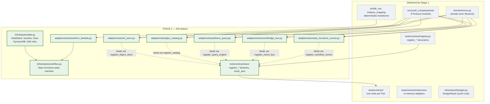
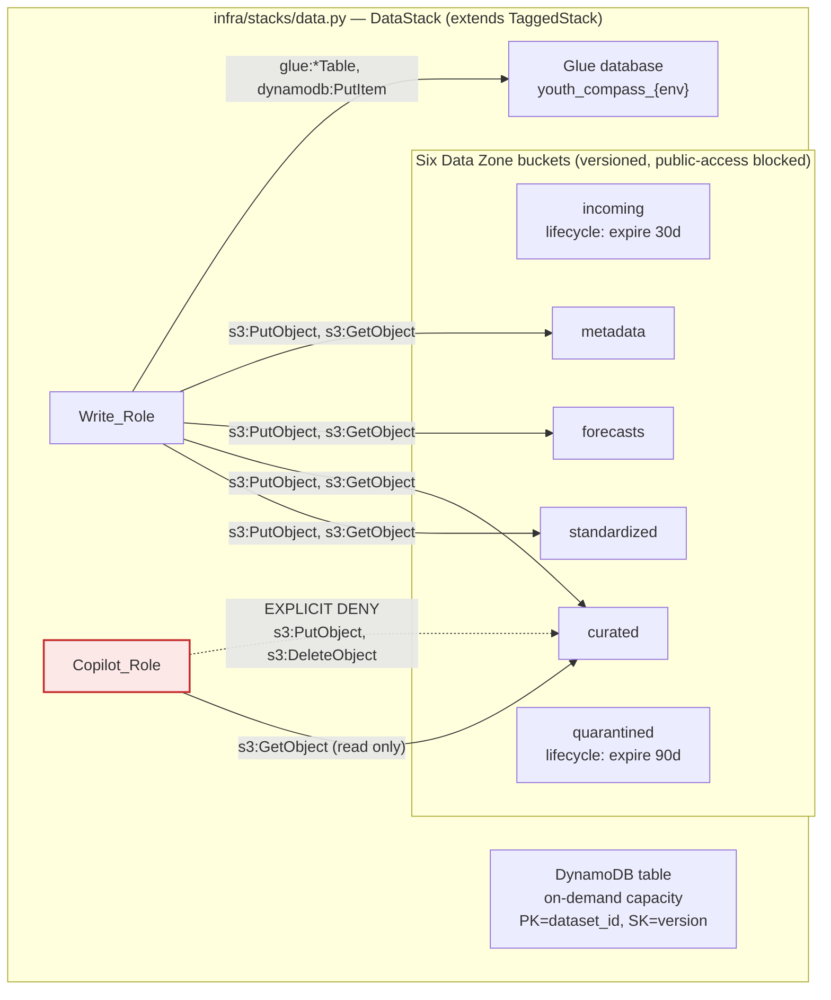
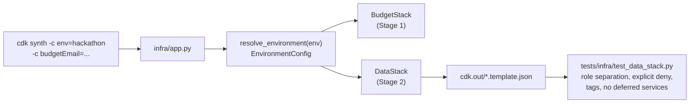
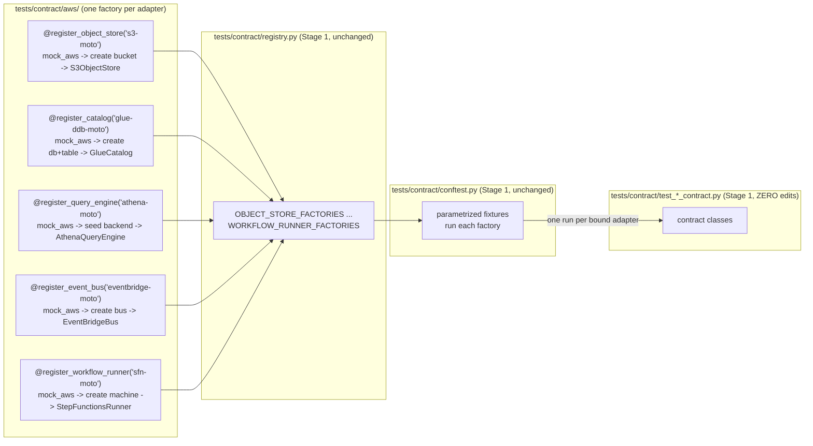
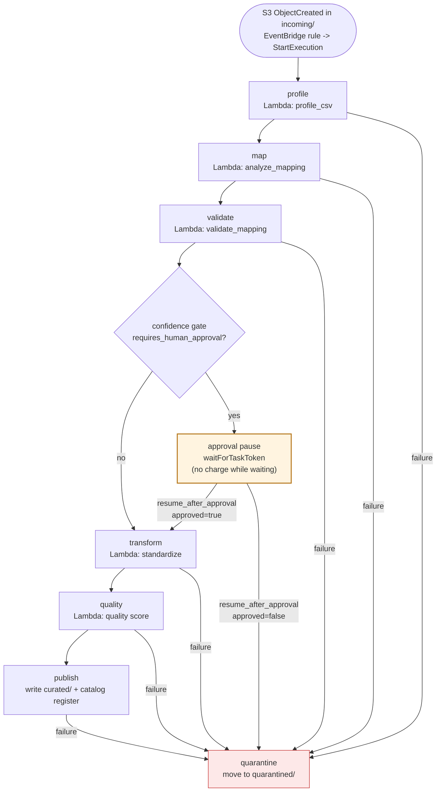

# Design Document

## Overview

Stage 2 turns the Stage 1 seam into a working AWS data lake. Stage 1 published nine port Protocols, a contract-test harness that runs one reusable suite per Port against any number of bound adapters, a CDK application that synthesizes a budget stack but deploys nothing, and four verification scripts. Stage 2 plugs real AWS services into four of those ports, adds the CDK data stack the adapters address, packages the existing deterministic transforms as a Lambda function, and assembles the Step Functions ingestion workflow with a human-approval callback.

The design is organised around one invariant carried forward from Stage 1: **the contract suite is the acceptance bar, and every new adapter binds to it through one `register_*` factory with zero edits to any contract class body.** Everything else — the data stack, the Lambda, the workflow — exists to make those bindings pass under Moto today and against a real personal account before 9/12 2026.

The Stage 2 artifact groups:

| Group | Location | What it is |
|---|---|---|
| Data stack | `infra/stacks/data.py`, tests in `tests/infra/` | A CDK stack defining six S3 buckets, one Glue database, one DynamoDB table, and two least-privilege IAM roles, extending the existing `infra/app.py` |
| AWS adapters | `adapters/aws/` | S3 ObjectStore, Glue+DynamoDB DataCatalog, Athena QueryEngine, EventBridge EventBus |
| Transform Lambda | `adapters/aws/transform_lambda.py` | An ARM64 Lambda handler calling the existing `profile_csv` and `analyze_mapping` |
| Ingestion workflow | `adapters/aws/step_functions_runner.py`, `infra/stacks/workflow.py` | A Step Functions state machine implementing WorkflowRunner with a `waitForTaskToken` approval pause |
| Contract bindings | `tests/contract/aws/` | One `register_*` factory per adapter, each wrapping `mock_aws()` |
| Bootstrap wiring | `scripts/aws_bootstrap.py`, `Makefile`, `docs/` | The step-4 data-stack deploy that Stage 1 stubbed, now closing |

### Design goals

1. **Interchangeability is mechanically proven, not asserted.** Each AWS adapter runs the exact contract class the reference adapter runs, so `storage.provider: filesystem` and `storage.provider: s3` are provably substitutable. *(Requirements 2, 3, 4, 5)*
2. **Domain code stays AWS-free.** No module under `src/youth_compass/` imports `boto3`; the Stage 1 guard test keeps passing; no `botocore.ClientError` escapes a port boundary. *(Requirements 2.9, 3.6, 4.5, 5.4, 6.5, 6.6)*
3. **Cost is bounded per use.** Every service is billed per request, per byte, or per transition — nothing runs when no one is ingesting or querying — and the budget alarms deploy before any data resource. *(Requirements 1.10, 1.13, 7.10, 8.2)*
4. **The write path and the query path are separated by role.** The copilot cannot mutate curated data because its role carries an explicit deny, proven by a CDK assertion test. *(Requirements 1.6, 1.8, 1.9)*
5. **The exact backend logic runs in the cloud.** The Lambda calls `profile_csv` and `analyze_mapping` rather than reimplementing them, and a test asserts byte-identical output against the local CLI. *(Requirement 6)*
6. **Nothing Stage 1 delivered breaks.** The 328 existing tests keep passing; Amazon Bedrock, SageMaker AI, and AgentCore appear in no construct. *(Requirements 8.6, 8.8)*

### Design non-goals

Stage 2 integrates no foundation model (Stage 3), builds no dashboard, and does not replace the local adapters — the filesystem/SQLite/DuckDB adapters remain the offline default. The Athena and Step Functions bindings are proven against Moto with the same fidelity boundary Stage 1 documented; real SQL semantics and real state transitions are verified only in the opt-in personal-account rehearsal.

### Research findings that shaped the design

Three findings from Stage 1 carry directly into Stage 2 decisions:

1. **Moto does not execute Athena SQL and returns zero rows by default.** ([moto Athena docs](https://github.com/getmoto/moto/blob/master/docs/docs/services/athena.rst)) Consequence: the Athena contract binding seeds the Moto Athena backend with the column metadata and rows the adapter expects, so the contract suite verifies the adapter's submit/poll/parse/error-translation path rather than SQL execution. The determinism property (QueryEngine contract) is satisfied against the seeded backend. *Content was rephrased for compliance with licensing restrictions.*
2. **Moto interprets a Step Functions definition only under an explicit configuration flag.** ([moto configuration options](https://docs.getmoto.org/en/latest/docs/configuration/index.html)) Consequence: the WorkflowRunner contract binding runs the runner's state tracking in memory over the Moto Step Functions backend, and the `waitForTaskToken` suspend/resume behaviour is asserted against the adapter's own job-state model, not Moto's interpreter. *Content was rephrased for compliance with licensing restrictions.*
3. **An S3 ETag is not a general checksum.** Multipart ETags are not an MD5 of the object. Consequence: the S3 adapter records an explicit content checksum on `put` (Requirement 2 criterion 2) rather than relying on the ETag, matching the exporter's three-way checksum decision from Stage 1.

---

## Architecture

### 1.1 Where Stage 2 sits in the ports-and-adapters seam

Stage 1 built the seam and the reference adapters. Stage 2 fills the `adapters/aws/` package the guard test already forbids `src/` from importing.



The dependency-direction rule is unchanged: the AWS adapters import from `ports/` and `domain/errors.py`, never the reverse, and `src/youth_compass/` imports nothing from `adapters/`. The Stage 1 `test_guards_imports.py` continues to enforce this and gains no exemption.

### 1.2 Data-stack architecture and the role boundary



The `DataStack` is added to the existing `infra/app.py` alongside `BudgetStack`, both extending the Stage 1 `TaggedStack` base so the four mandatory cost-allocation tags are enforced at construction. The explicit deny on `Copilot_Role` is the security core of Requirement 1: a deny overrides any allow, so even a future permissions widening cannot let the query path write curated data.



### 1.3 Adapter binding into the Stage 1 harness

Each adapter binds through the same registration mechanism the reference adapters use. The only Stage-2-specific detail is that each factory enters a `mock_aws()` context and provisions the resources the adapter needs before yielding it.



The factories are imported into the harness the same way `reference/__init__.py` is: a `tests/contract/aws/__init__.py` imports every module so registration happens before collection. `conftest.py` gains one import line for that package — the only touch to a Stage 1 harness file, and it adds a binding rather than editing a class body.

### 1.4 Ingestion workflow state machine



Every failure transition routes to the quarantined zone and leaves the curated zone untouched (Requirement 7 criteria 6, 7). The approval state uses `waitForTaskToken`, so the machine suspends with no per-hour charge until a reviewer returns the `Callback_Token` through `resume_after_approval` (criterion 3).

---

## Components and Interfaces

### 3.1 S3 ObjectStore adapter

**File:** `adapters/aws/s3_store.py` **Class:** `S3ObjectStore`

Implements `ObjectStore` from `src/youth_compass/ports/object_store.py` with the exact parameter names and return types. The adapter is constructed with a bucket name and an optional key prefix, and holds one `boto3` S3 client built from an injectable session so the contract binding can hand it a Moto-backed session.

| Port method | AWS calls | Notes |
|---|---|---|
| `put(key, content, metadata)` | `put_object(Bucket, Key, Body, Metadata, ChecksumAlgorithm="SHA256")` | Returns `s3://{bucket}/{key}`; records the SHA-256 S3 reports (Req 2.2). Overwriting a key leaves one object (Req 2.5). |
| `get(uri)` | `get_object(Bucket, Key)` then read `Body` | Parses `s3://bucket/key`; `NoSuchKey`/`404` → `ObjectNotFoundError` (Req 2.3). |
| `list(prefix)` | `get_paginator("list_objects_v2")` | Returns keys, paginated so more than one page is complete; empty list when none match. |
| `exists(uri)` | `head_object(Bucket, Key)` | `404` → `False`; other client errors translate to a domain error. |

**Error translation.** A single decorator/`try` wrapper maps `botocore.exceptions.ClientError` and `OSError` to the domain hierarchy: a `NoSuchKey`, `NoSuchBucket`, or `404` on `get`/`exists` becomes `ObjectNotFoundError`; any other failure becomes a generic `YouthCompassError` subclass declared for storage. No `ClientError` crosses the boundary (Req 2.3, 2.4).

**Binding.** `@register_object_store("s3-moto")` in `tests/contract/aws/s3_store.py`: a context manager that enters `mock_aws()`, creates the bucket in `ap-northeast-1`, yields `S3ObjectStore(bucket=..., session=...)`, and exits the mock on teardown. Zero edits to the ObjectStore contract class (Req 2.6, 2.7).

**Opt-in real test.** `tests/integration/aws/test_s3_real.py`, marked `@pytest.mark.real_aws` and skipped unless `YOUTH_COMPASS_REAL_AWS=1`, exercises `put`/`get`/`list`/`exists` against a real bucket in `ap-northeast-1` and cleans up (Req 2.8).

### 3.2 Glue + DynamoDB DataCatalog adapter

**File:** `adapters/aws/glue_catalog.py` **Class:** `GlueCatalog`

Implements `DataCatalog` (`register`, `get`, `search_compatible`). Schemas live in the Glue database; application metadata lives in the DynamoDB table. The split is invisible across the port — the domain registers and retrieves `DatasetMetadata` without knowing two services sit behind it.

| Port method | AWS calls | Notes |
|---|---|---|
| `register(dataset)` | `glue:create_table`/`update_table` for the column schema; `dynamodb:put_item` for approval status, quality score, mapping version, published-version pointer | Same identifier twice upserts to one record with later values (Req 3.4). |
| `get(dataset_id)` | `dynamodb:get_item` then `glue:get_table` | Missing item → `DatasetNotFoundError` (Req 3.3). |
| `search_compatible(profile)` | `dynamodb:query`/`scan` filtered by grain, hydrating from Glue | Returns grain-compatible records, matching the reference adapter. |

**Published-version pointer.** The DynamoDB item schema carries a `published_version` attribute the adapter repoints without deleting prior versions, so a bad publish rolls back by moving the pointer rather than destroying data (Req 3.5).

**Error translation.** `botocore.ClientError` from either service maps to the domain hierarchy: `EntityNotFoundException` (Glue) and a missing DynamoDB item both become `DatasetNotFoundError`; other failures become the declared catalog domain error (Req 3.6).

**Binding.** `@register_catalog("glue-ddb-moto")`: enters `mock_aws()`, creates the Glue database and the on-demand DynamoDB table, yields `GlueCatalog(...)` (Req 3.7, 3.8).

### 3.3 Athena QueryEngine adapter

**File:** `adapters/aws/athena_query.py` **Class:** `AthenaQueryEngine`

Implements `QueryEngine.execute`. The typed `QuerySpec` is rendered to SQL **entirely inside the adapter**; no SQL string crosses the port boundary in either direction (Req 4.2).

**SQL rendering.** `QuerySpec` maps to a single parameterised `SELECT`:

- `metrics` + `dimensions` → the `SELECT` list, each identifier validated against the allowlist and quoted;
- `table` → `FROM`, checked against the allowlisted table set;
- `filters` → a `WHERE` conjunction with values bound rather than interpolated;
- `order_by` → `ORDER BY`, each identifier allowlist-checked;
- `max_rows` → `LIMIT`.

Any table, metric, or dimension outside the configured allowlist raises `QueryNotPermittedError` **before** any Athena call, returning no rows (Req 4.3).

**Guardrails.** The adapter enforces three limits: the `max_rows` `LIMIT`, a configurable query timeout (poll `get_query_execution` until `SUCCEEDED`/timeout), and a configurable scanned-bytes cap read from the execution statistics. Reaching the timeout or the scanned-bytes cap raises `QueryExecutionError` naming the limit reached (Req 4.4). The returned `QueryResult.scanned_bytes` carries the byte count Athena reports (Req 4.7).

**Error translation.** A permitted query that fails for any non-allowlist reason raises `QueryExecutionError`; no `ClientError` propagates (Req 4.5).

**Binding.** `@register_query_engine("athena-moto")`: enters `mock_aws()`, creates the workgroup and output-location bucket, and seeds the Moto Athena backend with the column metadata and rows the contract cases expect (see research finding 1) so determinism (Req 4.6) is testable. Zero edits to the QueryEngine contract class (Req 4.8).

### 3.4 EventBridge EventBus adapter

**File:** `adapters/aws/eventbridge_bus.py` **Class:** `EventBridgeBus`

Implements `EventBus.publish` and `subscribe`. The adapter carries the dotted audit vocabulary from `docs/08` §6 as each event's `event_type`, unchanged across publish and delivery (Req 5.2).

| Port method | AWS calls | Notes |
|---|---|---|
| `publish(event)` | `events:put_events` with `DetailType=event.event_type`, `Detail=event.model_dump_json()` | Also drives in-process subscriber delivery in publish order (Req 5.3). |
| `subscribe(event_type, handler)` | registers the handler in an in-process routing table keyed by `event_type` | A handler receives every matching event and no non-matching event. |

Because Moto does not deliver EventBridge events to arbitrary Python callables, the adapter keeps an in-process subscription table so the delivery semantics the EventBus contract asserts hold under both Moto and a real bus; the `put_events` call exercises the real EventBridge path for publish. Error translation maps `botocore.ClientError` to the domain hierarchy (Req 5.4).

**Binding.** `@register_event_bus("eventbridge-moto")`: enters `mock_aws()`, creates the event bus, yields `EventBridgeBus(...)` (Req 5.5, 5.6).

### 3.5 CDK DataStack

**File:** `infra/stacks/data.py` **Class:** `DataStack(TaggedStack)`

Added to `infra/app.py` beside `BudgetStack`:

```python
DataStack(
    app,
    f"{env_config.stack_prefix}-Data",
    env_config=env_config,
    env=cdk_env,
)
```

**Buckets.** Exactly six `aws_s3.Bucket` constructs, one per Data Zone, and no other bucket (Req 1.2). Every bucket sets `versioned=True` and `block_public_access=BlockPublicAccess.BLOCK_ALL` (Req 1.3). The `incoming` and `quarantined` buckets add a `LifecycleRule` expiring objects after a bounded age — 30 days for incoming, 90 days for quarantined — documented in the stack and in `infra/README.md` (Req 1.4).

**Catalog + metadata.** Exactly one `aws_glue.CfnDatabase` and exactly one `aws_dynamodb.Table` in `BillingMode.PAY_PER_REQUEST` with no provisioned capacity (Req 1.5).

**IAM roles and policies.** Exactly two `aws_iam.Role` constructs (Req 1.6):

- `Write_Role`: `s3:PutObject`/`s3:GetObject` on standardized, curated, forecasts, and metadata; Glue table writes; DynamoDB writes (Req 1.7).
- `Copilot_Role`: `s3:GetObject` on curated **plus an explicit `Effect.DENY`** on `s3:PutObject` and `s3:DeleteObject` for every curated path (Req 1.8):

```python
copilot_role.add_to_policy(
    iam.PolicyStatement(
        effect=iam.Effect.DENY,
        actions=["s3:PutObject", "s3:DeleteObject"],
        resources=[curated_bucket.arn_for_objects("*")],
    )
)
```

**Assertion tests** (`tests/infra/test_data_stack.py`, using `aws_cdk.assertions.Template`):

- the synthesized `Copilot_Role` policy contains the explicit deny for both actions on curated paths and grants neither (Req 1.8);
- the two roles are distinct and the copilot holds no write/delete on any curated object (Req 1.9);
- every resource-bearing stack carries the four tags with non-empty values (Req 1.11);
- the template contains zero `AWS::Bedrock*`, `AWS::SageMaker*`, `AWS::BedrockAgentCore*` resources and zero of the five always-on types (Req 1.12).

`cdk synth` for `dev`/`demo`/`hackathon` writes the template with a zero exit inside 120 seconds and invokes no mutating AWS API when credentials are absent (Req 1.10).

### 3.6 Transform Lambda

**File:** `adapters/aws/transform_lambda.py` **Handler:** `handler(event, context)`

The handler dispatches on an `action` field to call the existing deterministic transforms and nothing else:

```python
from youth_compass.ingestion.csv_profiler import profile_csv
from youth_compass.mapping.engine import analyze_mapping
```

It contains no reimplementation of profiling or mapping (Req 6.1). Input arrives as an S3 URI the handler reads through the S3 adapter; output is the profile or mapping analysis serialised the same way the local CLI serialises it, so invoking the packaged handler on `tests/fixtures/employment_unfamiliar.csv` produces byte-identical output to the local CLI (Req 6.3).

**Packaging.** Built for ARM64 (`Architecture.ARM_64`, Graviton) per `docs/01` §8; every bundled dependency provides a CPython 3.12 `aarch64`/`py3-none-any` distribution (Req 6.2) — the Stage 1 dependency audit already confirmed this for the transitive set. The handler lives under `adapters/aws/` and is not imported by any `src/` module (Req 6.6).

**Error contract.** The handler translates every surfaced failure into the domain hierarchy and lets no `botocore` or other technology-specific exception escape as its error contract (Req 6.5).

**Test.** `tests/integration/aws/test_transform_lambda.py` invokes the packaged handler on the employment fixture and asserts byte-identical equality with the local CLI output (Req 6.4).

### 3.7 Step Functions ingestion workflow

**Files:** `infra/stacks/workflow.py` (state machine definition), `adapters/aws/step_functions_runner.py` (`StepFunctionsRunner` implementing `WorkflowRunner`).

**State machine.** States in order: profile → map → validate → confidence gate (Choice) → approval pause → transform → quality → publish, with every task's `Catch` routing to a quarantine state (Req 7.1). The approval state is a Lambda-or-task invocation with the `waitForTaskToken` integration; the machine suspends there, incurring no per-hour charge, until the token returns (Req 7.3). Failure `Catch` blocks route to quarantine, leaving curated unchanged (Req 7.6, 7.7).

**Adapter methods.**

| Port method | AWS calls | Notes |
|---|---|---|
| `start_ingestion(request)` | `states:start_execution` | Returns a `JobReference` with `job_id`, status, `created_at`, and the `callback_token` when suspended (Req 7.2). |
| `resume_after_approval(job_id, decision)` | `states:send_task_success` (approve) or a rejecting `send_task_success` routing to quarantine | Approving proceeds to transform/quality/publish; rejecting routes to quarantine (Req 7.4). Unknown or already-settled `job_id` → `WorkflowStateError` (Req 7.5). |

**Auto-trigger.** An EventBridge rule on S3 `ObjectCreated` in the incoming bucket starts an execution, so a normal ingestion needs no manual start (Req 7.8).

**Binding.** `@register_workflow_runner("sfn-moto")`: enters `mock_aws()`, creates a minimal state machine, and yields a `StepFunctionsRunner` whose job-state tracking satisfies the WorkflowRunner contract (start returns a non-empty `job_id`; resume of an unknown or settled job raises `WorkflowStateError`) — matching the reference runner's observable behaviour (Req 7.9). The workflow definition incurs no charge while idle (Req 7.10).

### 3.8 Bootstrap wiring

Stage 1 delivered `scripts/aws_bootstrap.py` with a five-step chain whose step 4 (data-stack deploy) correctly errored because the stack did not exist. Stage 2 lands `DataStack`, so the bootstrap driver resolves it from the stacks the CDK app defines and step 4 becomes live (Req 8.1). The budget stack still deploys before the data stack (Req 8.2). The `Smoke_Tester --real` and `Data_Exporter` gain data-path coverage against the deployed buckets, catalog, and one guarded Athena query (Req 8.3, 8.4).

---

## Data Models

### 4.1 DynamoDB table schema

One on-demand table holds application metadata that Glue schemas do not model:

| Attribute | Role | Notes |
|---|---|---|
| `dataset_id` | partition key (S) | The catalog identifier. |
| `version` | sort key (S) | Monotonic version string; multiple versions per dataset coexist. |
| `approval_status` | attribute (S) | `received` \| `awaiting_approval` \| `published` \| `quarantined` \| `rejected`, from the domain `DatasetStatus`. |
| `quality_score` | attribute (N) | Quality score from the quality state. |
| `mapping_version` | attribute (S) | Version of the mapping proposal applied. |
| `published_version` | attribute (S), on the `#PUBLISHED` pointer item | Points at the currently published `version`; repointing rolls back without deleting versions (Req 3.5). |
| `glue_table` | attribute (S) | The Glue table name holding this version's column schema. |

The published-version pointer is a separate item (`dataset_id`, `version="#PUBLISHED"`) so a `put_item` on it is an atomic repoint. `register` writes the version item and, on publish, the pointer item; `get` reads the pointer then the version item then the Glue table.

### 4.2 Athena SQL rendering

`QuerySpec` renders deterministically to one statement, all identifiers allowlist-checked and quoted, all filter values bound:

```
SELECT   {quoted metrics + dimensions}
FROM     {quoted allowlisted table}
WHERE    {dimension = :bound for each filter, AND-joined}
ORDER BY {quoted allowlisted order_by}
LIMIT    {max_rows}
```

Rendering is a pure function of the `QuerySpec`, so two identical specs produce identical SQL and — against unchanged data — identical `QueryResult` row count, row values and order, and column names and order (Req 4.6). No branch of the renderer accepts a caller-supplied SQL string.

### 4.3 Reused Stage 1 models

The adapters consume the Stage 1 port payloads unchanged: `DatasetMetadata`/`DatasetProfile` (catalog), `QuerySpec`/`QueryResult` (query), `DomainEvent` (event bus), `IngestionRequest`/`JobReference`/`ApprovalDecision` (workflow). No payload model is added or modified by Stage 2.

---

## Correctness Properties

*A property is a characteristic or behavior that should hold true across all valid executions of a system — a formal statement about what the system should do.*

**Group A — Adapter contract compliance**

### Property 1: The S3 adapter satisfies the ObjectStore contract under Moto

*For any* contract case in the ObjectStore suite run against the `s3-moto` binding, the case passes: round-trip bytes are preserved, a repeated write leaves one object and one listing entry, prefix listing is exact set equality, and `get` of an unwritten URI raises `ObjectNotFoundError` with no `botocore` or OS exception propagating.

**Validates: Requirements 2.1, 2.3, 2.5, 2.6, 2.7**

### Property 2: The Glue+DynamoDB adapter satisfies the DataCatalog contract under Moto

*For any* contract case in the DataCatalog suite run against the `glue-ddb-moto` binding, register-then-get preserves every field, re-registration upserts to one record with the later values, and `get` of an unknown identifier raises `DatasetNotFoundError` with no technology-specific exception propagating.

**Validates: Requirements 3.1, 3.3, 3.4, 3.7, 3.8**

### Property 3: The Athena adapter satisfies the QueryEngine contract and is deterministic

*For any* identical `QuerySpec` executed twice against the seeded Moto backend, the two `QueryResult` values share row count, row values and order, and column names and order; and *for any* spec naming a table, metric, or dimension outside the allowlist, the adapter raises `QueryNotPermittedError`, returns no rows, and issues no Athena query.

**Validates: Requirements 4.1, 4.3, 4.6, 4.8**

### Property 4: The EventBridge adapter satisfies the EventBus contract

*For any* published event and *for any* set of subscriptions, every handler subscribed to the event's type receives it in publish order and no handler subscribed to a different type receives it, and the `event_type` is unchanged across publish and delivery.

**Validates: Requirements 5.1, 5.2, 5.3, 5.5, 5.6**

### Property 5: The Step Functions runner satisfies the WorkflowRunner contract

*For any* started ingestion, `start_ingestion` returns a `JobReference` with a non-empty `job_id`; *for any* `resume_after_approval` on an unknown or already-settled job, the runner raises `WorkflowStateError`.

**Validates: Requirements 7.2, 7.5, 7.9**

**Group B — Error translation**

### Property 6: No adapter lets a technology-specific exception cross a port boundary

*For any* AWS adapter and *for any* `botocore.ClientError`, `OSError`, or other technology-specific exception raised by an underlying call, the exception is translated to a `youth_compass.domain.errors` type before it crosses the port boundary; no such exception propagates through any port method.

**Validates: Requirements 2.3, 2.4, 3.6, 4.5, 5.4, 6.5**

### Property 7: Domain code imports no AWS SDK

*For any* `.py` module found by recursive search of `src/youth_compass/`, no import statement names `boto3`, `botocore`, or a module under `adapters/`, and the Stage 1 guard test asserting this continues to pass.

**Validates: Requirements 2.9, 3 (Ports_And_Adapters_Rule), 6.6**

**Group C — Data-stack IAM and shape**

### Property 8: The write role and the copilot role are distinct and unequal in power

*For any* synthesized environment, the `Write_Role` and `Copilot_Role` are distinct roles, the copilot holds no permission to write or delete any curated-zone object, and the copilot policy contains an explicit deny of `s3:PutObject` and `s3:DeleteObject` on the curated paths granting neither.

**Validates: Requirements 1.6, 1.8, 1.9**

### Property 9: The write role reaches exactly its four write zones

*For any* synthesized environment, the `Write_Role` is granted object-write permission to the standardized, curated, forecasts, and metadata buckets and to no other Data Zone bucket, and holds curated-read for the copilot's zone only through its own separate grant.

**Validates: Requirements 1.7**

### Property 10: The stack defines exactly the six zones and the single catalog resources

*For any* synthesized environment, the template contains exactly six S3 buckets — one per Data Zone and no other — each versioned with public access fully blocked, exactly one Glue database, and exactly one DynamoDB table in on-demand mode with no provisioned capacity.

**Validates: Requirements 1.2, 1.3, 1.5**

### Property 11: Lifecycle rules bound transient-zone storage

*For any* synthesized environment, the incoming and quarantined buckets each carry a lifecycle rule expiring objects after the documented bounded age, and no other Data Zone bucket carries an expiration rule.

**Validates: Requirements 1.4**

### Property 12: Every resource-bearing stack carries the four mandatory tags

*For any* synthesized environment and *for any* resource-bearing stack the app defines, all four cost-allocation tags (`Project`, `Environment`, `Owner`, `CostCenter`) are present with non-empty values.

**Validates: Requirements 1.11**

### Property 13: Synthesis is free and mutates nothing

*For any* of the three context environments synthesized with no AWS credentials present, `cdk synth` writes the CloudFormation template locally, terminates with a zero exit within 120 seconds, and invokes no AWS API that creates, updates, or deletes a resource.

**Validates: Requirements 1.10**

### Property 14: No stack or adapter names a deferred service

*For any* synthesized environment and *for any* resource in the template, the resource type belongs to neither the deferred-service namespaces (Amazon Bedrock, Amazon SageMaker AI, Amazon Bedrock AgentCore) nor the five always-on types; and no adapter, the Transform Lambda, or the workflow contains a construct or call for those services.

**Validates: Requirements 1.12, 8.8**

**Group D — Lambda and workflow behaviour**

### Property 15: The Lambda produces byte-identical output to the local CLI

*For any* invocation of the packaged Transform Lambda handler on `tests/fixtures/employment_unfamiliar.csv`, the handler's output is byte-identical to the output the local CLI produces from the same input.

**Validates: Requirements 6.1, 6.3, 6.4**

### Property 16: The Lambda package is ARM64-installable

*For any* dependency the Transform Lambda bundles, the dependency provides an installable distribution for CPython 3.12 on ARM64, and the package targets the ARM64 architecture.

**Validates: Requirements 6.2**

### Property 17: An approving decision advances the workflow; a rejecting one quarantines it

*For any* suspended workflow resumed with an approving `ApprovalDecision`, the machine proceeds from the approval state to transform, quality, and publish; *for any* resumed with a rejecting decision, the job routes to the quarantined zone.

**Validates: Requirements 7.3, 7.4**

### Property 18: A failed run preserves the curated zone and quarantines the job

*For any* state that fails during ingestion, the job routes to the quarantined zone and the curated zone is unchanged; and *for any* failed ingestion of one file, a different file's published data in the curated zone is byte-identical before and after.

**Validates: Requirements 7.6, 7.7**

### Property 19: Idle workflow and adapters incur no charge

*For any* period in which no ingestion is in progress and no query is running, the Step Functions definition, the Transform Lambda, and the adapters incur no AWS charge, consistent with per-use billing.

**Validates: Requirements 7.10, 8.5**

**Group E — Guardrails and integration**

### Property 20: The Athena adapter enforces its three limits

*For any* permitted query, the rendered SQL carries the `max_rows` limit; *for any* query reaching the configured timeout or scanning at or above the configured cap, the adapter raises `QueryExecutionError` naming the limit reached, and the returned `scanned_bytes` equals the byte count Athena reports.

**Validates: Requirements 4.4, 4.7**

### Property 21: No SQL string crosses the query port boundary

*For any* call into or return from `QueryEngine.execute`, no SQL string is accepted from or returned to the caller; the `QuerySpec` is rendered to SQL entirely within the adapter.

**Validates: Requirements 4.2**

### Property 22: The published-version pointer rolls back without data loss

*For any* sequence of registrations for one dataset and *for any* repoint of the published-version pointer to an earlier version, that version becomes published and no prior version's schema or data is deleted.

**Validates: Requirements 3.5**

### Property 23: Every binding routes to Moto and reads no ambient credentials

*For any* contract case run against any Stage 2 binding, every `boto3` call is served by Moto, no AWS credential is read from the environment or `~/.aws/`, and the suite reports zero failed, errored, or skipped cases.

**Validates: Requirements 2.7, 3.8, 4.8, 5.6, 7.9**

### Property 24: The existing suite is undisturbed

*For any* run of `uv run pytest` at the repository root, the 328 tests delivered before Stage 2 all pass, and every Stage 2 adapter runs its Port's contract suite under Moto with zero failed, errored, or skipped cases.

**Validates: Requirements 8.6**

---

## Error Handling

### 5.1 Per-adapter translation tables

Every adapter wraps its AWS calls so only domain errors cross the boundary.

| Adapter | Underlying exception | Translated to |
|---|---|---|
| S3 ObjectStore | `NoSuchKey` / `404` on `get`/`exists` | `ObjectNotFoundError` |
| | `NoSuchBucket`, other `ClientError`, `OSError` | storage `YouthCompassError` |
| Glue+DynamoDB | Glue `EntityNotFoundException`, missing DynamoDB item | `DatasetNotFoundError` |
| | other `ClientError` from either service | catalog `YouthCompassError` |
| Athena | allowlist rejection (before any call) | `QueryNotPermittedError` |
| | timeout, scanned-byte breach, execution failure | `QueryExecutionError` |
| EventBridge | `ClientError` on `put_events` | event-bus `YouthCompassError` |
| Step Functions | unknown / settled `job_id` | `WorkflowStateError` |
| | `ClientError` on start/send-task | workflow `YouthCompassError` |
| Transform Lambda | any `botocore`/technology exception | domain error as the handler's error contract |

### 5.2 Workflow failure routing

Every task state carries a `Catch` on `States.ALL` that transitions to the quarantine state, which moves the object to the quarantined zone and writes a `quarantined` status to the DynamoDB item. The curated zone is written only by the terminal `publish` state, so no failed run touches it (Req 7.6, 7.7). A rejecting approval decision routes through the same quarantine state.

---

## Testing Strategy

### 6.1 The three verification layers

1. **Contract suites under Moto (zero cost, the acceptance bar).** Each adapter binds through its `register_*` factory and runs its Port's Stage 1 contract class with zero edits. Every `boto3` call is served by Moto; no credentials are read; the suite reports zero failed/errored/skipped cases. This is the bar every requirement's "SHALL be bound to the Contract_Test_Suite" criterion names.
2. **CDK assertion tests.** `tests/infra/test_data_stack.py` uses `aws_cdk.assertions.Template` to prove role separation, the copilot's explicit deny, the six-bucket shape, lifecycle rules, on-demand DynamoDB, the four tags, and zero deferred-service resources. Synthesis runs with placeholder account/region and reads no credentials.
3. **Opt-in real-account integration tests.** Marked `@pytest.mark.real_aws` and skipped unless `YOUTH_COMPASS_REAL_AWS=1`, these exercise the S3 adapter and the packaged Lambda against a real account in `ap-northeast-1`, and clean up. They are the only tests that spend money and never run in CI.

### 6.2 The bootstrap end-to-end flow

`make hackathon-bootstrap` runs the five-step chain — preflight, CDK bootstrap, budget deploy, data-stack deploy, smoke `--real` — against the personal account. The smoke tester's `--real` path writes and reads a Data Zone bucket, registers and retrieves a catalog record, and runs one guarded Athena query, cleaning up every resource it creates (Req 8.3). The exporter copies objects and exports the Glue database with a manifest (Req 8.4). The whole flow is rehearsable within single-digit dollars before 9/12 (Req 8.5).

### 6.3 What Stage 2 cannot verify under Moto

Carried forward from the Stage 1 Moto fidelity boundary: real Athena SQL semantics and scanned-byte accounting, real Step Functions state transitions and the `waitForTaskToken` callback timing, real IAM enforcement of the copilot deny at runtime, and the S3 event-notification trigger. The opt-in real-account rehearsal is the mitigation for each.

---

## Risks and Open Decisions

### 7.1 Risks

1. **Moto fidelity for Athena and Step Functions.** Moto does not run Athena SQL and interprets Step Functions only under a flag, so the contract bindings verify the adapter's orchestration and error translation, not the service semantics. *Mitigation:* the seeded-backend technique makes determinism testable, and the personal-account rehearsal covers the real semantics before the competition.
2. **The Lambda byte-identical assertion is sensitive to serialisation.** Any nondeterminism in how the transforms serialise (dict ordering, float formatting) would break the byte-identical test. *Mitigation:* the transforms are already deterministic by Stage 1's definition; the handler reuses their exact serialisation rather than re-emitting.
3. **The data stack touches `infra/app.py`, shared with the budget stack.** *Mitigation:* the change is additive — one new stack construction beside the existing one — and the Stage 1 snapshot tests for the budget stack must remain green.
4. **Six days to competition.** The workflow is the largest piece and depends on the Lambda and the adapters. *Mitigation:* the task ordering front-loads the independent adapters so a slip in the workflow does not block the data-path rehearsal.

### 7.2 Open decisions

1. **DynamoDB single-table vs. two-item layout for the published pointer.** This design uses a pointer item (`version="#PUBLISHED"`) for atomic repoint; an alternative is a separate small table. The pointer item is simpler and keeps the resource count at one table (Req 1.5), so it is the default pending a rollback-frequency review.
2. **EventBridge in-process delivery vs. real rule targets.** The adapter keeps an in-process subscription table so the EventBus contract's ordered-delivery semantics hold under Moto. Whether production subscribers should instead be real EventBridge rule targets (Lambda/SQS) is deferred to the consumer's needs; the port contract does not require it.
3. **Athena allowlist source.** The allowlist of tables/metrics/dimensions is configuration-driven; whether it is derived from the Glue catalog at startup or declared statically in `configs/` is left to the wiring task, with the static declaration as the safer default for the rehearsal.
