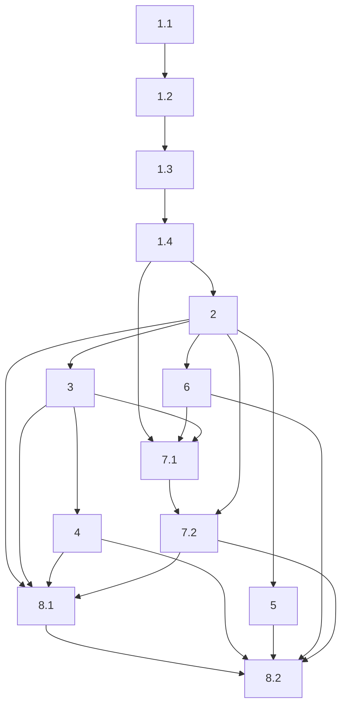

# Implementation Plan

## Overview

Ordering follows design 7.1 Risk 4: the CDK data stack first because every adapter addresses its buckets and roles, then the four adapters cheapest-and-most-independent first (S3, then Glue+DynamoDB, then Athena, then EventBridge), then the Lambda that packages existing code, then the Step Functions workflow that depends on the Lambda and the adapters, then the bootstrap wiring that closes the Stage 1 step-4 gap and rehearses against a personal account. Every adapter task binds to its Port's Stage 1 contract class through one `register_*` factory and runs that suite under Moto with zero edits to the class body — the contract suite is the acceptance bar for every adapter.

The plan is 8 top-level tasks delivering the cheap real-AWS layer: a data-lake CDK stack with least-privilege IAM roles, four AWS adapters bound to their existing contract suites, an ARM64 Lambda wrapping the deterministic transforms, a Step Functions ingestion workflow with a human-approval callback, and the end-to-end bootstrap rehearsal. Everything runs free under Moto in CI; only the opt-in real-account tests and the rehearsal spend money.

## Tasks

- [ ] 1. Deploy the data-lake CDK stack with least-privilege IAM roles
- [ ] 1.1 Define the six Data Zone buckets and the catalog resources
  - Add `infra/stacks/data.py` with `DataStack(TaggedStack)` defining exactly one S3 bucket per Data Zone — incoming, quarantined, standardized, curated, forecasts, metadata — and no other bucket, each `versioned=True` with `BlockPublicAccess.BLOCK_ALL`
  - Attach a lifecycle rule expiring incoming after 30 days and quarantined after 90 days, documenting each chosen age in the stack and in `infra/README.md`
  - Define exactly one Glue database (`youth_compass_{env}`) and exactly one DynamoDB table in `BillingMode.PAY_PER_REQUEST` with no provisioned read or write capacity
  - _Requirements: 1.2, 1.3, 1.4, 1.5_
  - _Design: 3.5 CDK DataStack, 4.1 DynamoDB table schema_
  - _Properties: 10, 11_
- [ ] 1.2 Define the two least-privilege IAM roles with the copilot explicit deny
  - Define exactly two `aws_iam.Role` constructs, `Write_Role` and `Copilot_Role`, each granted only the permissions its task requires
  - Grant `Write_Role` object-write on standardized, curated, forecasts, and metadata plus Glue table writes and DynamoDB writes; grant `Copilot_Role` read-only on curated
  - Add an explicit `Effect.DENY` on `s3:PutObject` and `s3:DeleteObject` for every curated path to `Copilot_Role`
  - _Requirements: 1.6, 1.7, 1.8_
  - _Design: 3.5 CDK DataStack, 1.2 Data-stack architecture and the role boundary_
  - _Properties: 8, 9_
- [ ] 1.3 Wire the DataStack into `infra/app.py` and prove synthesis is free
  - Extend `infra/app.py` to construct `DataStack` beside `BudgetStack` for each of `dev`, `demo`, `hackathon`, without disturbing the existing budget-stack snapshot tests
  - Verify `cdk synth -c env=<each>` with credentials unset writes each template, exits zero within 120 seconds, and invokes no creating, updating, or deleting AWS API
  - _Requirements: 1.1, 1.10_
  - _Design: 3.5 CDK DataStack, 1.2 Data-stack architecture and the role boundary_
  - _Properties: 13_
- [ ] 1.4 Write the CDK assertion tests for role separation, tags, and deferred services
  - `tests/infra/test_data_stack.py` using `aws_cdk.assertions.Template`: prove the synthesized `Copilot_Role` policy contains the explicit deny for both actions on curated paths and grants neither; prove the two roles are distinct and the copilot holds no curated write/delete
  - Prove every resource-bearing stack carries the four cost-allocation tags with non-empty values, and that the template contains zero `AWS::Bedrock*`, `AWS::SageMaker*`, `AWS::BedrockAgentCore*` resources and zero of the five always-on types
  - Prove exactly six buckets (versioned, public-access blocked), exactly one Glue database, and exactly one on-demand DynamoDB table
  - _Requirements: 1.9, 1.11, 1.12_
  - _Design: 3.5 CDK DataStack, 6.1 The three verification layers_
  - _Properties: 8, 10, 12, 14_

- [ ] 2. Implement the S3 ObjectStore adapter and bind it to the contract suite
  - Add `adapters/aws/s3_store.py` with `S3ObjectStore` implementing `put`, `get`, `list`, `exists` with the parameter names and return types from `src/youth_compass/ports/object_store.py`; `put` records a SHA-256 checksum and returns the scheme-qualified URI, and a repeated write leaves one readable object with the later content and one listing entry
  - Translate every `botocore.ClientError` and `OSError` to the domain hierarchy: `NoSuchKey`/`404` on `get`/`exists` to `ObjectNotFoundError`, no technology-specific exception crossing the boundary
  - Bind with `@register_object_store("s3-moto")` in `tests/contract/aws/s3_store.py`, wrapping `mock_aws()` and creating the bucket, and add the one import to `tests/contract/aws/__init__.py`; run the ObjectStore suite under Moto with zero failed, errored, or skipped cases and zero edits to the contract class body
  - Add an opt-in `tests/integration/aws/test_s3_real.py` marked `@pytest.mark.real_aws`, skipped unless `YOUTH_COMPASS_REAL_AWS=1`, exercising the four methods against a real bucket in `ap-northeast-1` and cleaning up (OPT-IN REAL ACCOUNT)
  - Confirm the Stage 1 no-`boto3`-under-`src/` guard test still passes
  - _Requirements: 2.1, 2.2, 2.3, 2.4, 2.5, 2.6, 2.7, 2.8, 2.9_
  - _Design: 3.1 S3 ObjectStore adapter, 1.3 Adapter binding into the Stage 1 harness_
  - _Properties: 1, 6, 7, 23_

- [ ] 3. Implement the Glue + DynamoDB DataCatalog adapter
  - Add `adapters/aws/glue_catalog.py` with `GlueCatalog` implementing `register`, `get`, `search_compatible` from `src/youth_compass/ports/catalog.py`; store the column schema in the Glue database and the approval status, quality score, mapping version, and published-version pointer in the DynamoDB table
  - Maintain the published-version pointer item so repointing to an earlier version restores it as published without deleting any prior version's schema or data; a repeated `register` with one identifier upserts to one record with the later values
  - Translate every Glue and DynamoDB `botocore` exception to the domain hierarchy: a Glue `EntityNotFoundException` or a missing DynamoDB item to `DatasetNotFoundError`, no technology-specific exception crossing the boundary
  - Bind with `@register_catalog("glue-ddb-moto")` wrapping `mock_aws()` and creating the Glue database and on-demand DynamoDB table; run the DataCatalog suite under Moto with zero failed, errored, or skipped cases and zero edits to the contract class body
  - _Requirements: 3.1, 3.2, 3.3, 3.4, 3.5, 3.6, 3.7, 3.8_
  - _Design: 3.2 Glue + DynamoDB DataCatalog adapter, 4.1 DynamoDB table schema_
  - _Properties: 2, 6, 22, 23_

- [ ] 4. Implement the Athena QueryEngine adapter with guardrails
  - Add `adapters/aws/athena_query.py` with `AthenaQueryEngine` implementing `execute` from `src/youth_compass/ports/query_engine.py`, rendering the typed `QuerySpec` to SQL entirely within the adapter with allowlist-checked, quoted identifiers and bound filter values; no SQL string is accepted from or returned to any caller
  - Raise `QueryNotPermittedError` before any Athena call for a table, metric, or dimension outside the allowlist, returning no rows; enforce the `max_rows` limit, a configurable timeout, and a configurable scanned-bytes cap, raising `QueryExecutionError` naming the limit reached, and populate `QueryResult.scanned_bytes` from the reported byte count
  - Translate a permitted-query failure to `QueryExecutionError` with no `botocore` exception propagating
  - Bind with `@register_query_engine("athena-moto")` wrapping `mock_aws()`, creating the workgroup and output bucket, and seeding the Moto Athena backend with the expected column metadata and rows so an identical `QuerySpec` executed twice yields identical rows, order, and columns; run the QueryEngine suite under Moto with zero failed, errored, or skipped cases and zero edits to the contract class body
  - _Requirements: 4.1, 4.2, 4.3, 4.4, 4.5, 4.6, 4.7, 4.8_
  - _Design: 3.3 Athena QueryEngine adapter, 4.2 Athena SQL rendering, 6.3 What Stage 2 cannot verify under Moto_
  - _Properties: 3, 6, 20, 21, 23_

- [ ] 5. Implement the EventBridge EventBus adapter
  - Add `adapters/aws/eventbridge_bus.py` with `EventBridgeBus` implementing `publish` and `subscribe` from `src/youth_compass/ports/event_bus.py`, carrying the dotted audit vocabulary from `docs/08` section 6 as each event's `event_type` unchanged across publish and delivery
  - Deliver a published event to every handler subscribed to its type in publish order and to no handler subscribed to a different type, using an in-process subscription table alongside the `events:put_events` call
  - Translate every `botocore` exception to the domain hierarchy before it crosses the boundary
  - Bind with `@register_event_bus("eventbridge-moto")` wrapping `mock_aws()` and creating the event bus; run the EventBus suite under Moto with zero failed, errored, or skipped cases and zero edits to the contract class body
  - _Requirements: 5.1, 5.2, 5.3, 5.4, 5.5, 5.6_
  - _Design: 3.4 EventBridge EventBus adapter_
  - _Properties: 4, 6, 23_

- [ ] 6. Package the deterministic transforms as an ARM64 Lambda
  - Add `adapters/aws/transform_lambda.py` with a `handler(event, context)` that dispatches to the existing `profile_csv` (from `src/youth_compass/ingestion/csv_profiler.py`) and `analyze_mapping` (from `src/youth_compass/mapping/engine.py`) and reimplements neither
  - Build the package for ARM64 (CPython 3.12, Graviton) per `docs/01` section 8, confirming every bundled dependency provides an installable `aarch64`/`py3-none-any` distribution; keep the handler under `adapters/aws/` and import it from no `src/` module
  - Translate every surfaced failure to the domain hierarchy so no `botocore` or other technology-specific exception escapes as the handler's error contract
  - Add `tests/integration/aws/test_transform_lambda.py` invoking the packaged handler on `tests/fixtures/employment_unfamiliar.csv` and asserting byte-identical equality with the local CLI output for that fixture
  - _Requirements: 6.1, 6.2, 6.3, 6.4, 6.5, 6.6, 8.8_
  - _Design: 3.6 Transform Lambda_
  - _Properties: 14, 15, 16_

- [ ] 7. Build the Step Functions ingestion workflow with a human-approval callback
- [ ] 7.1 Define the state machine and the auto-trigger
  - Add `infra/stacks/workflow.py` defining a Step Functions state machine whose states in order are profile, map, validate, a confidence-gate Choice, an approval pause, transform, quality, and publish, with every task's `Catch` on `States.ALL` routing to a quarantine state
  - Use the `waitForTaskToken` integration on the approval state so the machine suspends with no per-hour charge until the callback token returns
  - Add an EventBridge rule on S3 `ObjectCreated` in the incoming bucket that starts an execution, so a normal ingestion needs no manual start; include no construct or call for Amazon Bedrock, Amazon SageMaker AI, or Amazon Bedrock AgentCore
  - _Requirements: 7.1, 7.3, 7.8, 7.10, 8.8_
  - _Design: 3.7 Step Functions ingestion workflow, 1.4 Ingestion workflow state machine, 5.2 Workflow failure routing_
  - _Properties: 14, 17, 18, 19_
- [ ] 7.2 Implement the WorkflowRunner adapter and bind it to the contract suite
  - Add `adapters/aws/step_functions_runner.py` with `StepFunctionsRunner` implementing `start_ingestion` and `resume_after_approval` from `src/youth_compass/ports/workflow_runner.py`; `start_ingestion` returns a `JobReference` with a non-empty `job_id`, and `resume_after_approval` sends the task token, proceeding on an approving decision and routing to quarantine on a rejecting one
  - Raise `WorkflowStateError` when `resume_after_approval` is called with an unknown or already-settled `job_id`, matching the reference runner's observable behaviour; leave the curated zone unchanged on any failed run so a different file's published data is byte-identical before and after
  - Bind with `@register_workflow_runner("sfn-moto")` wrapping `mock_aws()` and creating a minimal state machine; run the WorkflowRunner suite under Moto with zero failed, errored, or skipped cases and zero edits to the contract class body
  - _Requirements: 7.2, 7.4, 7.5, 7.6, 7.7, 7.9_
  - _Design: 3.7 Step Functions ingestion workflow, 5.2 Workflow failure routing_
  - _Properties: 5, 6, 17, 18, 23_

- [ ] 8. Wire the bootstrap flow end to end and rehearse
- [ ] 8.1 Close the bootstrap step-4 data-stack gap
  - Update `scripts/aws_bootstrap.py` so it resolves the now-present `DataStack` from the stacks the CDK app defines and step 4 (data-stack deploy) becomes live where it previously errored, keeping the budget stack deploying before the data stack
  - Extend the `Smoke_Tester --real` path to write and read a Data Zone bucket, register and retrieve a catalog record, and run one guarded Athena query, cleaning up every resource it creates; extend the `Data_Exporter` to copy objects from the selected Data Zone buckets and export the Glue database and table definitions with a manifest
  - Update `docs/12-aws-stage1-foundation.md` or add a Stage 2 document under `docs/` recording, for the Data_Stack, the four adapters, the Transform_Lambda, and the Ingestion_Workflow, each artifact's repository-relative path and a one-sentence purpose
  - _Requirements: 8.1, 8.2, 8.3, 8.4, 8.7_
  - _Design: 3.8 Bootstrap wiring, 6.2 The bootstrap end-to-end flow_
  - _Properties: 19_
- [ ] 8.2 Final integration verification and personal-account rehearsal
  - Run `uv run pytest` at the repository root: the 328 existing tests all pass and every Stage 2 adapter runs its Port's contract suite under Moto with zero failed, errored, or skipped cases
  - Confirm `uv run mypy` and `uv run mypy infra` clean and the Stage 1 no-`boto3`-under-`src/` guard still passes; confirm no stack, adapter, Lambda, or workflow contains a Bedrock, SageMaker AI, or AgentCore construct or call
  - Rehearse the whole flow — `make hackathon-bootstrap`, smoke `--real`, export — on the engineer's personal AWS account in `ap-northeast-1` before 9/12 2026, at a total cost within single-digit US dollars, confirming the deployed data path works (OPT-IN REAL ACCOUNT)
  - _Requirements: 8.5, 8.6, 8.8_
  - _Design: 6.1 The three verification layers, 6.2 The bootstrap end-to-end flow, 6.3 What Stage 2 cannot verify under Moto_
  - _Properties: 6, 7, 14, 23, 24_

## Task Dependency Graph


```json
{
  "waves": [
    {
      "wave": 1,
      "tasks": ["1.1"],
      "description": "Define the six Data Zone buckets and the catalog resources"
    },
    {
      "wave": 2,
      "tasks": ["1.2"],
      "description": "Define the two least-privilege IAM roles with the copilot explicit deny"
    },
    {
      "wave": 3,
      "tasks": ["1.3"],
      "description": "Wire the DataStack into infra/app.py and prove synthesis is free"
    },
    {
      "wave": 4,
      "tasks": ["1.4"],
      "description": "CDK assertion tests for role separation, tags, and deferred services"
    },
    {
      "wave": 5,
      "tasks": ["2"],
      "description": "S3 ObjectStore adapter, bound and passing under Moto"
    },
    {
      "wave": 6,
      "tasks": ["3", "5"],
      "description": "Glue+DynamoDB DataCatalog adapter and the EventBridge EventBus adapter"
    },
    {
      "wave": 7,
      "tasks": ["4", "6"],
      "description": "Athena QueryEngine adapter and the ARM64 Transform Lambda"
    },
    {
      "wave": 8,
      "tasks": ["7.1"],
      "description": "Step Functions state machine definition and the S3 auto-trigger"
    },
    {
      "wave": 9,
      "tasks": ["7.2"],
      "description": "WorkflowRunner adapter, bound and passing under Moto"
    },
    {
      "wave": 10,
      "tasks": ["8.1"],
      "description": "Close the bootstrap step-4 data-stack gap and extend smoke/export"
    },
    {
      "wave": 11,
      "tasks": ["8.2"],
      "description": "Final integration verification and the personal-account rehearsal"
    }
  ]
}
```

## Notes

- The contract suite is the acceptance bar. Every adapter task ends by binding to its Port's Stage 1 contract class through one `register_*` factory and running that suite under Moto with zero failed, errored, or skipped cases and zero edits to the class body. An adapter that lets a `botocore.ClientError` escape a port boundary fails the suite rather than passing silently.
- Moto has known limits for two services, per design 6.3. Moto does not execute Athena SQL and returns zero rows by default, so the Athena binding seeds the Moto backend with the expected column metadata and rows and the suite verifies the adapter's render/submit/poll/parse/error-translation path rather than SQL execution. Moto interprets a Step Functions definition only under an explicit flag, so the WorkflowRunner binding asserts against the runner's own job-state model. Real SQL semantics and real state transitions are proven only in the opt-in rehearsal.
- The bootstrap step-4 data-stack gap now closes. Stage 1 shipped `scripts/aws_bootstrap.py` with a five-step chain whose step 4 correctly errored because the data stack did not exist; task 1 lands `DataStack` and task 8.1 makes step 4 live, with the budget stack still deploying first so the cost alarms exist before any data resource.
- What needs the Stage 2 personal-account rehearsal (task 8.2), because Moto cannot prove it: real Athena SQL semantics and scanned-byte accounting, real Step Functions state transitions and the `waitForTaskToken` callback, runtime IAM enforcement of the copilot explicit deny, the S3 event-notification auto-trigger, and the ARM64 Lambda running on Graviton. The rehearsal against the engineer's personal account in `ap-northeast-1` before 9/12 2026, within single-digit dollars, is the mitigation.
- Opt-in real-account tests are marked `@pytest.mark.real_aws` and skipped unless `YOUTH_COMPASS_REAL_AWS=1`. They are the only tests that spend money and never run in CI (tasks 2 and 8.2).
- Amazon Bedrock, Amazon SageMaker AI, and Amazon Bedrock AgentCore remain out of scope and deferred to Stage 3; task 1.4 and task 8.2 assert their absence from every synthesized template, adapter, the Lambda, and the workflow.
