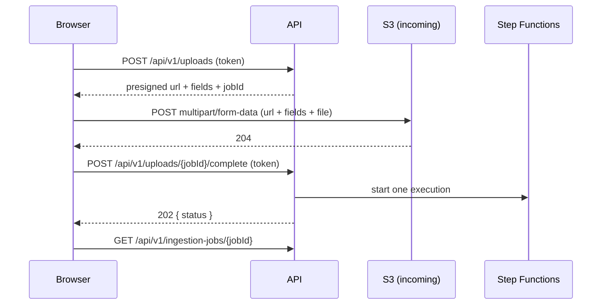
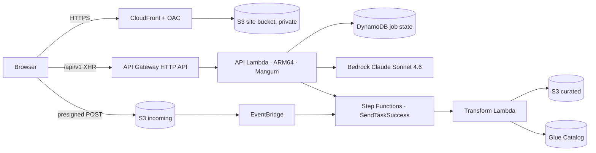

# API Deployment and Frontend Integration

> Owner: AWS integration engineer
> Status: **Deployed and verified live on the hackathon account.**
> Audience: the frontend developer integrating against the deployed API, and any teammate who needs to redeploy it.

The API and a static site are now publicly reachable. This document covers the live URLs, how to call the API from a browser, what changed in shared code and why, and how to redeploy.

---

## 1. Live endpoints

| What | URL |
|---|---|
| API base | `https://ewsx0mlrf4.execute-api.us-east-1.amazonaws.com` |
| Frontend site | `https://d2pz0g4ehmpkee.cloudfront.net` |

Both are `us-east-1`. The site bucket is `youthcompasshackathon-site-765996595659`; the CloudFront distribution is `E145P7CDE2N9TS`.

The site currently serves a placeholder page (`web/index.html`) that live-checks the API. It exists to prove hosting and cross-origin calls work — replace it with the real build.

---

## 2. Frontend integration

### 2.1 Reads are public, writes need a header

Reads need no credentials, so a judge can browse freely. The mutating endpoints require a shared secret in the `X-Youth-Compass-Token` header:

| Endpoint | Method | Guarded |
|---|---|---|
| `/health`, `/api/v1/datasets*`, `/api/v1/city/summary`, `/api/v1/districts*`, `/api/v1/ingestion-jobs/{id}` and its `mapping` / `quality-report` | GET | no |
| `/api/v1/copilot/query`, `/api/v1/copilot/capabilities` | POST / GET | no |
| `/api/v1/uploads`, `/api/v1/uploads/{job}/complete` | POST | **yes** |
| `/api/v1/ingestion-jobs/{id}/decision` | POST | **yes** |
| `/api/v1/datasets/upload` | POST | **yes** |

Ask me for the token; it is never committed. It lives in `.api-write-secret` locally (gitignored) and reaches the Lambda as an environment variable.

This is a shared secret, not user authentication. It closes the "anyone on the internet can publish data to the curated zone" hole without dragging a login flow into the frontend. Swapping it for a Cognito JWT authorizer later touches only `apps/api/security.py` and `infra/stacks/api.py`.

> Because it is a shared secret, treat it as compromised the moment it ships inside client-side JavaScript. For the demo, keep write actions behind a small operator UI or call them from a trusted context.

### 2.2 CORS

Only the CloudFront origin is allowed. Verified: that origin is echoed back, and an unrelated origin is not. If you serve the frontend from anywhere else — a local dev server, a preview URL — tell me and I will add the origin, or set it yourself:

```bash
YOUTH_COMPASS_API__CORS_ALLOWED_ORIGINS="https://d2pz0g4ehmpkee.cloudfront.net,http://localhost:5173"
```

It is a **comma-separated string**, not a JSON list. `Content-Type` and `X-Youth-Compass-Token` are the allowed request headers; `GET`, `POST`, and `OPTIONS` are the allowed methods.

### 2.3 A typed client from the contract

`contracts/api/openapi.json` is committed and current. Generate a client instead of hand-writing fetch calls:

```bash
npx openapi-typescript contracts/api/openapi.json -o src/api/schema.d.ts
```

### 2.4 The upload flow is three calls

The file never passes through the API; the browser posts it straight to S3.



Two things that will waste your afternoon if you miss them:

1. **Send the presigned `fields` exactly as returned**, as `multipart/form-data`, with the file part last. Expect `204`.
2. **The server chooses the object key.** Do not construct it. Uploads that bypass this flow are rejected: the object must carry `job-id` and `submitted-by` metadata and sit under `incoming/job-<hex>/`. Dropping a file into the bucket by hand or from the console will **not** start a workflow.

### 2.5 What a job does next

After `complete`, poll `GET /api/v1/ingestion-jobs/{jobId}`. Three outcomes, driven by how confidently the mapping engine understands the file:

| Mapping confidence | Status you will see | What happened |
|---|---|---|
| ≥ 0.95 | `published` | auto-published to curated, Glue table registered |
| below 0.95 | `awaiting_approval` | waiting for a human decision |
| analysis failed | quarantined | grain could not be inferred; nothing published |

To resume an `awaiting_approval` job, `POST /api/v1/ingestion-jobs/{jobId}/decision` with `{"decision":"approve","decidedBy":"..."}` and the token. Approving publishes curated data and registers the Glue table; rejecting publishes nothing.

Useful demo fixtures, measured against the real engine:

| CSV header | Confidence | Route |
|---|---|---|
| `year,district,age_label,population` | 0.980 | auto-publish |
| `year,district,headcount` | 0.893 | awaiting approval |
| `col_a,col_b,col_c,val_x` | analysis fails | quarantine |

### 2.6 The copilot needs entity ids

`POST /api/v1/copilot/query` answers from a grounded feature snapshot, so the entities you ask about must exist in it:

```json
{ "question": "Where should I buy a home?", "entityIds": ["banqiao", "linkou", "xindian"] }
```

Available entities: `banqiao`, `linkou`, `xindian`, and the siting candidates `site-banqiao-station`, `site-linkou-center`, `site-xindian-river`.

A response carries `status` (`answered`, `insufficient_data`, or `unsupported_question`), a routed `plan.profile_code`, ranked `candidates`, and `citations`. Verified live: the home-buying question ranks Banqiao first with four citations, and an EV-charger question routes to `ev_charger_placement`.

Omitting `entityIds` usually yields `unsupported_question`. That is the agent declining to guess rather than an error.

---

## 3. What changed in shared code, and why

Everything here was needed to make the existing API deployable. No routes or response shapes changed, and the offline behaviour is unchanged.

### 3.1 Heavy imports moved off the API's boot path

**Why:** a full dependency install came to 368 MB against Lambda's 250 MB unzipped limit, because importing the app pulled in `pyarrow` (128 MB) and `polars` (169 MB). There is no Dockerfile in this repo and the existing build is deliberately Docker-free, so a container image was not an option either.

- `adapters/local/feature_store.py` — `pyarrow` and `FEATURE_VALUE_SCHEMA` now import inside `FeatureParquetMaterializer.materialize()`. Only the write path needs Arrow; `DuckDBFeatureProvider` reads with DuckDB alone.
- `src/youth_compass/application/ingestion_workflow.py` — `youth_compass.transformation` now imports inside `_transform()`, the approval path that runs it.
- `CANONICAL_FIELDS` moved to a new `pyarrow`-free module, `youth_compass.domain.canonical`. `transformation.schema` re-exports it, so it remains the place to read the column order, and a check confirms the tuple still matches `CANONICAL_OBSERVATION_SCHEMA` field for field.

Result: **121.5 MB**, with 128.5 MB of headroom. The build fails loudly if a future change pushes it over.

If you add a dependency that the API imports at module scope, run `make build-api-lambda` and watch the reported size.

### 3.2 The app's data root is configurable

`create_app()` takes its default from `YOUTH_COMPASS_DATA_ROOT`. Lambda needs this because the package is unpacked read-only at `/var/task`, while the offline runtime opens a SQLite index and a local object store. The handler copies the baked data into `/tmp` on cold start and points the app there.

That local tree is ephemeral by design. Nothing durable depends on it: job state lives in DynamoDB and uploaded objects live in S3. It backs the read-only catalog and dashboard endpoints, which currently serve the bundled demo snapshot rather than Athena over the curated zone — see section 6.

### 3.3 CORS and the write guard

New `ApiSettings` group in `youth_compass.config`, plus `apps/api/security.py`. Both default to closed: no origin is allowed and, when no secret is configured, the guard is inactive so local development and the offline suite behave exactly as before.

A deployment sets `write_secret_arn` rather than `write_secret`, and the guard reads the value from Secrets Manager on first use (cached for five minutes). A literal `write_secret` still takes precedence, which is what tests and local runs use. If the secret cannot be read the guard fails closed with a 503 — an unreachable secret store must never become an unguarded write path.

---

## 4. Deploying

### 4.1 Prerequisites

```bash
export AWS_ACCOUNT_ID=765996595659
export YOUTH_COMPASS_REGION=us-east-1
```

The API write secret is no longer supplied at deploy time. The stack creates it in Secrets Manager with a generated value, so it appears in neither the CloudFormation template nor the function's environment. Read it back when you need to call a write endpoint:

```bash
aws secretsmanager get-secret-value \
  --secret-id YouthCompass-hackathon-api-write-secret \
  --query SecretString --output text
```

The secret's name is also published as the `WriteSecretName` stack output. Rotating it is a `put-secret-value` away: the function caches the value for five minutes and then picks up the new one without a redeploy.

### 4.2 API and infrastructure

```bash
make deploy-api ENV=hackathon
```

That builds the Lambda package and deploys the Workflow and Api stacks together.

> **Deploy both stacks together.** The Api stack imports the Workflow stack's state-machine ARN. Deploying Workflow alone makes CloudFormation try to remove that export and the update rolls back with `Cannot delete export ... as it is in use`. The `-c withApi=1` context flag keeps the Api stack in the synthesized app; without it, the Api stack is skipped entirely.

### 4.3 Frontend

```bash
make deploy-site                                  # uploads web/
uv run python -m scripts.deploy_site --source path/to/dist   # or your real build
```

The script reads the stack outputs, uploads the tree, injects the API base URL as `window.YOUTH_COMPASS_API_BASE`, sets caching (`no-cache` for entry documents, immutable for everything else), and invalidates CloudFront. Nothing to keep in sync by hand.

---

## 5. Architecture and cost



No always-on compute, no NAT, no VPC endpoints. Everything is request-billed, so idle cost stays at cents. The site bucket is private and reachable only through CloudFront via Origin Access Control.

IAM is scoped rather than convenient: Bedrock is limited to the configured model instead of `*`, and the API has **read-only** access to the curated zone — only the workflow may publish there.

The stack also grants `states:SendTaskSuccess` / `SendTaskFailure`, which a deployed API previously lacked entirely. Without it, approving a paused job could not have worked from AWS at all.

---

## 6. Known limitations

1. **Dashboard and catalog reads serve the bundled demo snapshot**, not Athena over the curated S3 zone. The AWS adapters for Glue and Athena exist and pass their contract suites, but the API's composition root wires the local ones. Deliberate: pointing the analytics endpoints at Athena needs canonical Parquet in the curated zone, and the deployed transform still copies the source file rather than transforming rows.
2. **The write guard is a shared secret, not user auth.** Fine for a demo, not for anything durable.
3. **`/api/v1/copilot/query` is unauthenticated** and spends Bedrock tokens per call. Acceptable for a short demo on an unadvertised URL; do not leave it exposed indefinitely.
4. **The local ingestion endpoint (`POST /api/v1/datasets/upload`) will fail on Lambda**, because the transformation path needs `polars`, which is excluded from the package. Use the presigned `/api/v1/uploads` flow — that is the real path.
5. **Forecasting does not exist** in any form. See `docs/aws-workstream-status.md` section 5.1.

---

## 7. Bugs found by deploying

Recorded because they are the kind of thing that only appears in a real deployment, and because two of them would have broken the demo.

**Every route returned 500.** `apps.api.main` builds an application at import time using the default data root, and Lambda unpacks the package read-only, so opening the SQLite catalog failed during init. Nothing in the offline suite covered it, because the data root is always writable locally. Now covered by `tests/integration/test_lambda_handler.py`, which imports the handler against a genuinely read-only directory.

**The `/tmp` copy was itself unwritable.** `shutil.copytree` replicates the source's permission bits, and the source is read-only.

**A messy CSV killed the whole workflow.** Pre-existing, and demo-breaking: the `analyze` handler reports failures *inside its payload* and returns successfully, so the `States.ALL` catch never fired. The `ConfidenceGate` then compared a path that did not exist and the execution died with `States.Runtime`, leaving the upload neither published nor quarantined and the job stuck. Any file whose grain could not be inferred hit this — exactly what happens when a judge uploads arbitrary data. The gate now routes a failed analysis to quarantine and checks the confidence path is present before comparing, falling through to human review otherwise. Locked in by `tests/infra/test_workflow_gate.py`.

---

## 8. Verified live

Not mocked. Run against the deployed stack:

- `/health` and `/api/v1/datasets` return 200 without credentials
- `POST /api/v1/uploads` returns 401 without the token, 200 with it
- Presigned upload → S3 → EventBridge → one Step Functions execution → paused at `awaiting_approval` → approved **through the deployed API** → execution `SUCCEEDED` → curated object written → Glue table registered with the correct inferred schema
- `POST /api/v1/copilot/query` answered with ranked candidates and citations via Bedrock, with no access denial in the logs
- CORS echoes only the CloudFront origin; an unrelated origin is refused
- SPA deep links serve `index.html`; HTTP redirects to HTTPS

Test suite: 625 passing. `ruff` and `mypy --strict` clean.

---

## 9. Related documents

- `docs/aws-workstream-status.md` — overall AWS status and remaining gaps
- `docs/06-backend-api.md` — API contract
- `docs/20-grounded-copilot.md` — the copilot and agent layer
- `docs/aws-architecture.md` — the wider deployed architecture
