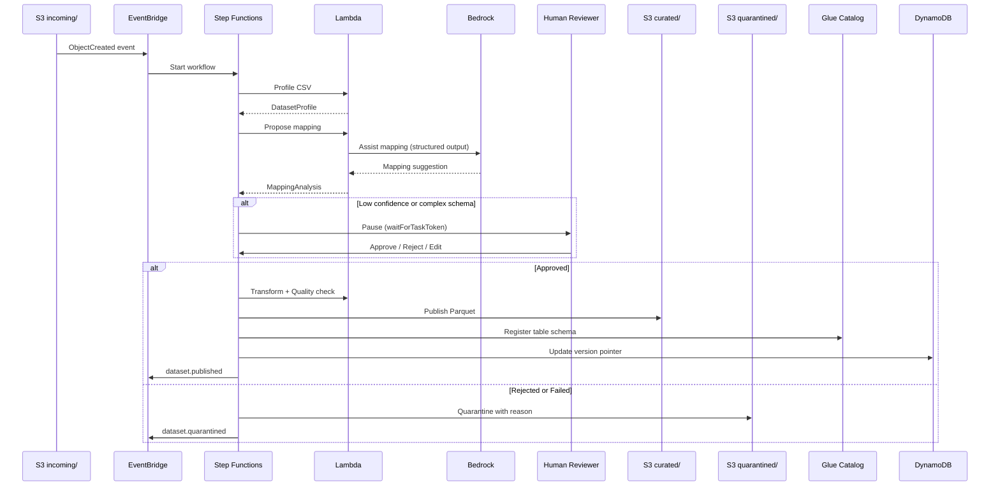
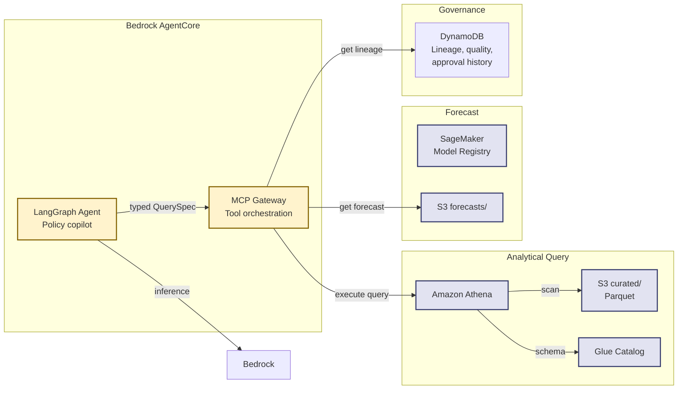
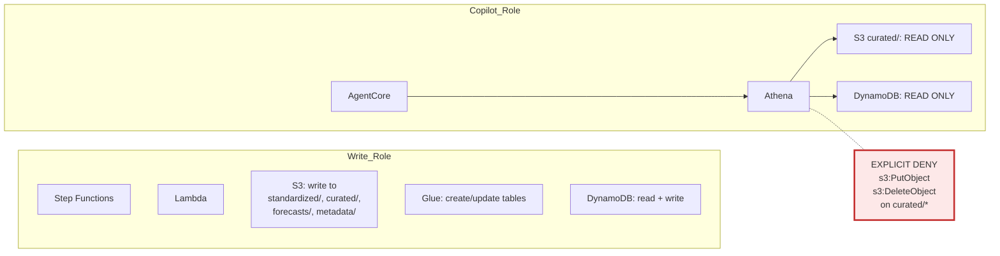

# AWS Architecture — New Taipei Youth Compass

> Region: ap-northeast-1 (Tokyo)

## System Architecture

```mermaid
graph TB
    subgraph S3["Amazon S3 — Data Lake"]
        S3_IN["incoming/<br/>Raw uploaded files"]
        S3_QUA["quarantined/<br/>Failed validation"]
        S3_STD["standardized/<br/>Canonical dimensions added"]
        S3_CUR["curated/<br/>Published analytical tables<br/>(Parquet, versioned)"]
        S3_FC["forecasts/<br/>Prediction artifacts"]
        S3_META["metadata/<br/>Quality reports, lineage"]
    end

    subgraph Compute["Serverless Compute"]
        LAMBDA["AWS Lambda<br/>(ARM64 Graviton)<br/>Data profiling,<br/>schema mapping,<br/>transformation"]
        SFN["AWS Step Functions<br/>Ingestion Workflow:<br/>profile → map → validate →<br/>approval pause →<br/>transform → quality → publish"]
    end

    subgraph Analytics["Analytics & Catalog"]
        GLUE["AWS Glue<br/>Data Catalog<br/>Table schemas"]
        DDB["Amazon DynamoDB<br/>Dataset metadata,<br/>approval status,<br/>version pointer"]
        ATHENA["Amazon Athena<br/>SQL over Parquet<br/>Typed queries only,<br/>scanned-bytes capped"]
    end

    subgraph AI["AI & ML"]
        BEDROCK["Amazon Bedrock<br/>Foundation model inference<br/>Policy copilot responses"]
        SAGEMAKER["Amazon SageMaker<br/>Forecast model training,<br/>model registry,<br/>batch transform"]
        AGENTCORE["Bedrock AgentCore<br/>LangGraph agent hosting,<br/>MCP Gateway,<br/>tool orchestration"]
    end

    subgraph Events["Event-Driven"]
        EB["Amazon EventBridge<br/>Audit events,<br/>S3 triggers,<br/>workflow notifications"]
    end

    subgraph Security["IAM & Cost Controls"]
        WRITE["Write_Role<br/>Ingestion workflow:<br/>write to data lake"]
        COPILOT["Copilot_Role<br/>Query path only:<br/>DENIED write + delete<br/>on curated data"]
        BUDGET["AWS Budgets<br/>Per-environment<br/>spending alerts"]
    end

    subgraph Observability["Observability"]
        CW["Amazon CloudWatch<br/>Logs, metrics, alarms"]
        OTEL["OpenTelemetry → CloudWatch<br/>Distributed traces"]
    end

    %% Ingestion flow
    S3_IN -->|"S3 event"| EB
    EB -->|"triggers"| SFN
    SFN -->|"invokes"| LAMBDA
    SFN -->|"on success"| S3_CUR
    SFN -->|"on failure"| S3_QUA
    SFN -->|"intermediate"| S3_STD
    SFN -->|"register schema"| GLUE
    SFN -->|"update metadata"| DDB

    %% AI-assisted mapping
    LAMBDA -->|"mapping proposals"| BEDROCK
    BEDROCK -->|"structured response"| LAMBDA

    %% Forecast pipeline
    SAGEMAKER -->|"trained models"| S3_FC
    SAGEMAKER -->|"reads training data"| S3_CUR

    %% Agent
    AGENTCORE -->|"tool calls"| ATHENA
    AGENTCORE -->|"tool calls"| DDB
    AGENTCORE -->|"inference"| BEDROCK

    %% Query path
    ATHENA -->|"scans"| S3_CUR
    ATHENA -->|"reads schema"| GLUE

    %% Audit
    SFN -->|"emits"| EB
    LAMBDA -->|"emits"| EB

    %% IAM
    WRITE -.->|"assumed by"| LAMBDA & SFN
    COPILOT -.->|"assumed by"| ATHENA & AGENTCORE

    %% Cost + observability
    BUDGET -.->|"monitors"| S3 & Compute & Analytics & AI
    CW -.->|"collects from"| LAMBDA & SFN & ATHENA & BEDROCK & SAGEMAKER
    AGENTCORE -->|"traces"| OTEL

    %% Styling
    classDef storage fill:#d4edda,stroke:#28a745,stroke-width:2px
    classDef compute fill:#cce5ff,stroke:#004085,stroke-width:2px
    classDef analytics fill:#e2e3f1,stroke:#383d6e,stroke-width:2px
    classDef ai fill:#fff3cd,stroke:#856404,stroke-width:2px
    classDef event fill:#d1ecf1,stroke:#0c5460,stroke-width:2px
    classDef iam fill:#fce4ec,stroke:#e91e63,stroke-width:2px
    classDef obs fill:#f0f0f0,stroke:#6c757d,stroke-width:2px

    class S3_IN,S3_QUA,S3_STD,S3_CUR,S3_FC,S3_META storage
    class LAMBDA,SFN compute
    class GLUE,DDB,ATHENA analytics
    class BEDROCK,SAGEMAKER,AGENTCORE ai
    class EB event
    class WRITE,COPILOT,BUDGET iam
    class CW,OTEL obs
```

## Ingestion Data Flow

## Query & Copilot Path

## Security Boundary

## Service Inventory

| Service | Purpose | Cost model |
|---|---|---|
| **Amazon S3** | Data lake (6 zones), versioned, public-access blocked | per GB stored + per request |
| **AWS Glue Data Catalog** | Table schemas for curated Parquet | per object cataloged |
| **Amazon DynamoDB** | Dataset metadata, approval status, version pointer | per request (on-demand) |
| **Amazon Athena** | SQL over curated Parquet, typed queries, cost-capped | per TB scanned |
| **AWS Lambda** | Profiling, mapping, transformation (ARM64) | per invocation |
| **AWS Step Functions** | Ingestion workflow with human-approval pause | per state transition |
| **Amazon EventBridge** | Audit events and S3 triggers | per event |
| **Amazon Bedrock** | Foundation model inference for the policy copilot | per token |
| **Amazon SageMaker** | Forecast training, model registry, batch transform | per instance-hour |
| **Bedrock AgentCore** | LangGraph agent hosting and MCP tool gateway | hosting |
| **Amazon CloudWatch** | Logs, metrics, alarms, distributed traces | per GB ingested |
| **AWS Budgets** | Per-environment spending alerts | free |
| **AWS IAM** | Role separation (write vs read-only copilot) | free |
