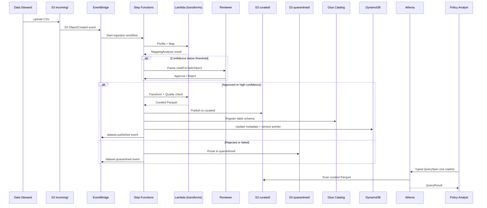
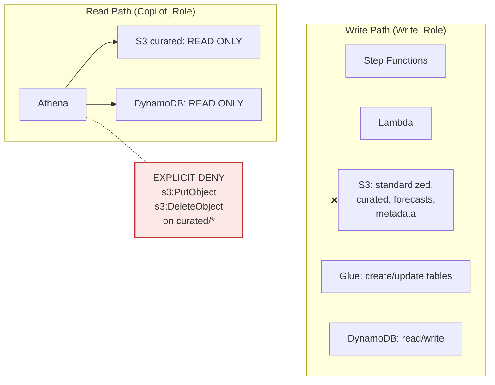

# AWS Architecture — New Taipei Youth Compass

> Region: ap-northeast-1 (Tokyo)
> Account: 330177109233

## Full Architecture Diagram

```mermaid
graph TB
    subgraph Users["Users"]
        STEWARD["Data Steward<br/>(uploads CSV, approves mappings)"]
        ANALYST["Policy Analyst<br/>(queries data, asks the copilot)"]
        REVIEWER["Reviewer<br/>(approves/rejects mappings)"]
    end

    subgraph Frontend["Frontend (other workstream)"]
        DASH["Dashboard<br/>(React)"]
    end

    subgraph Backend["Backend (other workstream)"]
        API["FastAPI<br/>apps/api/main.py"]
        DOMAIN["Domain Logic<br/>src/youth_compass/"]
        CLI["CLI<br/>youth-compass profile|map"]
    end

    subgraph Ports["Port Protocols (Stage 1)"]
        direction LR
        P_STORE["ObjectStore"]
        P_CATALOG["DataCatalog"]
        P_QUERY["QueryEngine"]
        P_WORKFLOW["WorkflowRunner"]
        P_EVENT["EventBus"]
        P_MODEL["ModelProvider"]
        P_FORECAST["ForecastService"]
        P_CKPT["CheckpointStore"]
        P_CLOCK["Clock"]
    end

    subgraph AWS_Stage2["AWS Services — Stage 2 (deployed)"]
        direction TB

        subgraph S3["Amazon S3 (Object Storage)"]
            S3_IN["incoming/"]
            S3_QUA["quarantined/"]
            S3_STD["standardized/"]
            S3_CUR["curated/"]
            S3_FC["forecasts/"]
            S3_META["metadata/"]
        end

        subgraph Catalog["Data Catalog"]
            GLUE["AWS Glue<br/>Database: youth_compass_dev<br/>(table schemas)"]
            DDB["Amazon DynamoDB<br/>Table: youthcompassdev-metadata<br/>(approval status, quality score,<br/>version pointer, rollback)"]
        end

        ATHENA["Amazon Athena<br/>(SQL queries over S3 Parquet,<br/>typed QuerySpec only,<br/>allowlisted tables/metrics,<br/>scanned-bytes cap)"]

        LAMBDA["AWS Lambda<br/>(ARM64, calls profile_csv +<br/>analyze_mapping,<br/>no reimplementation)"]

        SFN["AWS Step Functions<br/>(ingestion workflow:<br/>profile → map → validate →<br/>approval pause → transform →<br/>quality → publish)"]

        EB["Amazon EventBridge<br/>(audit events:<br/>dataset.published,<br/>mapping.reviewed, etc.)"]
    end

    subgraph IAM["IAM Roles (least-privilege)"]
        WRITE_ROLE["Write_Role<br/>(workflow service:<br/>can write to curated)"]
        COPILOT_ROLE["Copilot_Role<br/>(read-only:<br/>DENIED s3:PutObject +<br/>s3:DeleteObject on curated)"]
    end

    subgraph Cost["Cost Controls (Stage 1)"]
        BUDGET["AWS Budgets<br/>$10/mo dev budget<br/>alerts at 80% + 100%"]
        TAGS["Cost Allocation Tags<br/>Project, Environment,<br/>Owner, CostCenter"]
    end

    subgraph Stage3["Stage 3 (deferred — competition credits)"]
        BEDROCK["Amazon Bedrock<br/>(foundation models,<br/>mandatory per rules)"]
        SAGEMAKER["Amazon SageMaker<br/>(forecast training +<br/>model registry)"]
        AGENTCORE["Bedrock AgentCore<br/>(LangGraph agent hosting,<br/>MCP Gateway)"]
    end

    subgraph Scripts["Operational Scripts"]
        PREFLIGHT["aws_preflight.py<br/>(10s readiness check)"]
        SMOKE["aws_smoke_test.py<br/>(round-trip verification)"]
        EXPORT["aws_export.py<br/>(data rescue before<br/>account suspension)"]
        BOOTSTRAP["aws_bootstrap.py<br/>(empty account →<br/>verified stack)"]
    end

    %% User flows
    STEWARD -->|uploads CSV| S3_IN
    REVIEWER -->|approves/rejects| SFN
    ANALYST -->|queries| DASH

    %% Frontend → Backend
    DASH --> API
    API --> DOMAIN

    %% Domain → Ports (no AWS imports here)
    DOMAIN --> P_STORE & P_CATALOG & P_QUERY & P_WORKFLOW & P_EVENT

    %% Ports → AWS Adapters (Stage 2)
    P_STORE -->|s3_store.py| S3
    P_CATALOG -->|glue_catalog.py| GLUE & DDB
    P_QUERY -->|athena_query.py| ATHENA
    P_WORKFLOW -->|step_functions_runner.py| SFN
    P_EVENT -->|eventbridge_bus.py| EB

    %% Ports → Stage 3 (deferred)
    P_MODEL -.->|bedrock_model.py| BEDROCK
    P_FORECAST -.->|sagemaker_forecast.py| SAGEMAKER
    P_CKPT -.->|agentcore_checkpoint.py| AGENTCORE

    %% Ingestion workflow
    S3_IN -->|S3 event / EventBridge| SFN
    SFN -->|calls| LAMBDA
    LAMBDA -->|profile_csv + analyze_mapping| DOMAIN
    SFN -->|on success| S3_CUR
    SFN -->|on failure| S3_QUA
    SFN -->|waitForTaskToken| REVIEWER

    %% Athena reads curated data
    ATHENA -->|scans| S3_CUR

    %% IAM
    WRITE_ROLE -.->|assumed by| SFN & LAMBDA
    COPILOT_ROLE -.->|assumed by| ATHENA

    %% EventBridge audit
    SFN -->|emits events| EB
    LAMBDA -->|emits events| EB

    %% Cost controls
    BUDGET -.->|monitors all| AWS_Stage2
    TAGS -.->|applied to| AWS_Stage2

    %% Scripts
    PREFLIGHT -->|read-only checks| AWS_Stage2
    SMOKE -->|round-trip test| S3 & GLUE & ATHENA & SFN
    EXPORT -->|data rescue| S3 & GLUE
    BOOTSTRAP -->|deploys| Cost & AWS_Stage2

    %% Styling
    classDef deployed fill:#d4edda,stroke:#28a745,stroke-width:2px
    classDef deferred fill:#fff3cd,stroke:#ffc107,stroke-width:2px,stroke-dasharray: 5 5
    classDef port fill:#e8f4fd,stroke:#0d6efd,stroke-width:2px
    classDef script fill:#f0f0f0,stroke:#6c757d
    classDef iam fill:#fce4ec,stroke:#e91e63

    class S3_IN,S3_QUA,S3_STD,S3_CUR,S3_FC,S3_META,GLUE,DDB,ATHENA,LAMBDA,SFN,EB,BUDGET,TAGS deployed
    class BEDROCK,SAGEMAKER,AGENTCORE deferred
    class P_STORE,P_CATALOG,P_QUERY,P_WORKFLOW,P_EVENT,P_MODEL,P_FORECAST,P_CKPT,P_CLOCK port
    class PREFLIGHT,SMOKE,EXPORT,BOOTSTRAP script
    class WRITE_ROLE,COPILOT_ROLE iam
```

## Service Inventory

### Deployed (Stage 1 + Stage 2) — all per-use, no always-on compute

| Service | Resource | Purpose | Cost model |
|---|---|---|---|
| **Amazon S3** | 6 buckets (incoming, quarantined, standardized, curated, forecasts, metadata) | Data lake zones, versioned, public-access blocked | per GB stored + per request |
| **AWS Glue** | Database `youth_compass_dev` | Table schemas for curated Parquet | per object cataloged (free tier covers this) |
| **Amazon DynamoDB** | Table `youthcompassdev-metadata` (on-demand) | App metadata: approval status, quality score, version pointer for rollback | per read/write request, $0 when idle |
| **Amazon Athena** | Workgroup (via adapter) | SQL over curated S3 Parquet, typed QuerySpec only | $5/TB scanned, capped by adapter |
| **AWS Lambda** | Transform function (ARM64) | Calls `profile_csv` + `analyze_mapping` | per invocation, $0 when idle |
| **AWS Step Functions** | Ingestion state machine | profile → map → validate → approval → publish | per state transition, $0 when idle |
| **Amazon EventBridge** | Event bus | Audit events (dataset.published, mapping.reviewed, etc.) | per event published |
| **AWS Budgets** | $10/mo dev budget | Alerts at 80% and 100% actual spend | free |
| **AWS IAM** | Write_Role + Copilot_Role | Least-privilege: copilot denied writes on curated | free |
| **CloudFormation** | 3 stacks (CDKToolkit, Budget, Data) | Infrastructure as code | free |

### Deferred to Stage 3 (competition credits required)

| Service | Purpose | Why deferred |
|---|---|---|
| **Amazon Bedrock** | Foundation model inference (mandatory per competition rules) | Per-token cost |
| **Amazon SageMaker** | Forecast model training + registry | Per-instance-hour |
| **Bedrock AgentCore** | LangGraph agent hosting + MCP Gateway | Hosting cost |

## Data Flow

## Security Boundary

The copilot (the AI that answers policy questions) physically cannot modify or delete published data, even if a prompt injection attempts to make it write. This is enforced at the IAM level, not in application code.
