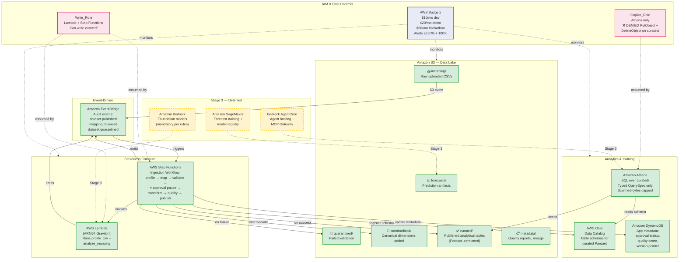
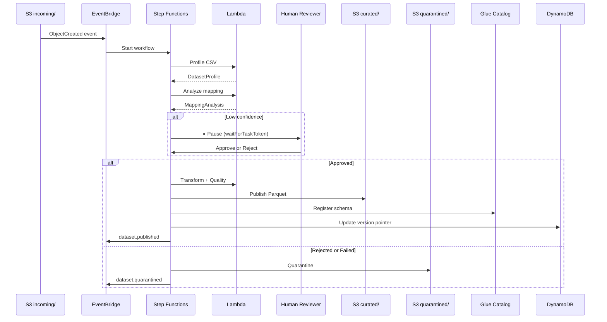
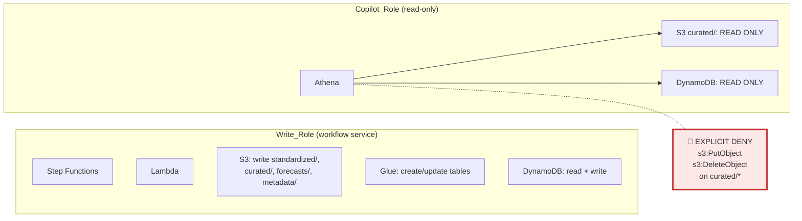

# AWS Architecture — New Taipei Youth Compass

> Region: ap-northeast-1 (Tokyo) | Account: 330177109233

## AWS Services Architecture

## Ingestion Data Flow

## Security Boundary

## Service Cost Summary

| Service | Billing model | Cost when idle |
|---|---|---|
| Amazon S3 (6 buckets) | per GB/month + per request | ~$0 at current scale |
| AWS Glue Data Catalog | per object cataloged | free tier |
| Amazon DynamoDB (on-demand) | per read/write request | $0 |
| Amazon Athena | $5 per TB scanned | $0 |
| AWS Lambda (ARM64) | per invocation + duration | $0 |
| AWS Step Functions | per state transition | $0 |
| Amazon EventBridge | per event published | $0 |
| AWS Budgets | free | free |
| AWS IAM | free | free |
| **Amazon Bedrock** *(Stage 3)* | per input/output token | $0 |
| **Amazon SageMaker** *(Stage 3)* | per instance-hour | $0 when no job |
| **Bedrock AgentCore** *(Stage 3)* | hosting cost | deferred |
