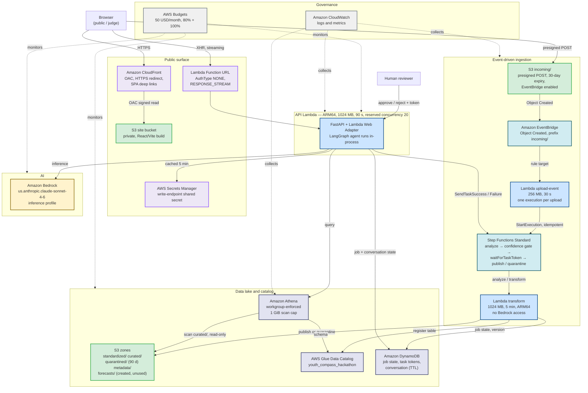
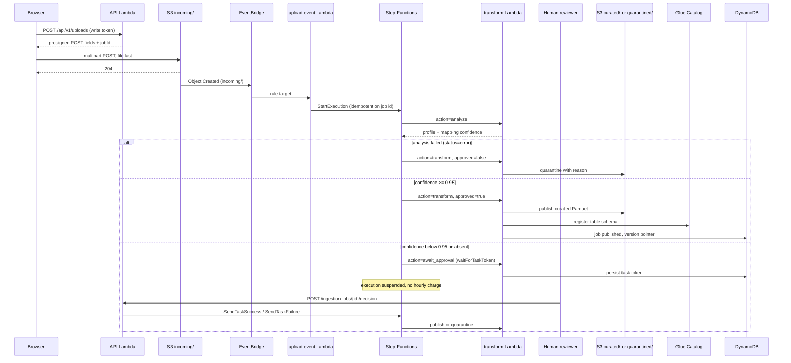
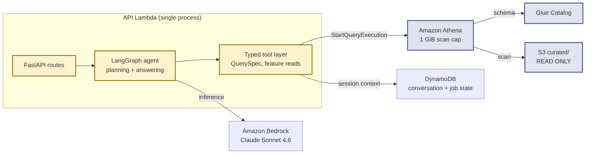
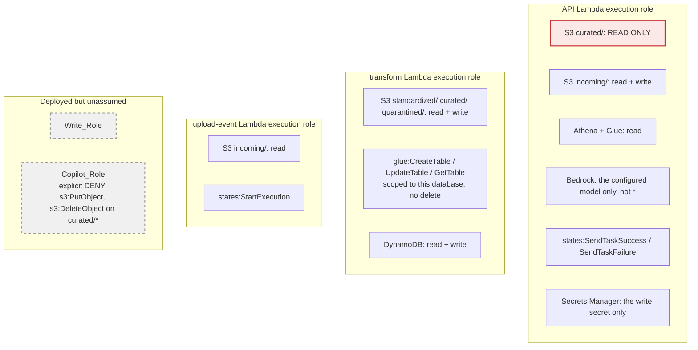

# AWS Architecture — New Taipei Youth Policy

> Region: **us-east-1** (N. Virginia) · Environment: `hackathon` · Account: `765996595659`
>
> **This document describes what is actually deployed**, not the original plan. Services that
> exist only in the planning documents are listed in [§6 Not deployed](#6-not-deployed).
> The drawable version is `docs/aws-architecture.drawio`.

## 1. System Architecture

## 2. Ingestion Data Flow

Mapping is **deterministic confidence scoring**. No model is called on this path — the transform
Lambda holds no Bedrock permission at all.

## 3. Query and Copilot Path

The agent runs **in-process inside the API Lambda**. There is no AgentCore runtime and no MCP
Gateway.

## 4. Security Boundary

The boundary that actually applies is each function's own execution role. `Write_Role` and
`Copilot_Role` are deployed in the Data stack but **no principal assumes them yet** — the
planned role separation is not wired up.

Other enforced guardrails:

- **Athena workgroup** sets `enforce_work_group_configuration=true`, so the 1 GiB scan cap and
  the result location cannot be overridden per query.
- **Site bucket** blocks all public access and is reachable only through CloudFront via OAC.
- **CORS** allows only the CloudFront origin; `GET`, `POST`, `OPTIONS` only.
- **Write endpoints** require `X-Youth-Compass-Token`. If the secret cannot be read the guard
  fails closed with 503 — an unreachable secret store never becomes an unguarded write path.
- **No VPC, no NAT, no always-on compute.** Everything is request-billed.

## 5. Service Inventory

| Service | Purpose | Cost model |
|---|---|---|
| **Amazon CloudFront** | SPA delivery, OAC to a private bucket, HTTPS redirect | per request + GB out |
| **Amazon S3** | Site bucket + 6 data-lake zones, versioned, public access blocked | per GB + per request |
| **AWS Lambda** | API (Function URL, response streaming), upload-event, transform — all ARM64 | per request + GB-second |
| **AWS Step Functions** | Standard workflow with `waitForTaskToken` approval pause | per state transition |
| **Amazon EventBridge** | S3 Object Created rule scoped to `incoming/` | per event |
| **AWS Glue Data Catalog** | Table schemas for curated Parquet | per object cataloged |
| **Amazon Athena** | SQL over curated Parquet, workgroup-enforced 1 GiB cap | per TB scanned |
| **Amazon DynamoDB** | Job state, workflow task tokens, conversation context (TTL) | per request (on-demand) |
| **Amazon Bedrock** | Copilot inference, single configured model | per token |
| **AWS Secrets Manager** | Write-endpoint shared secret, stack-generated | per secret + per call |
| **Amazon CloudWatch** | Lambda and Athena logs and metrics | per GB ingested |
| **AWS Budgets** | 50 USD/month, alerts at 80% and 100% | free |
| **AWS IAM** | Per-function execution roles | free |

## 6. Not deployed

Present in the planning documents and the earlier diagram, absent from every stack:

| Claimed | Reality |
|---|---|
| **Amazon SageMaker** — forecast training, model registry, batch transform | No construct in any stack. `config.py` has a `SAGEMAKER` enum value and `forecasting/baseline.py` calls it "a future SageMaker batch job"; the forecast ships as a precomputed artifact. |
| **Bedrock AgentCore** — LangGraph hosting, MCP Gateway | No construct. The agent runs in-process in the API Lambda. |
| **Bedrock-assisted schema mapping** | The transform Lambda is granted no Bedrock permission. Mapping is deterministic confidence scoring. |
| **OpenTelemetry → CloudWatch distributed traces** | Not wired. CloudWatch logs and metrics only. |
| **`forecasts/` write path** | The bucket is created and `Write_Role` can write it, but nothing does; `YOUTH_COMPASS_FORECAST__PROVIDER=local`. |
| **`Write_Role` / `Copilot_Role` enforcing the boundary** | Both deployed, neither assumed by any principal. |
| **Region ap-northeast-1 (Tokyo)** | Deployed in **us-east-1**. `infra/environments.py` still defaults to `ap-northeast-1`; the deploy passes `-c region=us-east-1` and the Makefile defaults `YOUTH_COMPASS_REGION` to `us-east-1`. |

## 7. Related documents

- `docs/21-api-deployment.md` — live endpoints, redeploy steps, frontend integration
- `docs/aws-workstream-status.md` — overall AWS status and remaining gaps
- `docs/06-backend-api.md` — API contract
- `docs/aws-architecture.drawio` — the drawable diagram (Traditional Chinese)
